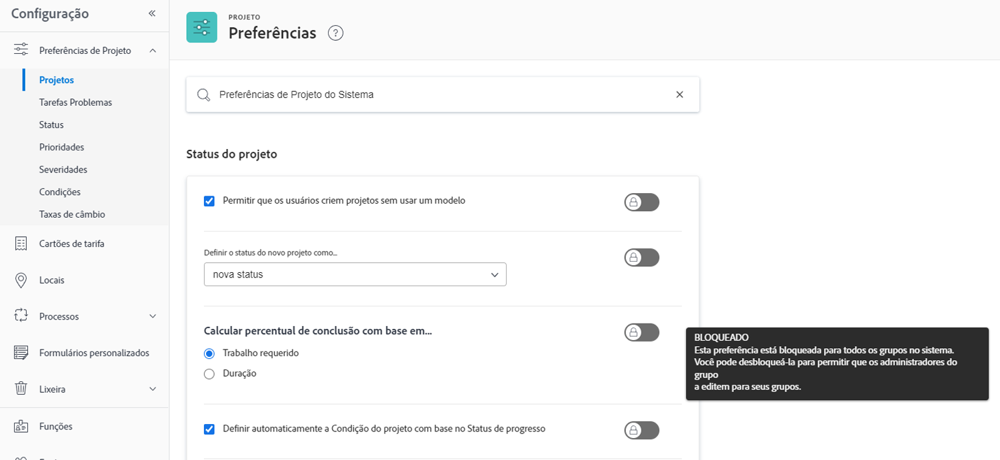
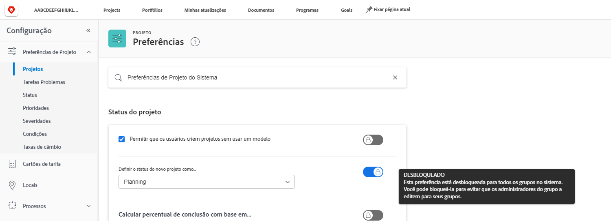
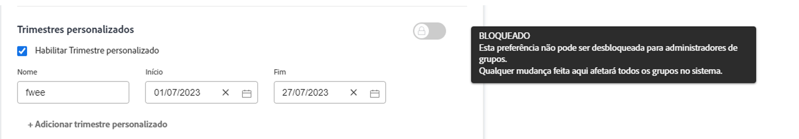

# Definir configurações globais padrão do projeto

<!---
21.4 updates have been made
--->

Neste vídeo, você aprenderá a:

* Alterar um status personalizado
* Definir preferências globais do projeto
* Criar e usar agendas

>[!VIDEO](https://video.tv.adobe.com/v/335065/?quality=12&learn=on)

## Configurações globais e de grupo para projetos, tarefas e problemas

Ao abrir a variável [!UICONTROL Projetos] configurações em [!DNL Workfront], você perceberá que diz &quot;[!UICONTROL Preferências de Projeto do Sistema]&quot; na barra de pesquisa na parte superior da janela. Isso permite que você saiba que essas configurações afetam todos na sua [!DNL Workfront] sistema — é uma configuração global.

![[!UICONTROL Preferências do projeto] página em [!UICONTROL Configuração]](assets/admin-fund-system-project-preferences-1.png)

Você verá algo semelhante ao abrir a variável [!UICONTROL Tarefas e problemas] configurações.

![[!UICONTROL Preferências de tarefas e problemas] in [!UICONTROL Configuração]](assets/admin-fund-task-issue-preferences-2.png)

No entanto, é possível que nem todos os grupos [!DNL Workfront] O precisa das mesmas preferências de projeto, tarefa e problema. Por exemplo, o grupo de marketing deseja que o status de um novo projeto seja Planejamento, enquanto o grupo de gerentes de projeto prefere o status Solicitação.

[!DNL Workfront] O permite que administradores de grupos ajustem determinadas preferências de projeto, tarefa e problema para seus grupos. As preferências que podem ser ajustadas são determinadas pelo [!DNL Workfront] administrador do sistema usando os botões bloquear/desbloquear.

Comece navegando até o [!UICONTROL Configuração] área:

1. Selecionar **[!UICONTROL Configuração]** no **[!UICONTROL Menu principal]**.
1. Expandir **[!UICONTROL Preferências do projeto]** no menu esquerdo.
1. Selecionar **[!UICONTROL Projetos]** ou **[!UICONTROL Tarefas e problemas]**, dependendo das configurações que você deseja modificar.

Bloqueie uma preferência para impedir que administradores de grupos ajustem essa configuração para seus grupos.

Desbloqueie a preferência para disponibilizá-la para que administradores de grupos personalizem.

Algumas configurações não podem ser desbloqueadas e permanecem como configurações globais do sistema.

### Definir preferências de grupo e subgrupo

Para quaisquer configurações desbloqueadas pelo administrador do sistema, os administradores de grupo podem fazer ajustes para os grupos que gerenciam e quaisquer subgrupos aninhados nesses grupos. Além disso, os administradores de grupo podem controlar quais configurações os administradores de subgrupo podem modificar.

1. Selecionar **[!UICONTROL Configuração]** no **[!UICONTROL Menu principal]**.
1. Clique em **[!DNL Groups]** no menu esquerdo.
1. Clique no nome do grupo ou subgrupo para abri-lo.
1. Selecionar **[!UICONTROL Preferências do projeto]** ou **[!UICONTROL Preferências de tarefas e problemas]** no menu esquerdo.
1. Faça as alterações necessárias para cada uma das preferências que foram desbloqueadas.
1. Selecionar **[!UICONTROL Salvar]**.

![[!UICONTROL Status do projeto] seção sobre [!UICONTROL Grupo] página](assets/admin-fund-group-preferences.png)

Se sua organização não estiver usando administradores de grupo, o administrador do sistema poderá gerenciar as configurações de preferências para os diferentes grupos.

<!---
learn more URLs and guides
Create or edit a group status 
Group administrators 
Configure system-wide project preferences 
Configure project preferences for a group 
Configure task and issue preferences for a group 
Create and modify a group’s schedule 
--->
