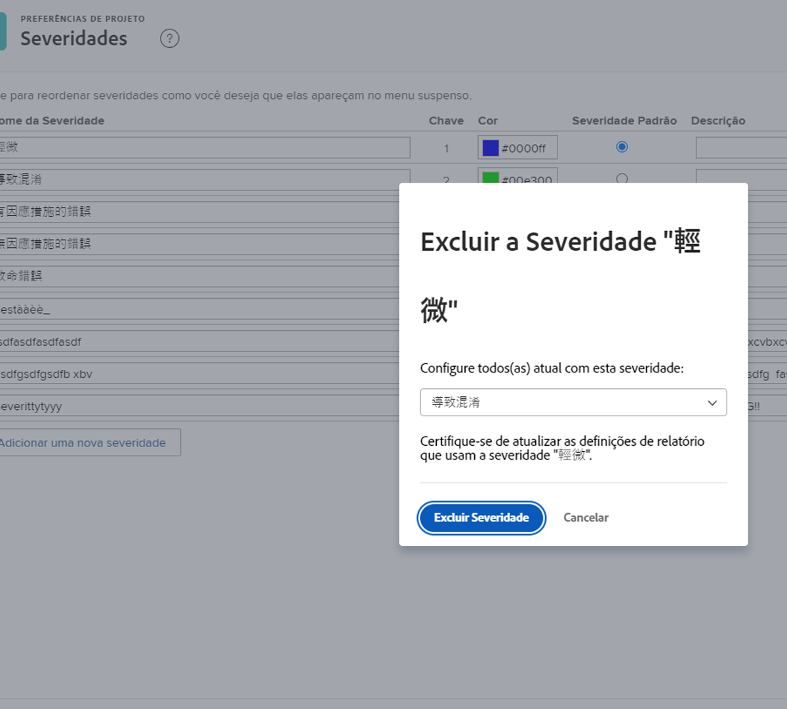

# Criar e gerenciar severidades de problemas

## Introdução a severidades de problemas

Uma severidade pode ser usada para indicar o quanto um problema é grave ou como ele pode afetar o trabalho que está sendo feito.

Menu ![[!UICONTROL Severidade] na janela](assets/admin-fund-severity-issue-details.png) [!UICONTROL Detalhes do problema]

O campo [!UICONTROL Severidade] pode ser acessado nos [!UICONTROL Detalhes do problema]. Ele também pode ser incluído em exibições de coluna em listas e em relatórios personalizados.

O [!DNL Workfront] tem cinco severidades padrão:

* [!UICONTROL Cosmética]
* [!UICONTROL Causa Confusão]
* [!UICONTROL Problema com Solução]
* [!UICONTROL Problema Sem Solução]
* [!UICONTROL Erro Fatal]

Os administradores do sistema podem renomear essas severidades padrão ou criar novas, se necessário.

As severidades estão disponíveis somente para problemas no [!DNL Workfront].

## Criar e gerenciar severidades de problemas

Como administrador do sistema, você pode criar novas severidades, se necessário, para concluir o fluxo de trabalho do problema.

Página ![[!UICONTROL Severidades] em [!UICONTROL Configuração]](assets/admin-fund-severity-section.png)

1. Clique em **[!UICONTROL Configuração]** no **[!UICONTROL Menu principal]**.
1. Expanda a seção **[!UICONTROL Preferências do projeto]** no painel do menu esquerdo.
1. Selecione **[!UICONTROL Severidades]**.
1. Clique em **[!UICONTROL Adicionar uma nova severidade]**.
1. Nomeie a severidade de acordo com o uso pretendido.
1. O número da **[!UICONTROL Importância]** corresponde à gravidade do problema. O número mais alto corresponde à maior severidade. O número da [!UICONTROL Importância] deve ser único.
1. Selecione uma cor para sua prioridade. Isso é usado em relatórios gráficos e em outros locais no [!DNL Workfront].
1. Designe uma das opções de severidade como **[!UICONTROL Severidade padrão]**. Isso é aplicado automaticamente a todos os novos problemas no Workfront.
1. Inclua uma descrição da severidade, por exemplo, como ela será usada.
1. Clique fora dos campos para salvar.

Lista](assets/admin-fund-severity-new.png) de ![[!UICONTROL Severidades]

### Modificação de severidades

Se uma severidade não for mais relevante para os workflows de problemas, ela poderá ser renomeada, oculta ou excluída.

Se uma severidade não for mais necessária, o [!DNL Workfront] recomenda que você a oculte (clique na caixa [!UICONTROL Ocultar] ao lado dela na área de configuração). Isso remove a opção de severidade do menu suspenso sobre o problema, mas a mantém nos dados históricos para que ainda esteja disponível para fins de relatório.

Coluna ![[!UICONTROL Ocultar] destacada na página [!UICONTROL Severidades] em [!UICONTROL  Configuração]](assets/admin-fund-severity-hide.png)

O [!DNL Workfront] recomenda que você **não** exclua uma severidade que tenha sido usada em problemas anteriores. Quando você exclui uma severidade, ele solicita que você substitua por outra. Isso pode alterar os dados históricos e afetar os relatórios.

<!---
learn more URLs
Create and customize issue severities
Update issue severity
--->
