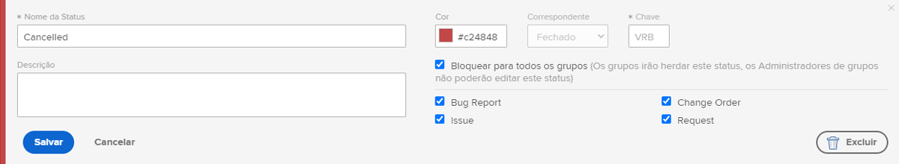
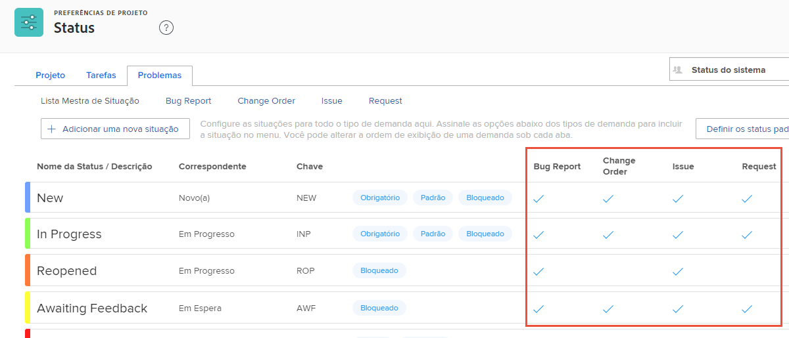

# Personalize os status de todo o sistema

O [!DNL Workfront] fornece uma variedade de status padrão para acomodar os fluxos de trabalho de gerenciamento de problemas da sua organização. Esses status podem ser renomeados de acordo com a terminologia da sua organização. E os status podem ser atribuídos a tipos de problema específicos.

Status adicionais podem ser criados, se necessário. Somente os administradores do sistema podem criar status para todo o sistema. Além disso, os administradores do sistema controlam quais status podem ser editados pelos administradores de grupos.

Guia ![[!UICONTROL Problemas] na página [!UICONTROL Status], em [!UICONTROL Configuração]](assets/admin-fund-all-issue-statuses.png)

## Modificar status existentes

O [!DNL Workfront] recomenda uma quantidade mínima de status. Isso facilita a escolha do status certo para os usuários e resulta em uma lista mais curta de status a serem mantidos.

É possível editar um status existente para alterar o nome, a que tipos de problema ele está atribuído, a cor relacionada etc.

![Lista de status de problemas com a opção [!UICONTROL Editar] realçada](assets/admin-fund-edit-issue-status.png)

1. Clique em **[!UICONTROL Configuração]**, no **[!UICONTROL Menu principal]**.
1. Expanda a seção **[!UICONTROL Preferências do projeto]** no painel do menu esquerdo.
1. Selecione **[!UICONTROL Status]**.
1. Selecione a guia **[!UICONTROL Problemas]** e verifique se [!UICONTROL Status do sistema] aparece no canto superior direito.
1. Selecione **[!UICONTROL Lista principal]** para ver os status de todos os tipos de problema. É aqui que você cria ou modifica um status de problema.
1. Passe o mouse sobre o lado direito do status que deseja renomear e clique em **[!UICONTROL Editar]**.
1. Dê um novo nome ao status ou altere qualquer outra informação, conforme desejado.
1. Bloqueie o status, se essas configurações se aplicarem a todos os usuários da sua instância do [!DNL Workfront].
1. Desbloqueie o status, para permitir que os administradores de grupos editem o status somente para seus grupos.
1. Marque as caixas para o tipo de problema ao qual o status deve se aplicar.
1. Clique em **[!UICONTROL Salvar]**.

### Atribuições de status

Nem todos os status podem ser atribuídos a todos os tipos de problema. A página [!UICONTROL Status] possui colunas que mostram para qual tipo de problema cada status pode ser usado.

Para ver apenas os status atribuídos a um tipo de problema específico, basta clicar no nome do tipo de problema, na parte superior da janela.

Guia ![[!UICONTROL Problema] na página [!UICONTROL Status] com colunas realçadas](assets/admin-fund-statuses-issue-type.png)

Aqui, você pode arrastar e soltar os problemas na ordem em que deseja que apareçam no menu suspenso [!UICONTROL Status].

Para editar os status, você precisará voltar à [!UICONTROL Lista principal].
