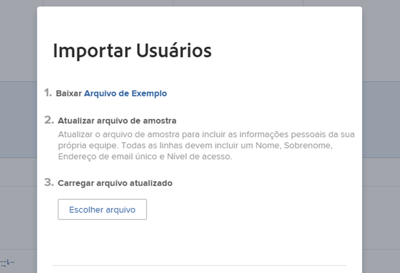
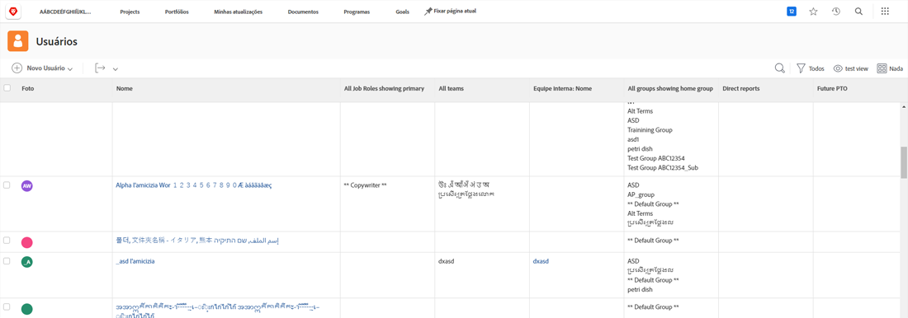

# Adicionar usuários em massa

Adicionar usuários um de cada vez pode ser demorado e cansativo. O [!DNL Workfront] permite que quem administra o sistema adicione vários usuários ao mesmo tempo usando o recurso de importação.

Opção de menu ![[!UICONTROL Importar pessoas]](assets/admin-fund-adding-users-5.png)

1. Selecione **[!UICONTROL Usuários]** no [!UICONTROL  Menu principal].
1. Selecione a seta no botão **[!UICONTROL Nova pessoa]** e clique em **[!UICONTROL Importar pessoas]**.
1. A janela que se abre orienta você na criação de uma planilha dos usuários a serem importados.
1. Baixe o arquivo de amostra, que é uma planilha do [!DNL Excel].
1. Atualize a planilha com as informações do usuário, como nome, sobrenome, endereço de email, nível de acesso, seguindo as instruções do próprio arquivo.
1. Clique no botão **[!UICONTROL Escolher arquivo]** assim que a lista de usuários for salva.
1. Navegue até o arquivo da planilha do usuário e o selecione.

Os usuários importados aparecem na lista [!UICONTROL Usuários]. Edite as informações sobre usuários individuais ou vários usuários, se necessário.

## Importar usuários: usando inícios rápidos

O [!DNL Workfront] fornece um modelo de início rápido para importar dados para o sistema. Também pode ser usado para importar usuários. Antes de usar o início rápido, o [!DNL Workfront] recomenda que você trabalhe com a pessoa responsável pela consultoria do [!DNL Workfront], pois há considerações das quais você deve estar ciente.

<!---
paragraph below needs URL to article
--->

Consulte Importar dados para o Workfront por meio de inícios rápidos para obter informações detalhadas.

![[!UICONTROL Importar dados] (Janela [!UICONTROL Inícios rápidos]) na área [!UICONTROL Configuração] ](assets/admin-fund-adding-users-8.png)

<!--
Learn more URLs
Import users
Import data into Workfront via Kick-Starts
-->
