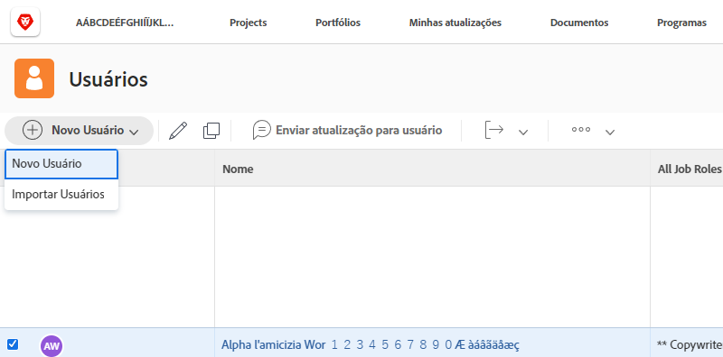

# Criar um perfil de usuário individual

Quando um novo funcionário é contratado ou alguém é transferido para um departamento usando o[!DNL Workfront], o administrador do sistema precisará criar apenas um usuário. Isso pode ser feito de forma rápida e fácil na área [!UICONTROL Usuários] no [!DNL Workfront].

1. Selecione **[!UICONTROL Usuários]** no **[!UICONTROL Menu principal]**.
1. Clique no botão **[!UICONTROL Nova pessoa]**.
1. Insira o nome e o sobrenome do usuário na janela [!UICONTROL Nova pessoa].
1. Insira o endereço de email do usuário. Este é o seu logon no [!DNL Workfront] e deve ser exclusivo na instância do [!DNL Workfront].
1. Se desejar que o usuário receba um email sobre seu novo logon, marque a caixa enviar convite.
1. Atribua à pessoa um nível de acesso. Isso concede as principais permissões no [!DNL Workfront].
1. Atribua o usuário a um grupo interno para garantir que ele tenha acesso ao trabalho correto.
1. Selecione **[!DNL Add this Person]** para concluir a criação do usuário.

Janela ![[!UICONTROL Nova pessoa]](assets/admin-fund-adding-users-1.png)

O link [!UICONTROL Mostrar opções avançadas] abre a janela completa de detalhes do usuário. Isso permite que o administrador do sistema defina informações adicionais de organização e planejamento de recursos, como equipes e funções de trabalho, além de inserir informações pessoais sobre o usuário (número de telefone, cargo etc.).

Janela ![[!UICONTROL Nova pessoa] depois de clicar em [!UICONTROL Mostrar opções avançadas]](assets/admin-fund-adding-users-2.png)

Algumas dessas informações podem ser modificadas pelo usuário, outras não (dependendo das permissões de nível de acesso do usuário).

## Copiar um usuário existente para criar um novo usuário

Utilize um usuário existente no sistema como base para a criação de um novo logon. Algumas das informações do usuário existentes serão copiadas, mas algumas informações precisam ser preenchidas do zero.

1. Selecione **[!UICONTROL Usuários]** no **[!UICONTROL Menu principal]**.
1. Selecione o usuário que deseja copiar marcando a caixa ao lado do nome.
1. Selecione a seta no botão **[!UICONTROL Nova pessoa]** e escolha **[!UICONTROL Novo da pessoa selecionada]**.
1. Preencha a seção **[!UICONTROL Informações pessoais]** com as informações do novo usuário.
1. Alguns campos são copiados do usuário original. Altere as informações conforme necessário.
1. Selecione **[!UICONTROL Adicionar esta pessoa]**.

Janela ![[!UICONTROL Nova pessoa]](assets/admin-fund-adding-users-4.png)

<!--
Learn more URLs
Add users
-->
