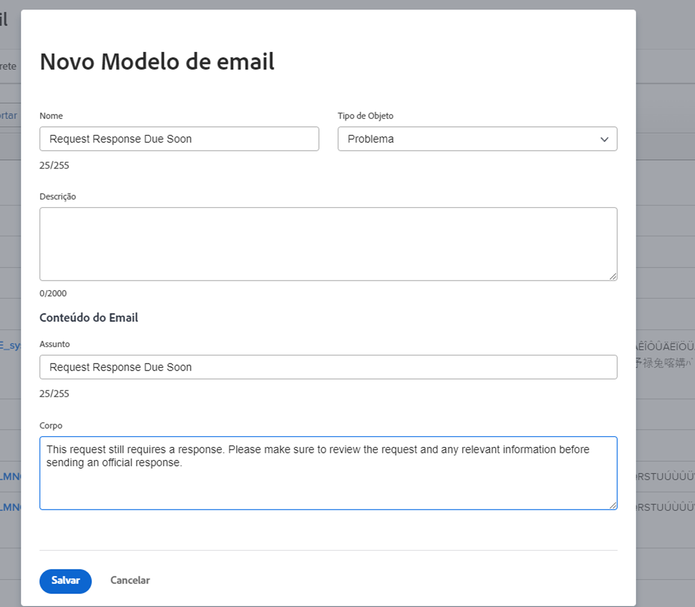

<!---
this has the same content as the system administrator notification setup and mangement section of the email and inapp notificiations learning path
--->

# Configurar notificações de lembrete

As notificações de lembrete são criadas pelos administradores do sistema na área de [!UICONTROL Configuração]. Assim elas podem ser anexadas e usadas pelos proprietários do projeto, da tarefa e do problema como lembretes de quando o trabalho está próximo ou atrasado.

Os lembretes são específicos do objeto e devem ser anexados manualmente ao item de trabalho correspondente para que a notificação possa ser enviada.

**Criar uma notificação de lembrete**

1. Clique em **[!UICONTROL Configuração]** no **[!UICONTROL Menu principal]**.
1. Clique na seção **[!UICONTROL Email]**.
1. Clique na seção **[!UICONTROL Notificações]**.
1. Clique na guia **[!UICONTROL Novo lembrete]**.
1. Clique no botão **[!UICONTROL +Nova notificação de lembrete]**.
1. Selecione o objeto desejado no menu suspenso.
1. Preencha as informações necessárias.
1. Clique em **[!UICONTROL Salvar]**.

Janela ![[!UICONTROL Nova notificação de lembrete] ](assets/admin-fund-reminder-notification-1.png)

Ao configurar o lembrete, há algumas coisas a serem consideradas:

* **[!UICONTROL Nome da notificação de lembrete]:** É o nome que será visto pelos gerentes de projeto quando anexarem um lembrete a um objeto. Certifique-se de que o nome seja sucinto, mas descritivo.
* **[!UICONTROL Período de qualificação]:** Número de horas, dias, semanas ou meses antes/depois da data selecionada na seção Tempo.
* **[!UICONTROL Tempo]:** Selecione se o lembrete deve ser enviado antes ou depois das datas planejadas, projetadas ou início efetivo/conclusão do objeto. As opções de folhas de horas estão relacionadas à data inicial, data final ou data da última atualização.
* **[!UICONTROL Critérios]:** Especifique os critérios para qualificar o lembrete a ser enviado. As opções variam dependendo do lembrete específico do objeto.
* **[!UICONTROL Destinatários]:** Selecione para quem o lembrete deve ser enviado. As opções da parte interessada variam dependendo do tipo de objeto selecionado para o lembrete.

Depois que as configurações do lembrete forem definidas e salvas, a notificação do lembrete estará disponível para os proprietários do objeto usarem dentro do [!DNL Workfront].

## Personalização de email

As notificações de lembrete usam um formato de email e uma mensagem padrão. Se quiser personalizar o email, você pode criar um modelo.

<!---
paragraph above needs a hyperlink to an article
--->

<!---
learn more URLs
--->
