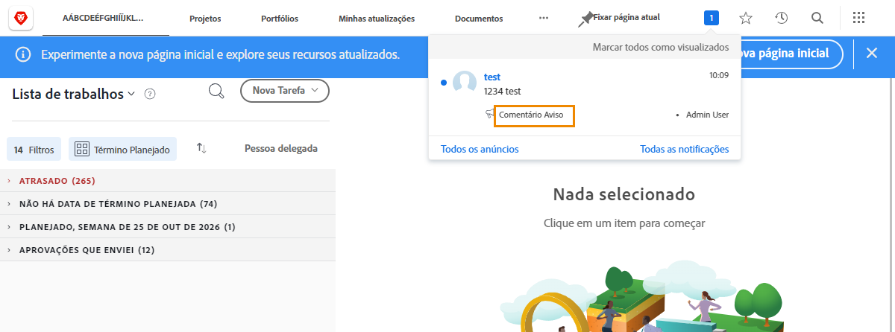
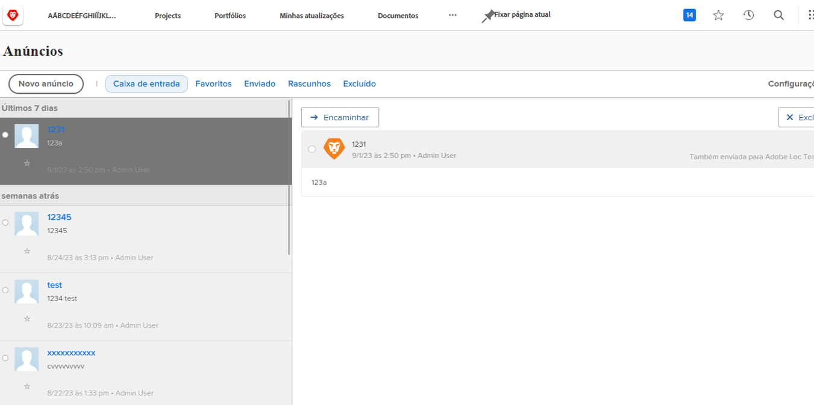

<!---
this has the same content as the system administrator notification setup and mangement section of the email and inapp notificiations learning path
--->

# Enviar [!UICONTROL Central de anúncios] messages

O [!UICONTROL centro de anúncios] é um local centralizado do qual os administradores do sistema recebem comunicações [!DNL Workfront] ou enviar anúncios para a [!DNL Workfront] usuários.

[!DNL Workfront] envia anúncios para administradores de sistema sobre versões de software, próximos webinars, manutenção de sistema e muito mais. O [!UICONTROL centro de anúncios] O coloca todas essas informações importantes em um único local, para que você não as perca entre as outras mensagens na caixa de entrada do email.

O ícone de notificação mostra notificações e anúncios não lidos enviados por [!DNL Workfront]. Os anúncios na lista são rotulados e podem ser clicados se desejar abri-los.

Os administradores do sistema também podem usar o [!UICONTROL centro de anúncios] para enviar [!DNL Workfront]mensagens para todos os usuários. Você pode enviar lembretes sobre quem entrar em contato para obter suporte, oferecer uma &quot;dica do dia&quot; e muito mais.

![[!UICONTROL Todos os anúncios] link](assets/admin-fund-announcements-2.png)

**Para enviar um anúncio**

1. Clique no botão **ícone de notificação**.
1. Clique em **[!UICONTROL Todos os anúncios]**.
1. Clique no botão **[!UICONTROL Novo anúncio]** botão. Por padrão, a variável [!UICONTROL Enviar para] preenche com [!UICONTROL Todos] para enviar uma mensagem a todos [!DNL Workfront] usuários. É possível excluir e inserir nomes de usuários, funções de trabalho, equipes, grupos ou empresas.
1. Informe uma linha de assunto.
1. Em seguida, digite o texto do anúncio, usando as ferramentas de edição, conforme desejado.
1. Anexe arquivos para compartilhamento clicando no link **[!UICONTROL Adicionar anexo]** , se aplicável.
1. Clique em **[!UICONTROL Enviar]**.

![Escrevendo um anúncio no [!UICONTROL Anúncios] página](assets/admin-fund-announcements-3.png)

A área de anúncios é semelhante a uma caixa de entrada, com mensagens recebidas no painel esquerdo. Clique em uma mensagem para lê-la.

