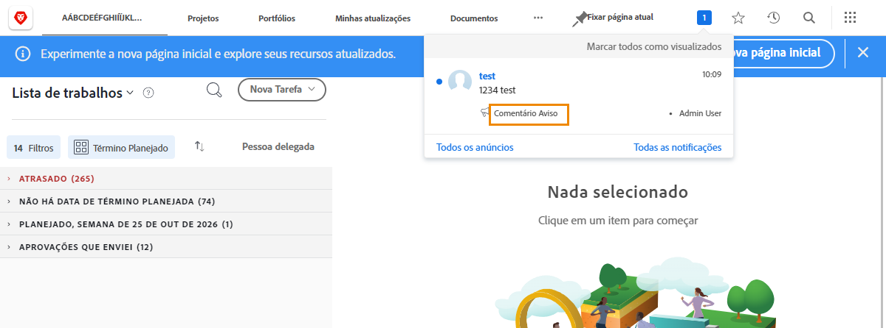
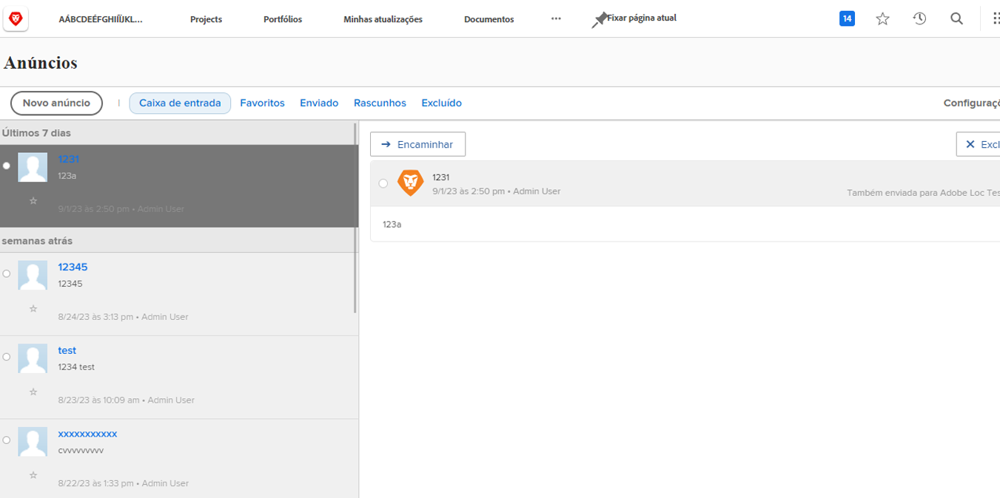

<!--
this has the same content as the system administrator notification setup and mangement section of the email and inapp notificiations learning path
-->

# Enviar mensagens por meio do [!UICONTROL centro de notificações]

O [!UICONTROL centro de notificações] é um local centralizado para admins de sistema receberem comunicados do [!DNL Workfront] ou enviarem avisos para os usuários do [!DNL Workfront] da sua organização.

O [!DNL Workfront] envia avisos a admins de sistema sobre lançamentos de software, próximos webinários, manutenção do sistema e muito mais. O [!UICONTROL centro de notificações] reúne todas essas informações importantes em um só local, para que elas não sejam perdidas entre as outras mensagens da caixa de entrada de emails.

O ícone de notificação mostra todas as notificações e avisos não lidos enviados por meio do [!DNL Workfront]. Os avisos da lista são rotulados e podem ser abertos com um clique.

Admins de sistema também podem usar o [!UICONTROL centro de notificações] para enviar mensagens de todo o [!DNL Workfront] para os usuários. Você pode enviar lembretes sobre quem contatar para obter suporte, oferecer uma “dica do dia” e muito mais.

Link ![[!UICONTROL Todos os avisos]](assets/admin-fund-announcements-2.png)

**Para enviar um aviso**

1. Clique no **ícone de notificação**.
1. Clique em **[!UICONTROL Todos os avisos]**.
1. Clique no botão **[!UICONTROL Novo aviso]**. Por padrão, a linha [!UICONTROL Enviar para] é preenchida com [!UICONTROL Todos] para enviar uma mensagem a todos os usuários [!DNL Workfront]. Você pode excluir isso e inserir nomes de usuários, funções de trabalho, equipes, grupos ou empresas.
1. Insira uma linha de assunto.
1. Em seguida, digite o texto do aviso usando as ferramentas de edição, conforme desejado.
1. Anexe arquivos para compartilhar clicando no botão **[!UICONTROL Adicionar anexo]**, se aplicável.
1. Clique em **[!UICONTROL Enviar]**.

![Criar um aviso na página [!UICONTROL Avisos]](assets/admin-fund-announcements-3.png)

A área de avisos se parece com uma caixa de entrada, com as mensagens recebidas exibidas no painel esquerdo. Clique em uma mensagem para lê-la.

