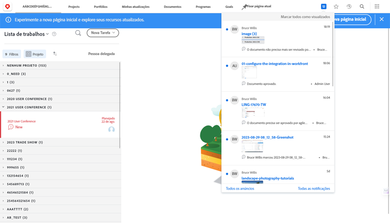
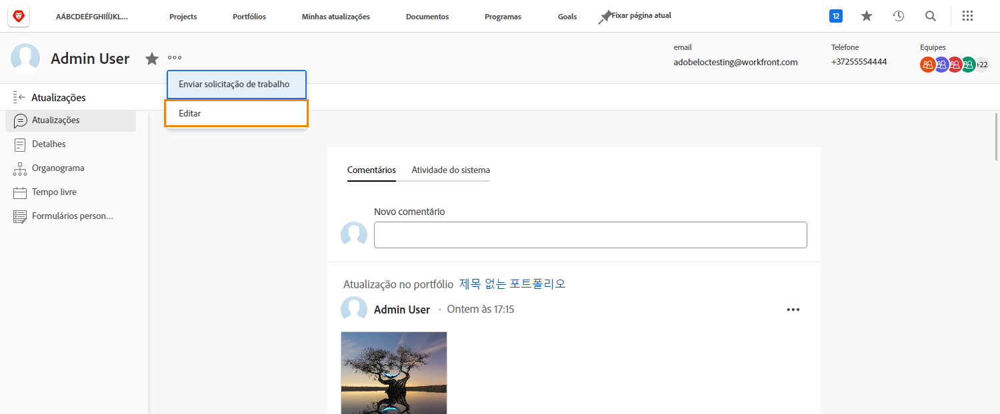

# Gerenciar notificações de evento no aplicativo e por email

O email é parte da vida útil diária e, em alguns dias, a quantidade de email que você recebe é avassaladora. No entanto, com [!DNL Workfront], os administradores do sistema podem garantir que todos recebam emails relevantes e úteis sobre o trabalho com o qual estão envolvidos.

Há vários tipos de notificações que o Workfront pode enviar para os usuários. Algumas dessas notificações são controladas no nível do sistema e afetam todos os usuários. Algumas notificações podem ser definidas para gerar emails instantaneamente em um resumo diário. Ou desativar os emails para gerar somente notificações no Workfront.

## Notificações de Eventos

Um evento é algo como uma alteração no status, um comentário publicado ou uma atribuição feita e pode acionar uma notificação no aplicativo em [!DNL Workfront].

No entanto, é possível determinar para quais eventos você deseja receber notificações por email selecionando ou desmarcando as opções nas preferências.

Para fazer essas alterações, clique no seu nome no [!UICONTROL Menu principal].

![Nome do usuário em [!UICONTROL Menu principal]](assets/admin-fund-user-notifications-02.png)

Clique em [!UICONTROL Editar] do [!UICONTROL Mais] menu.

Clique em [!UICONTROL Notificações] no [!UICONTROL Editar Pessoa] caixa pop-up.

![[!UICONTROL Editar Pessoa] janela](assets/admin-fund-user-notifications-04.png)

A partir daqui, você pode decidir quais notificações gostaria de receber instantaneamente, diariamente ou não. Todas as alterações feitas aqui são específicas para você e não afetam nenhum outro usuário no Workfront.

**[!UICONTROL Diariamente]**

Por padrão, os emails são configurados para serem enviados instantaneamente. No entanto, você pode alternar a frequência de notificação de email de [!UICONTROL Instantâneo] para [!UICONTROL Diariamente], garantindo que você obtenha as informações necessárias, quando desejar.

![[!UICONTROL Notificação] seção de [!UICONTROL Editar Pessoa] janela](assets/admin-fund-user-notifications-05.png)

A opção diária envia um resumo dos eventos do dia em um email. Os usuários recebem um email para cada agrupamento que veem na [!UICONTROL Notificações] seção.

Por exemplo, a variável [!UICONTROL Informações sobre projetos possuo] gerará um email diário, a seção [!UICONTROL Ação necessária] gerará um email diário, etc.

![[!UICONTROL Resumo diário] email para [!UICONTROL Informações sobre projetos possuo]](assets/admin-fund-user-notifications-06.png)

![[!UICONTROL Resumo diário] email para [!UICONTROL Ação necessária]](assets/admin-fund-user-notifications-07.png)

Além de selecionar a opção diária, defina um horário para o envio desses emails. Dependendo do que funcionar melhor, os emails de resumo podem ser enviados antes de você entrar no trabalho pela manhã ou antes de sair para o dia.

![[!UICONTROL Receita diária por email após] no menu suspenso da [!UICONTROL Editar Pessoa] janela](assets/admin-fund-user-notifications-08.png)

**Nem um pouco**

A opção final é desativar totalmente as notificações por email.

![Notificação selecionada desativada em [!UICONTROL Editar Pessoa] janela](assets/admin-fund-user-notifications-09.png)

Se você decidir fazer isso, saiba que, embora não esteja recebendo emails, o trabalho ainda está sendo atribuído, comentado e atualizado no [!DNL Workfront]. Ao desativar todas as notificações, talvez você esteja perdendo informações importantes que precisa estar ciente.

Há algumas instâncias em que [!DNL Workfront] O viu os usuários desativarem as notificações por email. Por exemplo, se você realizar a maior parte do seu trabalho por meio do [!DNL Workfront] no aplicativo móvel, você pode desativar as notificações por email e receber notificações somente pelo aplicativo.

Independentemente da [!UICONTROL Notificações de evento] Se você decidir receber notificações, elas serão importantes para o sucesso do trabalho realizado para as metas da sua organização.

## Recommendations

Há algumas notificações de que [!DNL Workfront] A recomenda deixar marcada, seja para um email instantâneo ou compilação diária.

Para a maioria dos usuários:

* [!UICONTROL Quando uma tarefa for concluída, enviar email para os usuários atribuídos primariamente de todas as tarefas dependentes]
* [!UICONTROL Alguém tiver me incluído em uma atualização direcionada]
* [!UICONTROL Alguém comenta sobre meu item de trabalho]
* [!UICONTROL A data de conclusão de uma tarefa atribuída a mim mudou]

Especificamente para os gestores de projeto:

* [!UICONTROL Quando uma status de projeto for alterada de ideia/aprovado/solicitado/em planejamento para atual, enviar email para a equipe]
* [!UICONTROL Quando um projeto for alterado de uma status positiva de progresso (no prazo) para uma status negativa de progresso (em atraso), enviar email para o proprietário do projeto]
* [!UICONTROL Quando um problema for adicionada enviar email para o proprietário do projeto.]
* [!UICONTROL A tarefa de marco é concluída em um projeto que eu possuo]

<!---
learn more URLs
Email notifications
guide: manage your notifications
--->
