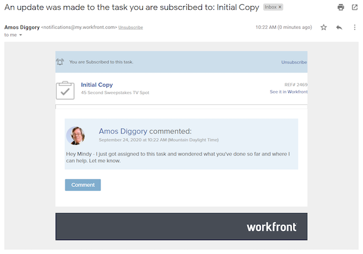
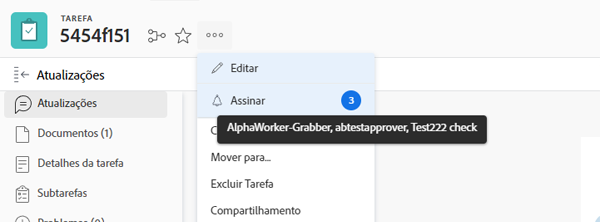

# Assinar itens de trabalho

As notificações de eventos permitem saber quais trabalhos foram atribuídos a você. No entanto, em alguns momentos, você pode querer acompanhar itens de trabalho aos quais não foi atribuído, caso eles possam afetar o seu trabalho. Assinar um item específico é a solução perfeita.

Por exemplo, suponha que você tem interesse no progresso da tarefa Cópia inicial. Você não foi atribuído(a) a esta tarefa, mas é responsável por editar a cópia inicial e gostaria de saber o que está acontecendo. É possível assinar a tarefa para que você receba uma notificação por email com atualizações em tempo real sobre o andamento do trabalho.

É importante observar que os emails de assinatura e as notificações do aplicativo são enviados somente quando comentários são feitos no item. Emails e notificações não são enviados para outras ações, como modificações de data de vencimento ou alterações de atribuição.

Para assinar um item de trabalho, você deve ter pelo menos uma permissão de compartilhamento de visualização para esse item.

Janela ![[!UICONTROL Acesso à tarefa]](assets/admin-fund-user-notifications-11.png)

Assim que você tiver acesso ao item de trabalho, assine-o da seguinte forma:

1. Acesse a página de destino do projeto, tarefa ou problema.
1. Clique no menu de **[!UICONTROL Ações]**.
1. Clique em **[!UICONTROL Assinar]**.

Opção ![[!UICONTROL Assinar] no menu de tarefas](assets/admin-fund-user-notifications-12.png)

Você pode ver quem mais assinou o item de trabalho passando o mouse sobre o número ao lado de [!UICONTROL Assinar/Cancelar inscrição] no menu.

Se você tem permissão para [!UICONTROL Gerenciar] ou [!UICONTROL Compartilhar] o item de trabalho, poderá inscrever outros usuários em um projeto, tarefa ou problema:

1. Clicando no número ao lado da opção **[!UICONTROL Assinar]**.
1. Adicionando o nome da(s) pessoa(s) que você deseja inscrever no item de trabalho.
1. Clicando em **[!UICONTROL Salvar]**.

Janela ![[!UICONTROL Assinar]](assets/admin-fund-user-notifications-15.png)

As pessoas que você inscreve não são notificadas sobre a assinatura. Todos os assinantes recebem permissões de visualização do item. No entanto, se o assinante já tiver permissão para [!UICONTROL Contribuir] ou [!UICONTROL Gerenciar] o item, elas permanecem inalteradas.

Uma entrada na guia [!UICONTROL Atualizações] do item individual também indica quem assinou e quando. A guia [!UICONTROL Atualizações] também registra quando um usuário é inscrito por outra pessoa.

Página de ![[!UICONTROL Atualizações] em uma tarefa que mostra as assinaturas](assets/admin-fund-user-notifications-16.png)

Para cancelar a inscrição de um usuário, clique no balão novamente para abrir a janela [!UICONTROL Assinantes]. Em seguida, clique no X ao lado do nome da pessoa. O usuário não é notificado de que sua assinatura foi cancelada.

Opção de menu ![[!UICONTROL Cancelar inscrição] em um projeto](assets/admin-fund-user-notifications-14.png)

<!--
learn more URL: Subscribe to items in Workfront
-->
