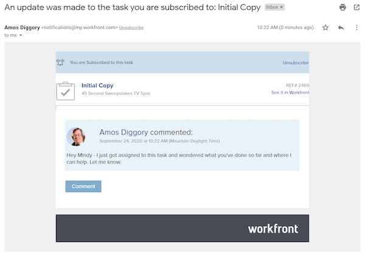

# Assinar itens de trabalho

As notificações de eventos atualizam você sobre o trabalho ao qual foi atribuído. No entanto, pode haver momentos em que você queira seguir itens de trabalho aos quais não está atribuído, pois isso pode afetar o trabalho que você faz. Assinar um item específico é a solução perfeita.

Por exemplo, você está interessado no progresso da tarefa Cópia inicial. Você não está atribuído a esta tarefa, mas é responsável por editar essa cópia inicial e gostaria de saber o que está acontecendo. Você pode se inscrever na tarefa e, quando houver atualizações, receber uma notificação por email fornecendo uma atualização em tempo real sobre o andamento desse trabalho.

É importante observar que os emails de assinatura e as notificações no aplicativo são enviados somente quando comentários são feitos no item. Emails e notificações não são enviados em outras ações, como modificações de data de vencimento ou alterações de atribuição.

Para assinar um item de trabalho, você deve ter pelo menos uma permissão de compartilhamento de Exibição para esse item.

![[!UICONTROL Acesso à tarefa] janela](assets/admin-fund-user-notifications-11.png)

Depois de ter acesso ao item de trabalho, assine-o:

1. Ir para a página de aterrissagem do projeto, tarefa ou problema.
1. Clicar no **[!UICONTROL Ações]** menu.
1. Clicando **[!UICONTROL Assinar]**.

![[!UICONTROL Assinar] opção no menu de tarefas](assets/admin-fund-user-notifications-12.png)

Você pode ver quem mais se inscreveu no item de trabalho, passando o mouse sobre o número ao lado de [!UICONTROL Assinar/cancelar assinatura] no menu.

Se você tiver [!UICONTROL Gerenciar] ou [!UICONTROL Compartilhar] permissões para o item de trabalho, é possível inscrever outros usuários em um projeto, tarefa ou problema ao:

1. Clicar no número ao lado da variável **[!UICONTROL Assinar]** opção.
1. Adicionando o nome da(s) pessoa(s) que deseja assinar o item de trabalho.
1. Clicando **[!UICONTROL Salvar]**.

![[!UICONTROL Assinar] janela](assets/admin-fund-user-notifications-15.png)

As pessoas que você assinar não serão notificadas da assinatura. Todos os assinantes recebem permissões de Exibição para o item. No entanto, se o assinante já [!UICONTROL Contribute] ou [!UICONTROL Gerenciar] ao item, essas permissões permanecerão inalteradas.

Uma entrada no [!UICONTROL Atualizações] no item individual também indica quem se inscreveu e quando. A variável [!UICONTROL Atualizações] A guia também registra quando um usuário é inscrito por outra pessoa.

![[!UICONTROL Atualizações] página em uma tarefa que mostra a assinatura](assets/admin-fund-user-notifications-16.png)

Para cancelar a assinatura de um usuário, clique no balão novamente para abrir a [!UICONTROL Assinantes] janela. Em seguida, clique no X ao lado do nome da pessoa. O usuário não é notificado de que teve a assinatura cancelada.

![[!UICONTROL Cancelar inscrição] opção de menu em um projeto](assets/admin-fund-user-notifications-14.png)

<!---
learn more URL: Subscribe to items in Workfront
--->
