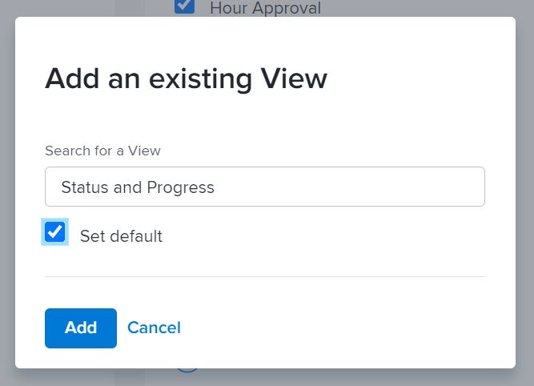

# Personalizar listas de relatórios com modelos de layout

Neste vídeo, você aprenderá a:

* Navegar até as configurações da lista de relatórios em um modelo de layout
* Remover filtros, visualizações e agrupamentos
* Adicionar filtros, visualizações e agrupamentos

>[!VIDEO](https://video.tv.adobe.com/v/335079/?quality=12&learn=on&enablevpops=1)

## Definir padrões de lista

Definir filtros, visualizações e/ou agrupamentos padrão para os usuários garante um acesso mais rápido a informações importantes, o que pode acelerar o andamento do trabalho.

Como admin de sistema ou de grupo, você pode determinar o que os usuários veem inicialmente ao consultar uma lista de projetos, tarefas, problemas etc., definindo um filtro, uma visualização e/ou um agrupamento padrão através de um modelo de layout.

![Janela [!UICONTROL Listas] do modelo de layout](assets/admin-fund-layout-template-default-lists-1-1.JPG)

>[!NOTE]
>
>Embora seja possível configurar um filtro, visualização e/ou agrupamento padrão, o sistema geralmente mostrará qualquer filtro, visualização e/ou agrupamento que o usuário tenha utilizado por último.

Se quiser definir uma lista padrão, você pode:

* Passar o mouse sobre uma opção já listada e clicar em [!UICONTROL Definir como padrão].

![Janela [!UICONTROL Listas] do modelo de layout com a opção [!UICONTROL Definir como padrão] visível](assets/admin-fund-layout-template-default-lists-1-2.JPG)

* Ou adicionar um filtro, visualização ou agrupamento personalizado e marcar a caixa ao lado de [!UICONTROL Definir padrão].

Janela 

Depois de concluir, você verá a tag [!UICONTROL Padrão].

Tag ![[!UICONTROL Padrão] próxima à opção de lista](assets/admin-fund-layout-template-default-lists-1-4.JPG)
