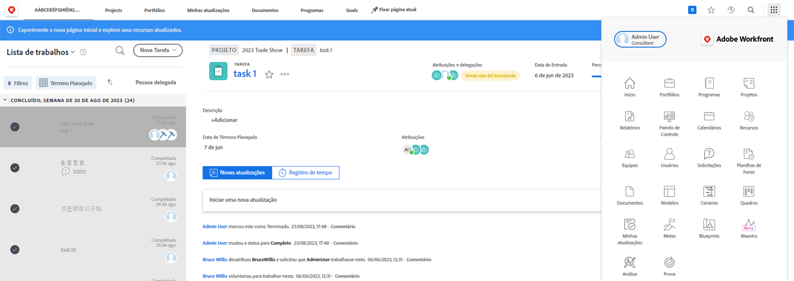
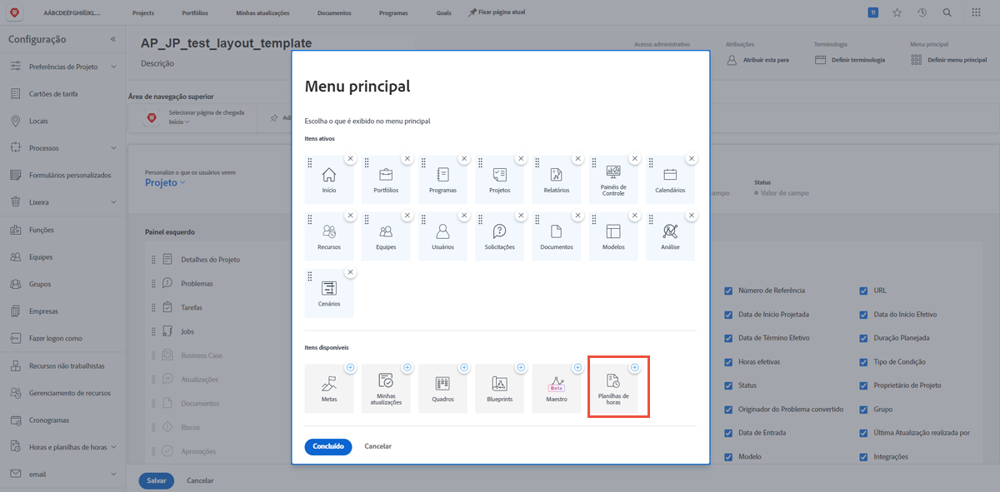
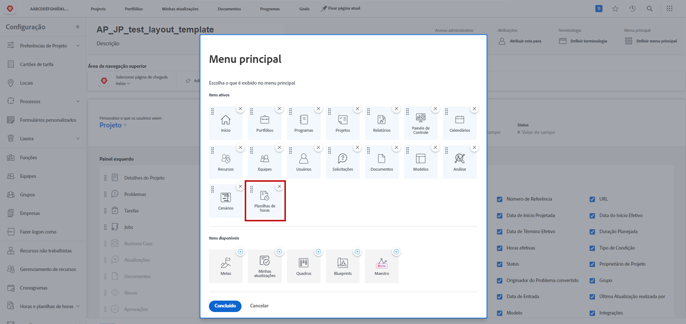

# O que são modelos de layout?

O Workfront possui muitas ferramentas úteis para ajudar você a realizar o trabalho. Mas mesmo que sejam úteis, o excesso de recursos também pode sobrecarregar.

Os modelos de layout permitem que admins de sistema e de grupo personalizem a experiência do usuário e aumentem o foco no que realmente é importante.

Por exemplo, a maior parte da sua organização não registra o tempo gasto. No entanto, a equipe de consultoria envia faturas para os clientes, por isso ela precisa registrar o tempo gasto para garantir um faturamento preciso. Com um modelo de layout, as folhas de horas podem ser ocultadas para quem não precisa delas e exibidas para quem precisa.

## Antes de criar

O Workfront recomenda conversar com seus usuários antes de criar um modelo de layout. Envolver as pessoas que usarão o modelo de layout no processo, como admins de grupo, tornará muito mais fácil disponibilizar as informações e ferramentas certas para cada usuário.

Além disso, não tenha medo de fazer alterações após a criação de um modelo. Continue solicitando feedback sobre o que precisam (e desejam) ver e acessar. Lembre-se de que os modelos de layout têm como objetivo criar uma experiência simples e fácil para usuários.
