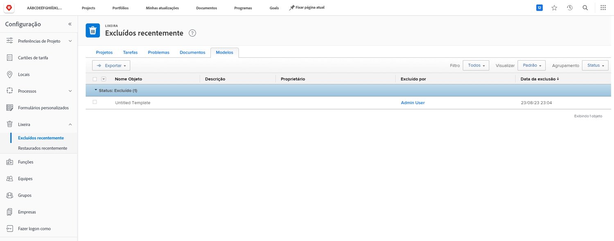
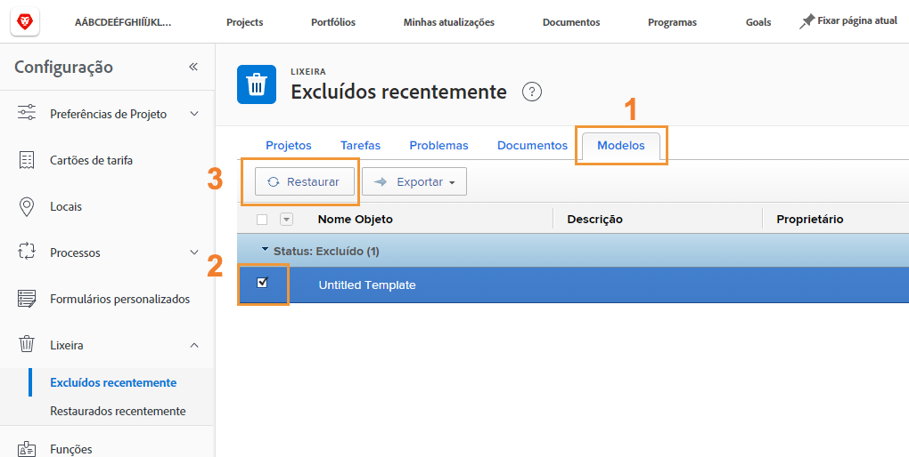
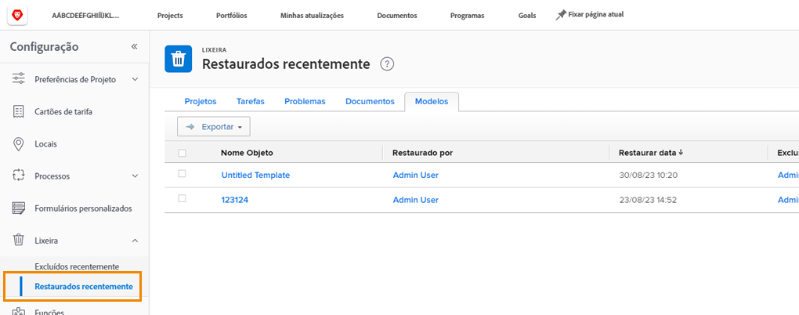

# Restaurar objetos da Lixeira

O trabalho do projeto passa por muitas mudanças. Você pode excluir algo e, 30 minutos depois, perceber que a tarefa era necessária ou que o documento era essencial para o problema que você está tentando resolver.

Porém, quando o objeto é excluído, o Workfront o coloca na Lixeira por até 30 dias. Admins de sistema podem restaurar o objeto à sua posição original no Workfront, juntamente com todas as suas informações (atualizações, horas registradas, documentos etc.).

## Restaurar um objeto

1. Selecione a área **Configuração** no **Menu principal**.
1. Clique na **Lixeira** no painel esquerdo.
1. Selecione **Excluído recentemente**.

Cada objeto restaurável possui uma guia que facilita a localização do item específico a ser restaurado.

1. Clique na guia do objeto desejado.
1. Marque a caixa ao lado dos objetos a serem restaurados.
1. Clique no botão **Restaurar**.

Os objetos que estão sendo restaurados aparecerão brevemente em uma seção [!UICONTROL Em progresso]. Depois que a tela for atualizada, os objetos desaparecerão dessa área, visto que foram restaurados. Os itens aparecem onde estavam anteriormente no [!DNL Workfront], o que pode ser verificado na tela [!UICONTROL Restaurados recentemente].

Admins de grupo podem restaurar um projeto que esteja associado ao grupo que gerenciam, juntamente com quaisquer tarefas, problemas ou documentos associados.

<!--
learn more URL
Restoring deleted items
Viewing items that have been recently restored
-->
