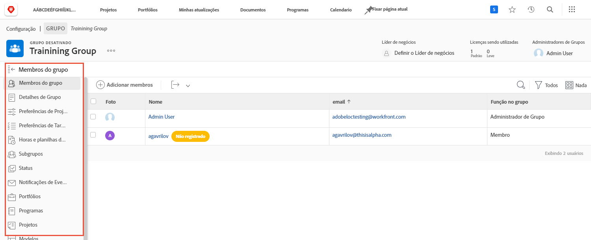

# Entender a necessidade de administradores de grupo

<!---
21.4 updates have been made
--->

Quando você é o administrador do sistema para uma grande empresa ou que tem muito de [!DNL Workfront] usuários, manter [!DNL Workfront] as configurações de cada grupo e subgrupo podem ser demoradas.

Nomeando administradores de grupos que podem executar algumas funções administrativas para seus próprios grupos em [!DNL Workfront] ajuda a equilibrar a carga quando se trata de atualizar e manter o sistema.

Os administradores de grupo tendem a estar mais em sintonia com os desafios diários de seu grupo, para que possam gerenciar as necessidades do grupo. Isso permite que você, como administrador do sistema, se concentre na função [!DNL Workfront] configurações que beneficiam sua organização como um todo.

Algumas das coisas que os administradores de grupo podem fazer no [!DNL Workfront] incluem:

* Crie subgrupos e adicione usuários aos subgrupos.
* Crie modelos de layout para o grupo.
* Criar processos de aprovação para o grupo.
* Crie status de fluxo de trabalho em nível de grupo.
* Acesse projetos, programas e portfólios associados ao grupo na página do grupo.
* Gerencie projetos no nível do grupo, tarefas e preferências de emissão.
* Gerenciar preferências de folha de ponto no nível do grupo.
* Gerencie notificações de eventos no nível do grupo.
* Faça logon como outros membros do grupo.
* Atribua um líder de negócios ao grupo.
* Gerencie uma empresa.

Como administrador de sistema ou de grupo, é possível criar subgrupos dentro dos grupos e subgrupos que você administra. Esses subgrupos podem receber seus próprios administradores de grupo.

>[!NOTE]
>
>Existe um limite de 14 níveis de subgrupos em um grupo.

**Saiba mais sobre administradores de grupo**

<!---
bullet points below need hyperlinks
--->

Para obter uma lista de quais administradores de sistema, administradores de grupo e administradores de subgrupo podem fazer em [!DNL Workfront], consulte o artigo Ações permitidas para diferentes tipos de administradores.

## Gerenciar um grupo

Gerencie de forma rápida e eficiente membros do grupo, subgrupos, status do grupo, preferências de projeto do grupo e muito mais da página de grupo em [!DNL Workfront].

1. Selecionar **[!UICONTROL Configuração]** do **[!UICONTROL Menu principal]**.
1. Ir para **[!UICONTROL Grupos]** no painel esquerdo.
1. Selecione o nome de um grupo para abri-lo.
1. Abra a seção na qual deseja fazer atualizações clicando nela no painel esquerdo.

<!---
learn more URLs
Create and manage groups 
Create and manage subgroups 
Business leader overview 
--->
