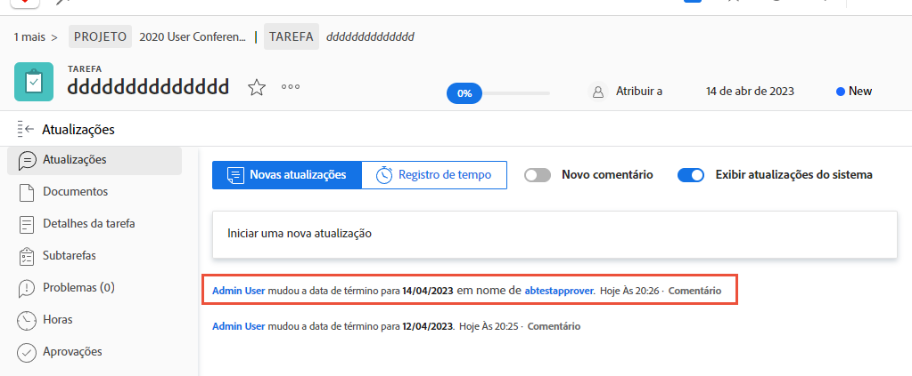

# Fazer logon como outro usuário

Um recurso que admins do Workfront consideram útil ao configurar a experiência do usuário é o recurso “Fazer logon como”. Esta função da área de [!UICONTROL Configuração] permite que você faça logon como outro usuário sem precisar se desconectar de sua própria conta.

Página ![[!UICONTROL Fazer logon como] na área de [!UICONTROL Configuração]](assets/admin-fund-log-in-as-1.png)

## Benefícios da opção Fazer logon como

Esse recurso é útil por vários motivos:

* Admins podem visualizar modelos de layout atribuídos aos usuários para garantir que os itens de menu ou painéis sejam exibidos corretamente.
* É útil durante o teste do fluxo de trabalho, para garantir que as permissões do usuário sejam configuradas corretamente.
* Admins podem até mesmo usar esse recurso para marcar uma tarefa como concluída ou fazer uma aprovação para alguém que não possa realizá-la.

## Acessar a opção Fazer logon como

1. Selecione **[!UICONTROL Configuração]** no **[!DNL Main Menu]**.
1. Clique em **[!UICONTROL Fazer logon como]** no painel esquerdo.
1. Insira o nome do usuário como o qual você precisa fazer logon.

Guia ![[!UICONTROL Registro de acesso] na página [!UICONTROL Fazer logon como] ](assets/admin-fund-log-in-as-3.png)

Depois de fazer logon, uma notificação na parte superior da tela indicará qual usuário está conectado.

Mensagem ![[!UICONTROL Conectado como] na parte superior da janela do [!DNL Workfront]](assets/admin-fund-log-in-as-2.png)

## A guia Atualizações monitora as atividades

Quando um(a) admin realiza o logon como outro usuário e faz alterações ou atualizações em nome desse usuário, as alterações são exibidas na área Atualizações do item em questão. O exemplo abaixo mostra que Joan Harris alterou a data de vencimento em nome de Roy Campbell.

