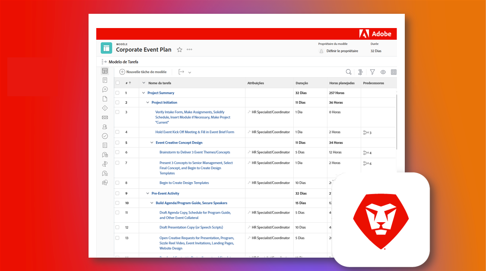

# Assuma o controle de uma instância existente do Adobe Workfront

O aspecto mais incrível do Workfront é o quanto ele é personalizável. O aspecto mais desafiador do Workfront é o quanto ele é personalizável. E, se você for um novo administrador de sistema ou grupo que está assumindo o controle de uma instância existente do Workfront, pode ser difícil descobrir como ela foi configurada e definida originalmente.

No entanto, por meio da nossa lista de verificação de instâncias herdadas, você pode aprender tudo o que precisa saber sobre a sua instância.

  

Na lista de verificação de instâncias herdadas, você analisará um conjunto abrangente de perguntas, recursos e links para ter uma compreensão clara de como ela foi configurada.

A lista de verificação foi criada como um blueprint do Workfront e como uma planilha do Excel para download. Recomendamos usar o blueprint para gerenciar e documentar o seu trabalho diretamente no Workfront.

Tanto o blueprint quanto a planilha são organizados por tópico, não por cronograma, para que você possa progredir da maneira que fizer mais sentido para você e a sua organização. As durações fornecidas são apenas um exemplo, sendo necessário ajustá-las para suprir as suas necessidades específicas. Isso não precisa ser feito de uma vez!

Sempre que possível, recomendamos trabalhar com outras pessoas da sua organização para revisar e documentar esses elementos, e manter a sua documentação atualizada, caso haja alguma alteração importante. Os futuros administradores da sua instância agradecerão!

* <b>Para baixar o blueprint</b>, navegue até o menu principal na sua própria instância do Workfront e selecione “Blueprints”. Encontre o blueprint intitulado “Noções básicas de instâncias herdadas | Lista de verificação” e clique em “Instalar”. Escolha o seu ambiente de produção ou sandbox, e continue configurando. Mais informações sobre como instalar e configurar blueprints podem ser encontradas [aqui](https://experienceleague.adobe.com/docs/workfront/using/administration-and-setup/blueprints/blueprints-install.html?lang=pt-BR).

* <b>Para baixar lista de verificação</b> do Excel, clique [aqui](assets/adobe-workfront-system-admin-playbook-inherited-instance.xlsx).

Seja usando o blueprint ou a lista de verificação do Excel, você pode pensar no processo em três fases principais: descoberta, auditoria e documentação. As descrições e os resultados ideais estão listados abaixo.

 
 

## Fase 1: aprendizagem e descoberta

<b>Período sugerido: quatro semanas</b>

A primeira coisa a fazer é entender como a sua instância do Workfront está configurada hoje.

Isso envolve a realização de entrevistas com as partes interessadas e a revisão de qualquer documentação existente para entender como vários grupos dentro da sua organização estão utilizando o Workfront.

Caso não conheça o Workfront do ponto de vista tecnológico, faça o treinamento para administradores de sistemas. Isso fornece os insights necessários sobre como diferentes configurações funcionam e afetam cada ferramenta e, potencialmente, cada usuário do Workfront.

No fim desta fase, você deverá ter:

* Uma compreensão clara do PORQUÊ por trás do uso do Workfront pela sua organização;

* Uma noção geral da integridade da sua instância, incluindo os principais casos de uso;

* Um documento descrevendo o que está funcionando bem, bem como os desafios e/ou lacunas entre processos e necessidades dos usuários
 
 

## Fase 2: auditoria do sistema

<b>Período sugerido: quatro semanas </b>

Após a descoberta inicial, é recomendável fazer uma auditoria mais técnica da sua instância. Isso significa que você precisa determinar as alterações ou melhorias que podem ser necessárias para garantir que a sua instalação e configuração atuais satisfaçam os seus requisitos e necessidades comerciais.

No fim desta fase, você deverá ter:

* Uma visão mais aprofundada do estado atual da sua instância

* Alterações ou melhorias identificadas que você gostaria de fazer na sua instância para suprir as necessidades comerciais.
 
 

## Fase 3: documentação e otimização

<b>Prazo sugerido: inicial = duas semanas; atualização contínua </b>

Com base no que você aprendeu nas fases 1 e 2, você poderá criar ou atualizar a documentação da sua instância, bem como desenvolver roteiros para enfrentar desafios estratégicos e no âmbito dos programas.

Enquanto essa fase estiver em andamento, você deverá ter:

* Documentação centralizada escrita que responda a perguntas nas guias deste documento

* Um diagrama visual dos fluxos de trabalho, automações e integrações de maior prioridade;

* Um backlog ou roteiro que documente melhorias futuras para ajudar a encarar os desafios organizacionais e estratégicos

 
Ao passar por cada fase e com ajuda da lista de verificação de instâncias herdadas, você, como responsável pela administração de sistema ou grupo, deverá ter uma melhor compreensão de como a sua instância do Workfront está configurada, quais ajustes ou melhorias precisam ser feitos, e solidificar a sua documentação para otimizar a experiência da sua organização com o Workfront.

 
 

Informações adicionais podem ser encontradas abaixo:
* [Webinar: dicas para assumir o controle de uma instância herdada](https://experienceleaguecommunities.adobe.com/t5/workfront-discussions/webinar-system-admin-essentials-tips-for-taking-over-an-existing/td-p/571873?profile.language=pt)
* [Definição de objetivos para a sua implementação do Workfront](https://experienceleague.adobe.com/docs/workfront/using/administration-and-setup/get-started-administration/define-wf-goals-objectives.html?lang=pt-BR)
* [Publicação do blog: Patrocínio executivo e valor para a liderança](https://experienceleaguecommunities.adobe.com/t5/workfront-blogs/customer-success-tips-executive-sponsorship-and-value-to/ba-p/518353?profile.language=pt)
* [Publicação do blog: Introdução aos KPIs do Adobe Workfront](https://experienceleaguecommunities.adobe.com/t5/workfront-blogs/kpi-dashboards-in-the-new-workfront-experience-introduction-to/ba-p/549001?profile.language=pt)
