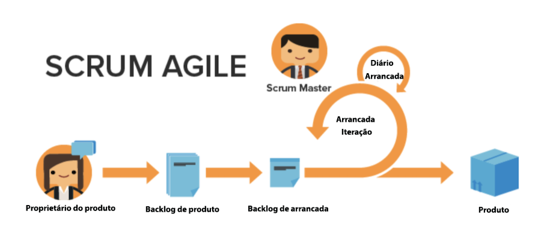

# Benefícios do uso do Agile

## Capacidade de ajustar e girar rapidamente

Como o nome sugere, a metodologia Agile permite que as equipes estejam mais bem equipadas para mudar rapidamente de direção e foco. As empresas de software e marketing estão especialmente cientes da tendência das mudanças na demanda ocorrerem de semana para semana. O Agile permite que as equipes reavaliem o trabalho que estão realizando e ajustem determinados incrementos para garantir que, à medida que o trabalho e o cenário do cliente mudarem, o foco também mude para a equipe.

## Transparência no trabalho de uma equipe

As equipes Agile usam reuniões diárias chamadas de &quot;stand-ups&quot; para garantir que a equipe permaneça focada na lista priorizada de recursos ou produtos a serem desenvolvidos. Eles não sentem mais a confusão de não saber no que todos os outros membros de sua equipe estão trabalhando. Eles controlam regularmente o que a equipe realizou no dia anterior, os problemas/bloqueios que possam ter que precisam ser solucionados e o que planejam trabalhar nesse dia.

Ter essa transparência e direção unificada permite que todos avancem mais rápido.

## Feedback frequente

O principal benefício final de adotar o Agile seria o loop de feedback que é incorporado no final de cada iteração (lembre-se: uma iteração é uma quantidade definida de tempo na qual a equipe precisa trabalhar para concluir produtos específicos). O ciclo de feedback permite que uma equipe olhe para as últimas semanas para determinar quais problemas surgiram, como o plano pode estar mudando no futuro, o que o cliente agora precisa se as necessidades anteriores mudaram e as lições aprendidas como equipe.
