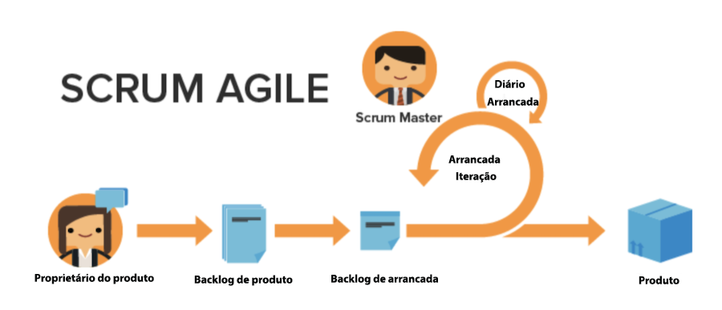

# Benefícios de usar uma metodologia ágil

## Capacidade de se realizar ajustes e modificações rápidas

Como o nome sugere, a metodologia Ágil permite que as equipes estejam mais bem equipadas para mudar rapidamente de direção e foco. As empresas de software e marketing, em particular, estão bem atentas à tendência das mudanças na demanda que ocorrem toda semana. A metodologia Ágil permite que as equipes reavaliem o trabalho que estão realizando e o ajustem de forma a garantir que o foco da equipe se adapte às mudanças nas necessidades do trabalho e do cliente.

## Transparência no trabalho de uma equipe

As equipes Ágil realizam reuniões diárias (chamadas de “stand-up”) para garantir que permaneçam focadas nos principais recursos ou produtos que devem ser desenvolvidos. Isso elimina a confusão de não saber com o que outros membros da equipe estão trabalhando. Essas reuniões permitem manter o controle sobre o que a equipe realizou no dia anterior, quais problemas ou obstáculos precisam ser resolvidos e qual será o foco do trabalho naquele dia.

Essa transparência e direção unificada permite que todos(as) avancem mais rápido.

## Feedback frequente

O principal benefício da adoção da metodologia Ágil é o ciclo de feedback incorporado no final de cada iteração (lembre-se: uma iteração é um determinado período de tempo durante o qual a equipe trabalha para concluir entregas específicas). O ciclo de feedback permite que uma equipe analise as últimas semanas para determinar quais problemas surgiram, como o plano pode mudar no futuro, o que o cliente precisa naquele momento (caso suas necessidades anteriores mudem) e as lições aprendidas em equipe.
