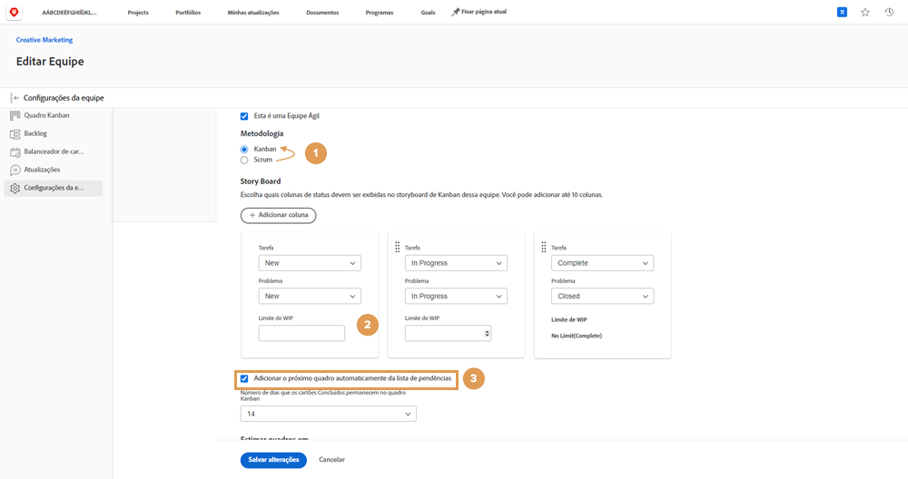
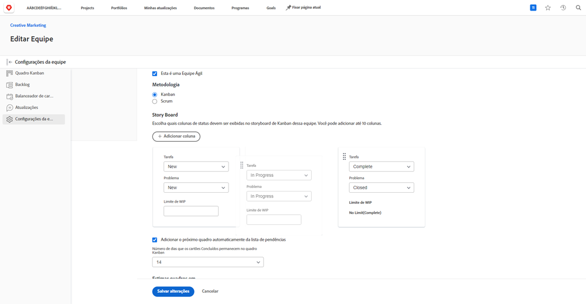
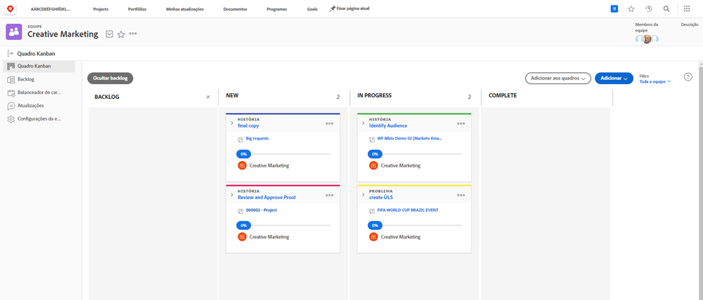
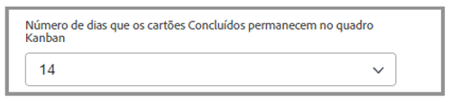

# Criar uma equipe kanban

A Equipe de Marketing Criativo vem usando o Scrum há algum tempo. Eles apreciam o ambiente flexível de uma equipe ágil, mas estão achando difícil autorizar histórias para um período específico por causa da frequência com que as prioridades mudam para sua equipe.

Eles têm uma alternativa para o Scrum. Chama-se Kanban.

Kanban trabalha para equipes que não desejam definir o que estão trabalhando dentro do período exigido por uma iteração baseada em Sombreamento. Em vez disso, Kanban permite que as equipes trabalhem continuamente por meio de seus registros.

Vamos mudar a Equipe de Marketing Criativo de uma equipe de Scrum para uma equipe Kanban [1]. Faça essa alteração na seção Ágil das Configurações da equipe.

Depois de alterar a metodologia, você precisa especificar quantas histórias uma equipe Kanban pode ter de cada vez em cada coluna ajustando o &quot;limite WIP&quot;. [2]. WIP significa Trabalho em Andamento. O número que você escolher colocar aqui depende de quantos itens ativos a equipe pode lidar. Ele será exibido no storyboard da equipe para ajudá-lo a lembrá-lo se o alocamento for excessivo ou não. Você (e qualquer membro da equipe com direitos de edição) também pode alterar o limite WIP diretamente do storyboard.

Observe que você pode arrastar e soltar colunas de status para colocá-las na ordem em que gostaria que estivessem.

Equipes kanban também podem optar por fazer com que a próxima história no backlog apareça automaticamente no storyboard quando uma história for concluída [veja o número 3 na imagem superior]. Isso ajudará as equipes que preferem um ciclo de trabalho contínuo.

A imagem abaixo mostra como é quando uma nova história aparece automaticamente no storyboard quando uma história é concluída.

Para ajudar a gerenciar seu trabalho concluído com mais eficiência, as histórias permanecem no quadro por 14 dias por padrão.

Se necessário, essa configuração pode ser ajustada para entre 1 e 30 dias na janela de configurações do grupo.

Lembre-se de que, mesmo que essa seja uma metodologia diferente, ainda é importante, ao trabalhar em um ambiente ágil, continuar aumentando o atraso discutindo os requisitos da história e ajustando a prioridade da história. Sempre que quiser priorizar novamente o backlog, será necessário mover uma guia até a guia Backlog para reorganizá-lo.
