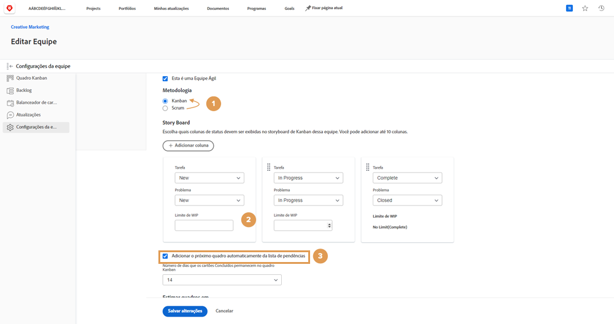
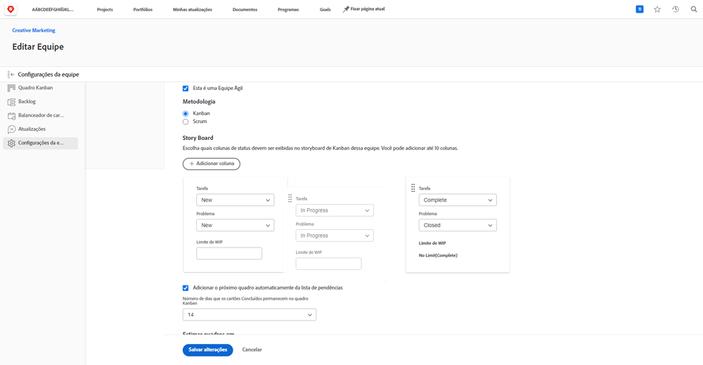
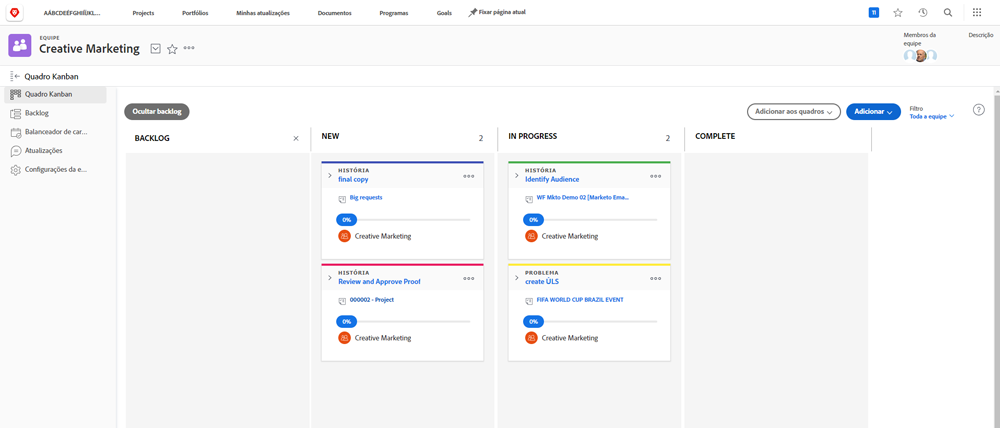
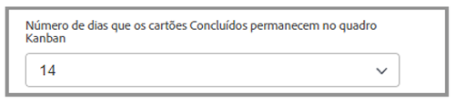

# Criar uma equipe Kanban

A equipe de marketing criativo utiliza Scrum há um bom tempo. Essas pessoas apreciam o ambiente flexível de uma equipe ágil, mas acham difícil concluir suas histórias dentro de um prazo específico devido à frequência com que as prioridades da equipe mudam.

Mas existe uma alternativa para o Scrum. Ela se chama Kanban.

O Kanban é destinado a equipes que não querem definir seu trabalho atual no período exigido por uma iteração baseada em Scrum. Em vez disso, o Kanban permite que as equipes trabalhem continuamente em sua lista de pendências.

Vamos transferir a equipe de marketing criativo de uma equipe Scrum para uma equipe Kanban [1]. Faça essa alteração na seção Ágil das Configurações da equipe.

Depois de alterar a metodologia, você precisa especificar quantas histórias uma equipe Kanban pode ter por vez em cada coluna ajustando o &quot;limite WIP&quot;. [2]. WIP significa Work in Progress (Trabalho em andamento). O número que deve ser inserido aqui depende de quantos itens ativos a equipe pode controlar. Ele será exibido no storyboard da equipe para ajudar a lembrá-los se estão superalocados ou não. Você (e qualquer membro da equipe com direitos de edição) também pode alterar o limite de WIP diretamente do storyboard.

Observe que você pode arrastar e soltar as colunas de status para colocá-las na ordem desejada.

As equipes Kanban também podem optar por exibir automaticamente a próxima história da lista de pendências no storyboard quando uma história for concluída [Veja o número 3 na imagem superior]. Isso ajuda as equipes que preferem um ciclo de trabalho contínuo.

A imagem abaixo mostra o que acontece quando uma nova história é exibida automaticamente no storyboard após a conclusão de uma história.

Para ajudar a gerenciar seu trabalho concluído com mais eficiência, por padrão, as histórias permanecem no quadro por 14 dias.

Se necessário, essa configuração pode ser ajustada entre 1 e 30 dias na janela de configurações da equipe.

Observe que, embora esta seja uma metodologia diferente, ao trabalhar em um ambiente ágil, ainda é importante organizar continuamente a lista de pendências, conversando sobre os requisitos da história e ajustando as prioridades. Sempre que desejar priorizar novamente a lista de pendências, será necessário mover uma guia para a lista de pendências para reorganizá-la.
