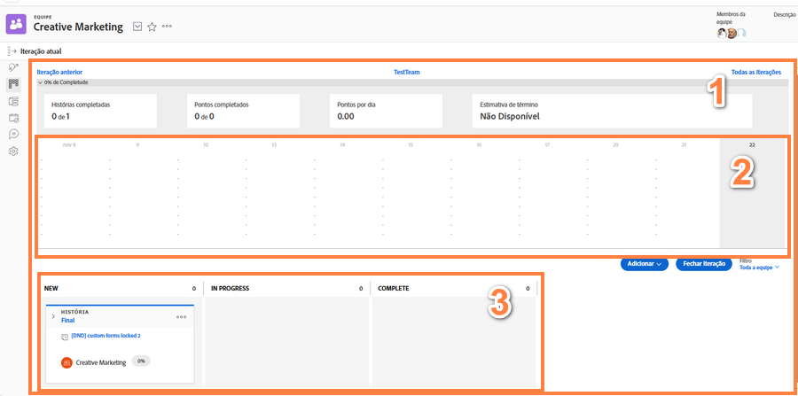

# Crie uma equipe ágil de Scrum

## Configurar uma equipe de Scrum

Uma equipe ágil no Workfront conclui seu trabalho na página de iteração [1]. O gráfico de burndown [2] na parte superior da página é uma visão geral do andamento atual dessa iteração. Abaixo do gráfico de burndown estão as histórias [3] com as quais a equipe se comprometeu nesta iteração.

Neste vídeo, você aprenderá a criar uma equipe ágil, selecionar a metodologia Scrum e determinar as configurações para a equipe de Scrum.

### Configurar uma equipe de Scrum do zero

Agora que você sabe como será a aparência final da equipe, é possível pular direto para a configuração no Workfront. Vamos analisar as configurações usando um estudo de caso de uma empresa chamada Swains. Você é responsável pelas operações da equipe criativa e deu autorização para que a equipe de marketing migrasse para o processo ágil.

Esta equipe em particular decidiu adotar a metodologia Scrum porque gostam da visibilidade aprimorada do storyboard, que permite saber quem está fazendo o que e em que status ou estágio os itens de trabalho se encontram. A possibilidade de planejar iterações curtas é útil quando consideram a sua demanda de trabalho atual. A equipe normalmente recebe campanhas de marketing de 2 a 3 semanas e precisa ser capaz de priorizar o que sua equipe pode fazer em tão pouco tempo.

## Criar uma equipe ágil de Scrum no Workfront

Neste vídeo, você aprenderá a:

- Criar uma equipe ágil
- Selecionar a metodologia Scrum
- Determinar as configurações da equipe de Scrum

>[!VIDEO](https://video.tv.adobe.com/v/346281/?quality=12&learn=on&enablevpops)

Já tem uma equipe no Workfront que deseja converter em uma equipe ágil? Sem problemas! Acesse as Configurações da equipe e marque a caixa “Esta é uma equipe ágil”.

## Alteração na configuração da equipe de Scrum

A opção “Na guia Problemas, mostrar” não está mais incluída na página de configurações da equipe, visto que a guia Problemas não é mais necessária para equipes ágeis. Os problemas atribuídos a uma equipe são encontrados na guia Lista de pendências, o que facilita o planejamento de iterações que incluem tarefas e problemas.
