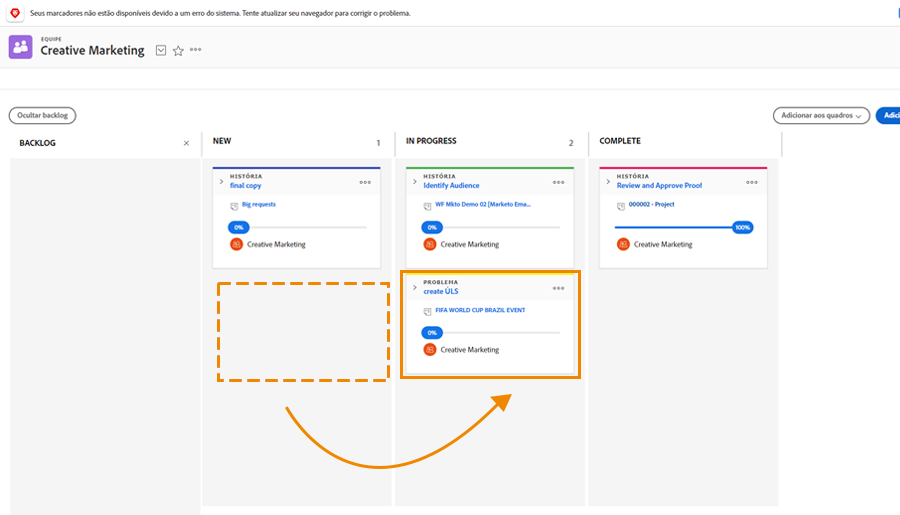
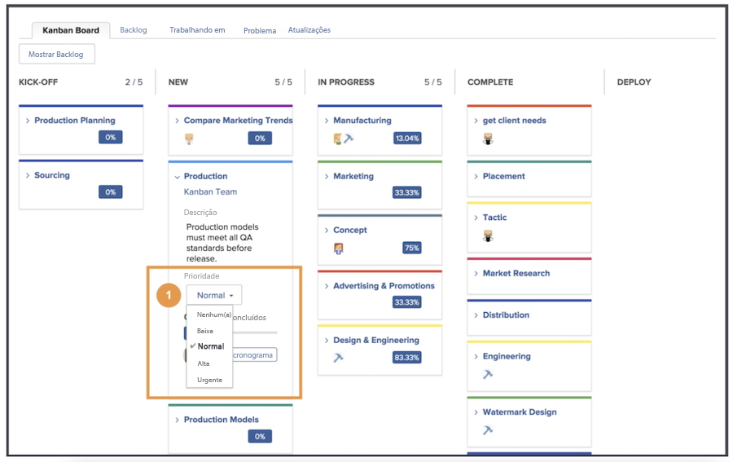
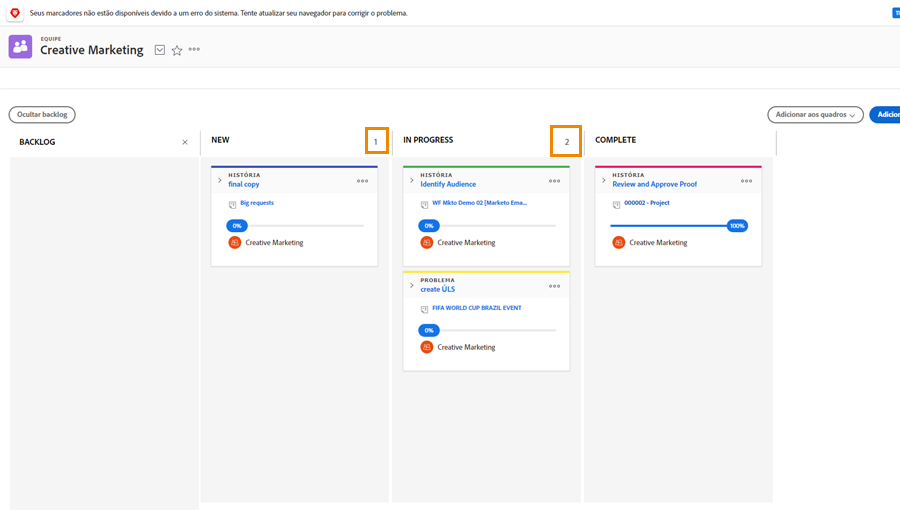
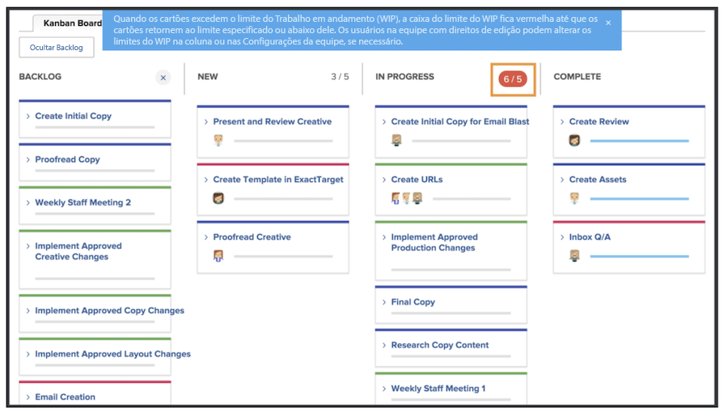

# Gerencie o trabalho com uma equipe Kanban

Gerencie o trabalho com uma equipe Kanban
Adicionar histórias ao backlog Kanban
Há várias maneiras de adicionar histórias ao backlog da equipe de marketing da Creative.

A equipe pode adicionar histórias diretamente da lista de pendências.
A equipe também pode ser atribuída a tarefas em um projeto. Se a equipe de marketing criativo tiver solicitações direcionadas a ela, essas aparecerão na guia Solicitações da equipe. Elas aparecerão na lista de pendências da equipe caso selecionem uma solicitação e a convertam em uma história.

## Uso do quadro Kanban

Depois de priorizar as histórias na lista de pendências, é hora de passar para o quadro Kanban. Você pode fazer atribuições arrastando os avatares de membros da equipe que trabalharão naquela história e soltando-os no cartão da história.

À medida que as histórias avançam, a equipe as moverá para o status apropriado no Storyboard. Membros da equipe podem usar os sinalizadores do Kanban para indicar se uma história está Dentro do prazo, Bloqueada ou Pronta para avançar. Isso informa a outros membros da equipe quais itens de trabalho estão em andamento e se já é possível trabalhar neles ou não.

Membros da equipe também podem fazer alterações nos cartões diretamente no Storyboard para refleti-las em itens como descrição, status ou prioridade. Isso pode ser feito clicando no menu suspenso em um cartão de história e editando o campo apropriado [1].

## Execução de história do Kanban

Observe que você está usando um limite de “Trabalho em andamento” de cinco histórias. Ao observar o quadro, é possível notar que à medida que as tarefas são movidaspara colunas de status, o número de tarefas em cada faixa é exibido na parte superior direita de cada coluna de status.

Se exceder o limite de uma coluna com o status Novo ou Em andamento, será exibida uma mensagem de erro indicando que você excedeu o limite de trabalhos em andamento.

Se sua equipe decidir modificar a quantidade de itens com os quais ela pode lidar por vez, você (e outros membros da equipe com direitos de edição) poderá alterar o número de trabalhos em andamento diretamente no Storyboard, clicando e editando o número de WIP.
