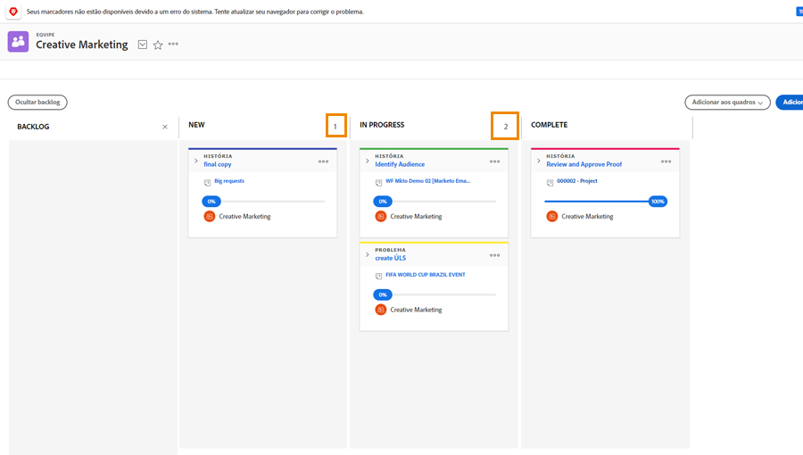

# Gerenciar o trabalho como uma equipe Kanban

Gerenciar o trabalho como uma equipe Kanban Adicionar histórias ao backlog Kanban Há várias maneiras de adicionar histórias ao backlog da equipe de Marketing criativo.

A equipe pode adicionar histórias diretamente do backlog.
Eles também podem receber tarefas em um projeto. Se a equipe do Creative Marketing tiver solicitações roteadas para ela, essas solicitações aparecerão na guia Solicitações da equipe. Eles aparecerão no backlog da equipe se ela selecionar a solicitação e a converter em uma história.

## Uso do quadro Kanban

Depois de priorizar histórias no backlog, é hora de migrar para o quadro Kanban. Você pode fazer atribuições arrastando e soltando os avatares dos membros da equipe que trabalharão nessa história no cartão da história.

Conforme o progresso é feito nas histórias, a equipe as moverá para o status apropriado no storyboard. Os membros da equipe podem usar os sinalizadores Kanban para indicar se uma história está No caminho certo, Bloqueada ou Pronta para puxar. Isso informa aos outros membros da equipe quais itens de trabalho estão no caminho certo e se eles estão prontos para serem trabalhados ou não.

Os membros da equipe também podem fazer atualizações nos cartões diretamente no storyboard para refletir alterações em coisas como descrição, status ou prioridade. Eles fazem isso clicando no menu suspenso em um cartão de história e fazendo suas edições no campo apropriado [1].

## Execução de história do Kanban

Observe que você está usando um limite de cinco histórias de Trabalho em andamento. Ao observar o quadro, você vê que à medida que move tarefas para colunas de status, o número de tarefas em cada faixa é exibido na parte superior direita de cada coluna de status.

Se você exceder o limite em uma coluna de status igual a Novo ou Em andamento, será exibida uma mensagem de erro indicando que você excedeu o limite de trabalho em andamento.

Se sua equipe decidir que pode lidar com mais ou menos itens de uma vez, você (e outros membros da equipe com direitos de edição) poderá alterar o número do Trabalho em andamento diretamente do storyboard, clicando no número do Trabalho em andamento e editando-o para refletir sua nova decisão.
