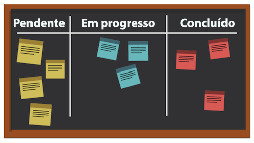
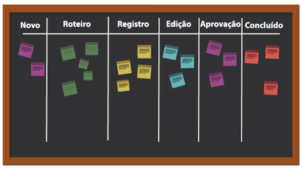

# O que é a metodologia Kanban e como ela funciona?

Ao contrário de outras metodologias ágeis com foco num processo cíclico, a metodologia Kanban foca um fluxo de trabalho otimizado. O Kanban visa melhorar o fluxo de trabalho através da visualização do trabalho num quadro Kanban, estabelecendo um limite para a quantidade de trabalho que pode estar em andamento e analisando o fluxo para fazer melhorias contínuas.

Vamos dar uma olhada em alguns dos principais elementos do Kanban.

## Players principais

Os players principais de uma equipe Kanban são semelhantes aos de uma equipe Scrum, exceto que não há um Scrum master. Ainda pode fazer sentido que alguém atue como gerente ou supervisor de projeto, mas teoricamente essa função deve ocorrer naturalmente conforme a necessidade.

## Visualização: quadro Kanban

Há muitas maneiras de formatar seu quadro Kanban. As equipes operam com um quadro que pode ter qualquer número de colunas. Cada coluna representa o status do trabalho que está sendo realizado.

No quadro mais simplificado, a primeira coluna pode ser “A fazer”, a segunda “Em andamento” e a terceira “Concluída”.

Muitas empresas têm sua própria terminologia para os nomes das colunas, ou podem até mesmo listar cada etapa de um processo, mas a intenção é a mesma. Os membros da equipe movem suas histórias de coluna a coluna, dependendo do estado em que o trabalho se encontra.

## Priorização

Os membros da equipe trabalham com um gerente de produto ou gerente de projeto para garantir que as histórias na lista de pendências e outras colunas de status sejam priorizadas, e que o trabalho continue avançando até a conclusão. O gerente de produto ainda é responsável por garantir que a voz do cliente seja ouvida e que o produto avance na direção correta.

## Limite o trabalho em andamento

Um aspecto único do Kanban é que as equipes têm um limite de capacidade para a quantidade de histórias que elas podem lidar num determinado momento. As equipes escolhem uma quantidade específica de histórias que desejam ter nas colunas “A fazer” e “Em andamento” e não ultrapassam esse número para evitar o esgotamento. Depois que uma história é movida para “Concluída”, uma história da lista de pendências ocupa seu lugar na coluna “A fazer”.

## Aprimoramento contínuo

O Kanban permite a melhoria contínua, fornecendo um sistema para as equipes medirem sua eficácia. É possível ver claramente como os fluxos de trabalho fluem, quanto tempo cada parte do fluxo de trabalho leva e com que frequência as entregas são feitas no prazo. Isso facilita a experimentação com diferentes maneiras de fazer as coisas para otimizar o resultado.
