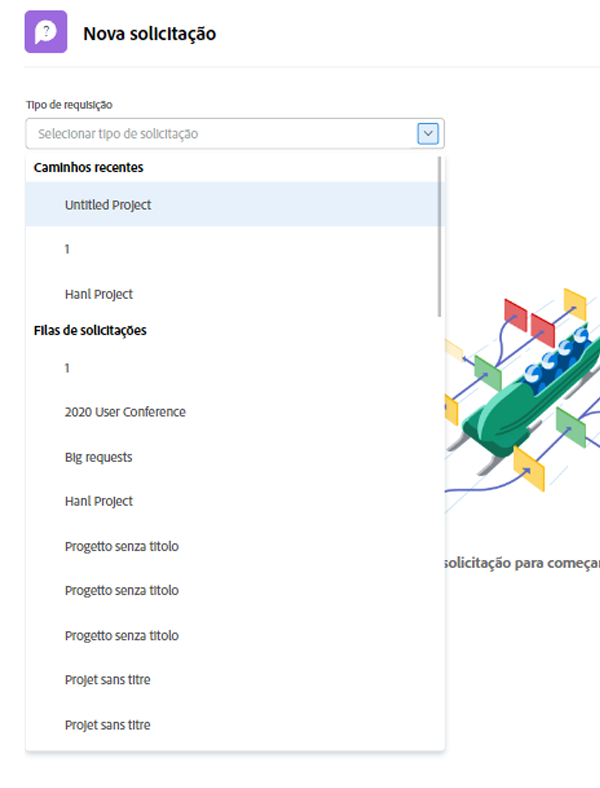
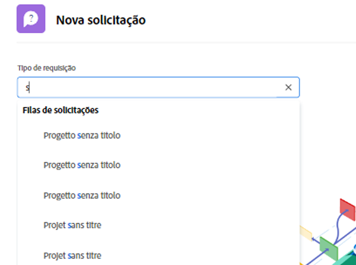

# Fazer uma solicitação

Neste vídeo, você aprenderá a:

* Navegue até a área de solicitação
* Fazer uma solicitação
* Exibir solicitações enviadas
* Localizar um rascunho de uma solicitação

>[!VIDEO](https://video.tv.adobe.com/v/336092/?quality=12&learn=on)

## Acesse os caminhos da fila de solicitações de maneira rápida e fácil

Ao clicar em na guia [!UICONTROL Tipo de solicitação] , os três últimos caminhos de solicitação enviados recentemente para o serão exibidos automaticamente na parte superior da lista. Selecione uma opção para arquivar outra solicitação nessa mesma fila.

Na parte inferior da lista estão todas as filas de solicitações às quais você tem acesso. Se não tiver certeza de qual fila usar para sua solicitação, use a pesquisa por palavra-chave para localizar de maneira rápida e fácil a fila necessária.

À medida que você digita palavras-chave, [!DNL Workfront] O traz correspondências para que você possa encontrar o caminho da fila de solicitações adequado às suas necessidades. Por exemplo, para fazer uma solicitação para uma publicação de mídia social, comece digitando &quot;redes sociais&quot; na [!UICONTROL Tipo de solicitação] e a lista é atualizada dinamicamente para mostrar qualquer correspondência.

Selecione a opção desejada, preencha o formulário de solicitação e envie a solicitação.

<!---
Learn more
Requests area overview
Create and submit Workfront requests
Guides
Make a work request
--->
