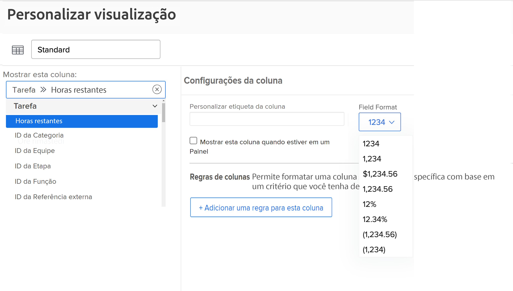
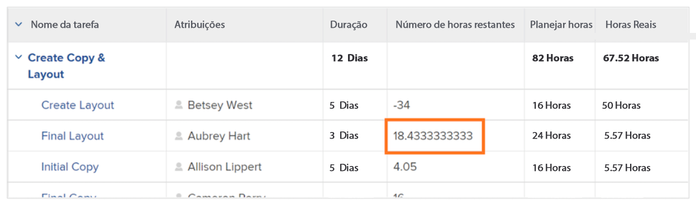

# Criar uma expressão de dados SUB, SUM, DIV ou PROD

Neste vídeo, você aprenderá:

* O que as expressões SUB, SUM, DIV e PROD fazem
* Como criar uma expressão de dados SUB em um campo calculado

>[!VIDEO](https://video.tv.adobe.com/v/335177/?quality=12&learn=on)

## Informações adicionais: expressão ROUND

### Criar uma expressão ROUND

A expressão ROUND arredonda qualquer número para um determinado número de casas decimais.

Na maioria das vezes, a expressão de dados ROUND é usada em conjunto com outra expressão de dados e quando o campo de formato é deixado como Texto ou Número.

Vamos criar um campo calculado para determinar a diferença entre o número de horas planejadas e efetivamente registradas em uma tarefa, o que exigirá a expressão SUB e deve ter esta aparência:

**SUB({workRequired},{actualWorkRequired})**

Considerando que o tempo é registrado em minutos e o formato de preferência é a exibição de informações em horas, a expressão também precisa ser dividida por 60 e ter esta aparência:

**DIV(SUB({workRequired},{actualWorkRequired}),60)**

Se o formato for alterado para Número ao criar o campo calculado no formulário personalizado, você poderá alterar o formato do número ao adicionar o campo em uma visualização.

No entanto, se o formato do campo ao criar um campo personalizado for definido como Texto, o formato não poderá ser facilmente alterado na visualização. A expressão ROUND deve ser usada para evitar que números como este sejam vistos em seu projeto:

<b>Usar a expressão de dados ROUND em um campo calculado</b>

A expressão ROUND inclui o nome da expressão (ROUND) e, normalmente, dois pontos de dados. Esses pontos de dados podem ser uma expressão ou um campo no Workfront, seguido por um número para indicar quantas casas decimais você deseja usar.

Uma expressão seria estruturada assim: ROUND(ponto de dados, #)

Na expressão que calcula a diferença entre horas planejadas e efetivas, use esta expressão DIV(SUB({workRequired},{actualWorkRequired}),60) como o primeiro ponto de dados. Em seguida, certifique-se de que os números provenientes dessa expressão não ultrapassem 2 casas decimais.

A expressão poderia ser escrita assim: ROUND(DIV(SUB({workRequired},{actualWorkRequired}),60),2).
