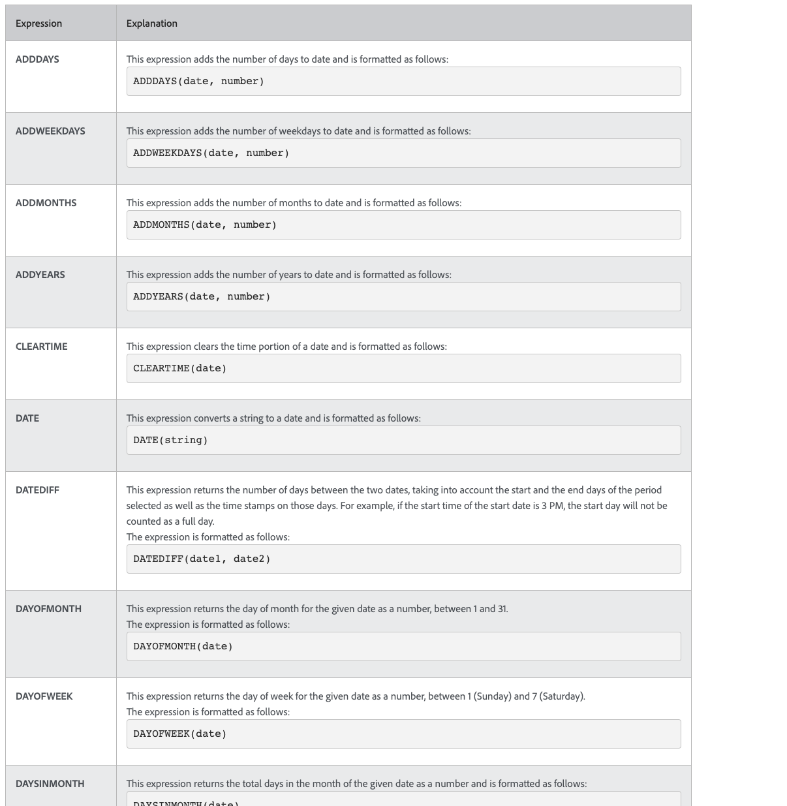

# Entender Data e Hora e Expressões Matemáticas

## Expressões de data e hora

As expressões de data e hora permitem que você extraia datas importantes para a frente de seus relatórios, calcule automaticamente o número de dias de trabalho necessários para concluir uma tarefa ou remova os carimbos de data e hora da exibição quando não são necessários.

Ao analisar as expressões de data e hora disponíveis, você encontrará várias opções disponíveis.

Há dois conjuntos de expressões de data e hora usados com mais frequência por [!DNL Workfront] clientes:

* ADDDAYS/ADDWEEKDAY/ADDMONTHS/ADDYEARS e
* DATEDIFF / WEEKDAYDIFF

## Expressões matemáticas

Permitem expressões matemáticas [!DNL Workfront] para fazer cálculos automaticamente, simples ou complicado.

Ao analisar as expressões de data e hora disponíveis, você descobrirá que tem várias opções disponíveis.

[!DNL Workfront] Os clientes do geralmente usam esses dois conjuntos de expressões matemáticas:

* SUB, SOMA, DIV, PROD
* ROUND
