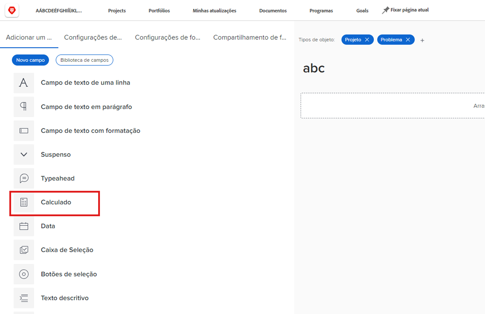
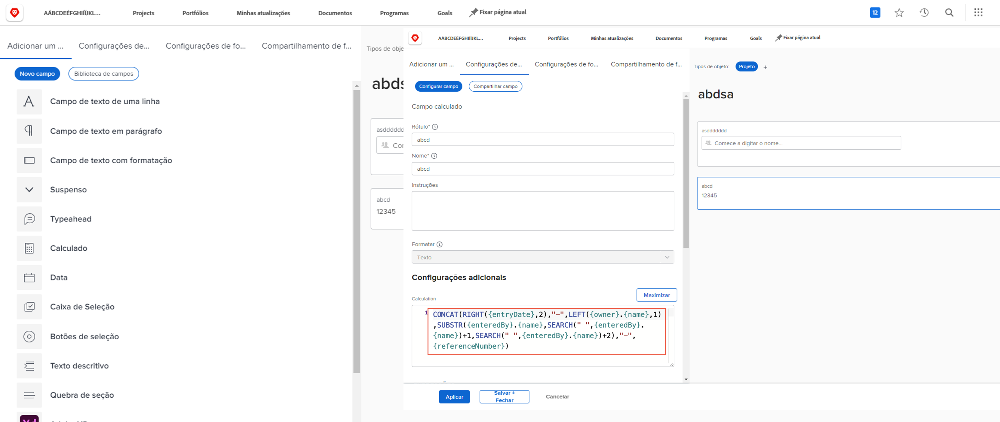
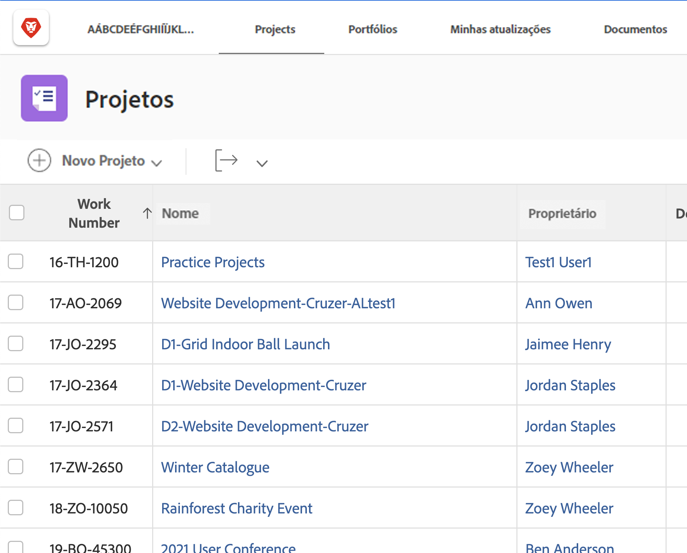
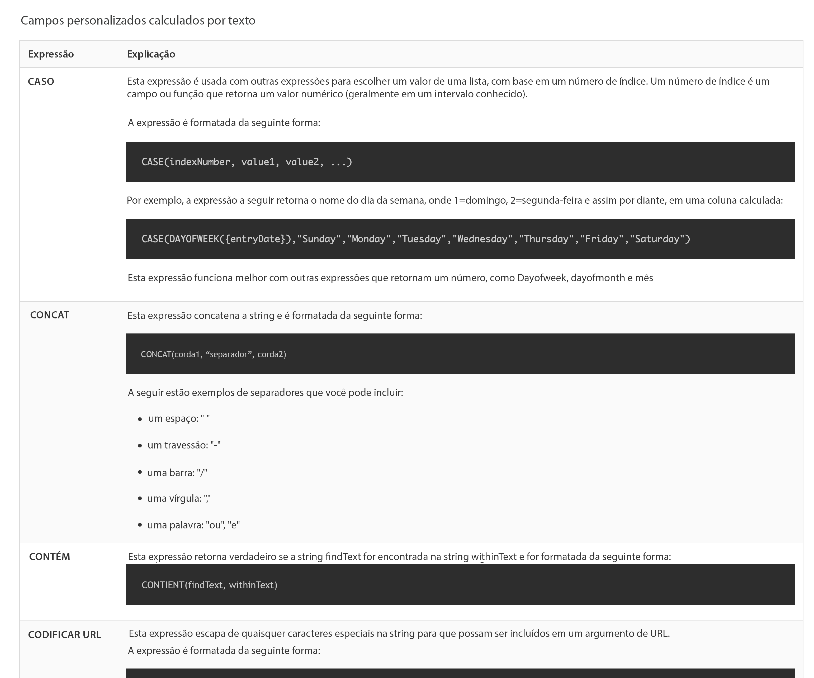

# Introdução a campos e expressões calculados

<!-- **Note**: The expression examples shown are simple and some may be mitigated by fields already supplied by  . However, the examples are used to illustrate the foundational knowledge needed in order to build expressions in Workfront.-->

[!DNL Workfront] O fornece uma variedade de campos que são comuns em várias áreas de negócios e são usados regularmente para o gerenciamento de trabalho. Campos como data de conclusão planejada, orçamento do projeto, nome do destinatário da tarefa etc.

No entanto, cada organização tem dados específicos para seu setor e empresa que precisam ser coletados para entender se os objetivos da empresa estão sendo cumpridos. Por exemplo, sua organização deseja acompanhar:

* A que linha de negócios um projeto contribuirá.
* Se o financiamento vem de fornecedores, internos ou ambos.
* Qual resolução é necessária para imagens usadas.

Embora esses campos não sejam inerentemente incorporados no [!DNL Workfront], é possível criar campos de entrada de dados personalizados e campos de resposta pré-preenchidos e multisselecionados por meio de um formulário personalizado.

Esse caminho de aprendizagem se concentra no campo calculado. Você aprenderá o que é um campo calculado, os diferentes tipos de informações que podem ser obtidas no campo calculado por meio de expressões de dados e como criar esses campos calculados para aprimorar a coleta de dados e os relatórios.

**Lembrete de formulário personalizado**

Os campos são específicos do objeto. Por exemplo, se você criar um campo calculado em um formulário personalizado de tarefa, poderá usar esse campo em qualquer relatório de tarefa.

## O que é um campo calculado?

Um campo calculado hospeda dados personalizados criados por meio de expressões de dados e campos Workfront existentes.

Por exemplo, sua organização tem um sistema específico de numeração de projeto, ou número de trabalho, que inclui:

* Ano de criação do projeto,
* Iniciais do proprietário do projeto e
* O [!DNL Workfront] número de referência do projeto.

Usando expressões em um campo calculado, é possível obter cada parte das informações já armazenadas em [!DNL Workfront] e criar essa ID de projeto exclusiva, ou número de trabalho, que pode ser adicionado a um relatório como este:

Dependendo dos dados específicos necessários, os campos calculados podem ser simples, usando uma ou duas expressões ou mais complicadas, usando várias expressões incorporadas. Lembre-se [!DNL Workfront] O pode usar somente os dados já armazenados ou obtidos no sistema para campos calculados.

## Expressões de texto

Expressões de texto pesquisam, dissecam e combinam informações encontradas em [!DNL Workfront] para criar dados mais significativos ou obter mais insights sobre o trabalho que está sendo feito para sua organização.

Por exemplo, expressões de texto podem ser usadas para:

* Mostre &quot;Mais de US$ 5.000&quot; quando as despesas do projeto ultrapassarem US$ 5.000, ou &quot;Menos de US$ 5.000&quot; quando as despesas estiverem abaixo disso, em uma coluna de uma visualização de projeto.

* Dê a cada projeto um número exclusivo que inclua o ano em que o projeto foi criado, o  [!DNL Workfront] número de referência, o nome do projeto e as iniciais do proprietário do projeto.

* Crie um relatório que lista todos os projetos que não estão atribuídos a um portfólio e/ou programa para que você possa usá-lo em suas reuniões do gerente.

Expressões de texto podem ser usadas em um campo personalizado para fazer esses tipos de pesquisas e combinações em [!DNL Workfront].
TE Ao examinar as possíveis expressões de texto, você encontrará várias opções.

Há seis expressões de texto usadas com mais frequência:

* CONCAT
* ESQUERDA / DIREITA
* CONTÉM
* SE
* ISBLANK