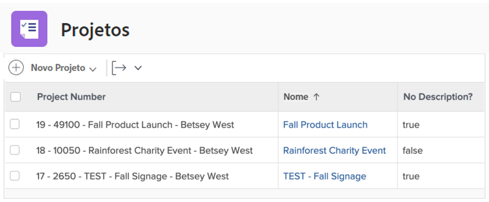
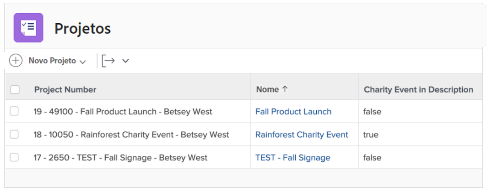
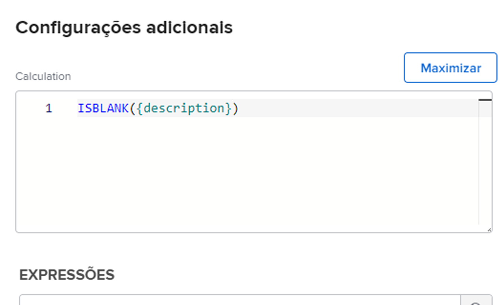
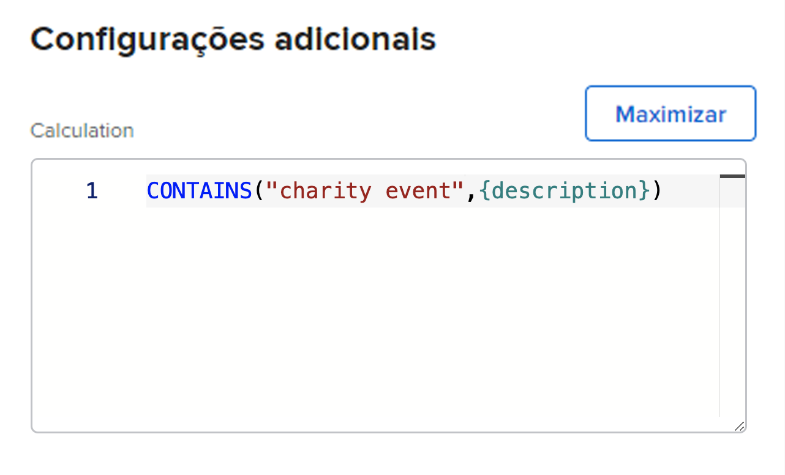

# Use as expressões ISBLANK e CONTAINS

Ambas as expressões CONTAINS e ISBLANK são usadas para fornecer valores simples de verdadeiro ou falso. A diferença é que a expressão ISBLANK verifica se o campo contém algum valor, enquanto a expressão de texto CONTAINS procura uma string específica em um campo.

Por exemplo, para ver se um projeto tem uma descrição, utilize a expressão ISBLANK. Se o campo de descrição estiver em branco, a expressão retornará um valor verdadeiro. Se o campo de descrição não estiver em branco, ele retornará um valor falso.

Para procurar um valor específico na descrição, como “evento beneficente”, use a expressão de texto CONTAINS. Se encontrar “evento beneficente” na descrição, o campo calculado indicará “verdadeiro”. Ele exibe “falso” se não encontrar “evento beneficente”.

## ISBLANK

A expressão de texto ISBLANK inclui o nome da expressão e um ponto de dados.

**ISBLANK({data point})**

No exemplo acima, em que você deseja saber se o projeto tem uma descrição, a expressão seria:

ISBLANK({description})

## CONTÉM

A expressão de texto CONTAINS inclui o nome da expressão, a palavra ou frase que você está procurando e o campo a ser procurado.

**CONTAINS(&quot;phrase&quot;,{fields})**

Coloque aspas ao redor da palavra ou frase que você está procurando, caso contrário a expressão não será válida.

No exemplo acima (procurando por “evento beneficente” na descrição do projeto), a expressão seria:

**CONTAINS(“evento beneficente”,{description})**

**Observação**: a expressão CONTAINS diferencia maiúsculas de minúsculas. Por exemplo, se “Evento beneficente” estiver em maiúscula no campo de descrição, coloque essa frase em maiúscula na expressão.

**CONTAINS(“Evento beneficente”,{description})**

Ambas as expressões ISBLANK e CONTAINS são boas para usar se você quiser ver se um valor está presente. No entanto, pode ser mais útil saber qual é o valor, para realmente vê-lo ou ter algum tipo de descritor para fornecer um melhor insight.

Por exemplo, em vez de apenas saber que um projeto foi convertido de uma solicitação, você deseja saber o nome da solicitação original.

Nesse caso, use a expressão CONTAINS juntamente com uma expressão IF.

Na maioria das vezes, as expressões de texto ISBLANK e CONTAINS são usadas com uma expressão de texto IF.
