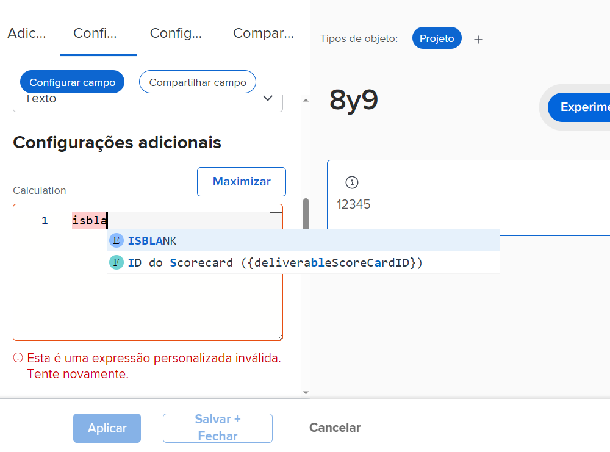
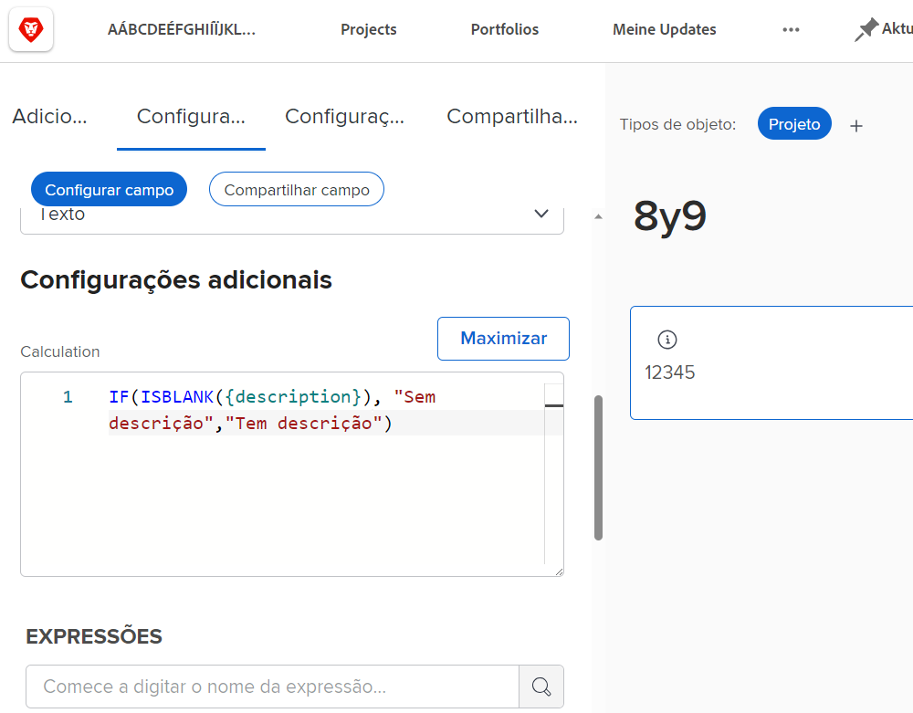
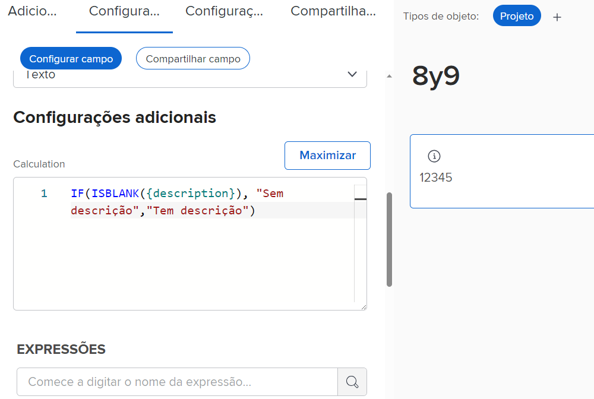
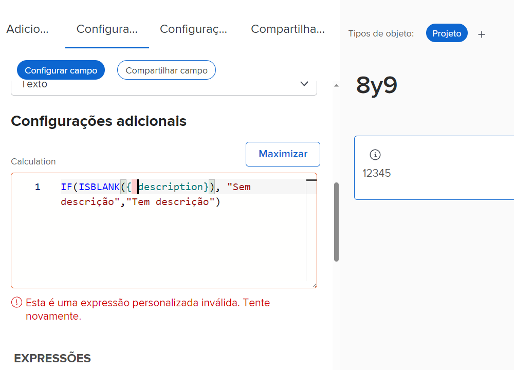
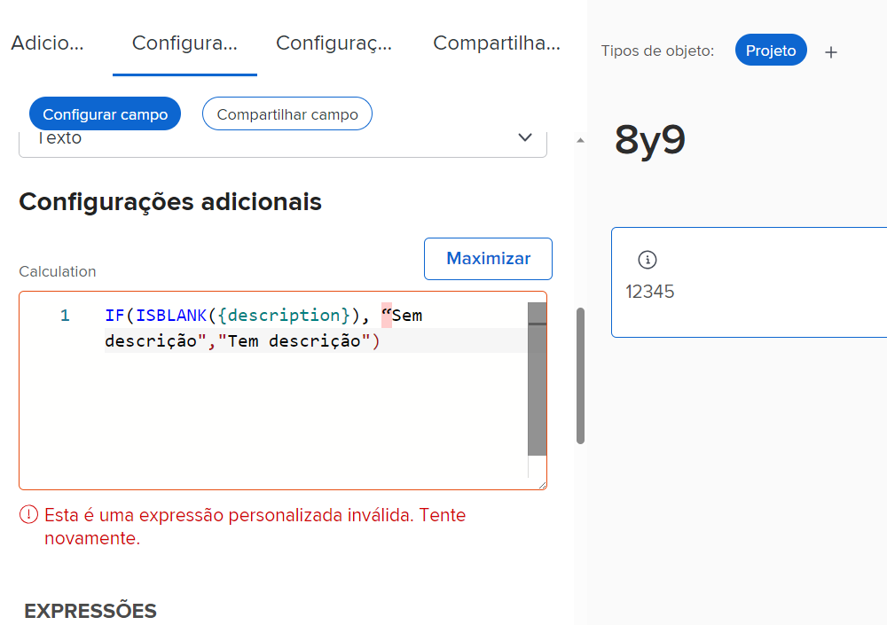
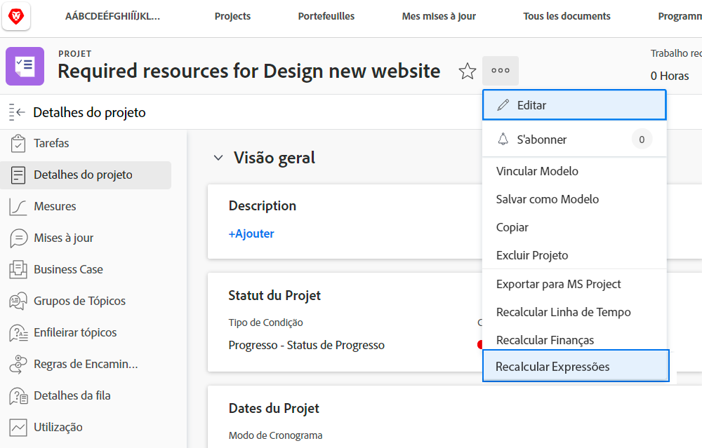
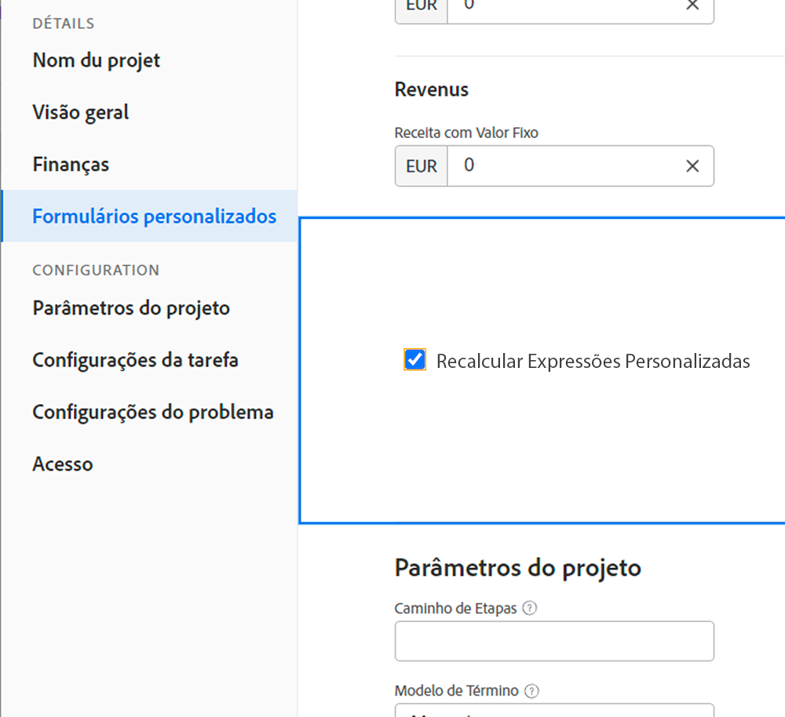

# O que você deve saber sobre expressões de campo calculado

Esta é uma lista de conceitos úteis ao trabalhar com campos calculados personalizados no Workfront.

## Geração de maiúsculas e minúsculas em nomes de expressão

Quando se trata de nomes de expressões, o uso de maiúsculas e minúsculas é importante. Ao escrever inicialmente um nome de expressão, você pode usar letras maiúsculas, minúsculas ou uma combinação de ambas.

No entanto, a expressão deve ser escrita como todas as letras maiúsculas para que o sistema reconheça a expressão e salve o campo.

## As horas são armazenadas em minutos

As horas no banco de dados do Workfront são armazenadas em minutos. Se você estiver fazendo referência a campos como Horas planejadas ou Horas efetivas, divida por 60 para mostrar o tempo em horas e não em minutos.

## O espaçamento não afeta expressões

A maneira recomendada de escrever expressões é com pouco ou nenhum espaçamento entre cada expressão.

* IF(ISBLANK({description}),“Sem descrição”,“Tem descrição”)

No entanto, se o espaçamento ajudar você a ver o que está acontecendo, algum espaçamento poderá ser adicionado às expressões. Os espaços extras não devem impedir que a expressão colete ou calcule um valor no [!DNL Workfront].

* IF (ISBLANK ({description}), “Sem descrição” , “Tem descrição” )

As únicas coisas que não podem ter espaços entre eles são os campos e as chaves. Caso contrário, você receberá uma mensagem de erro e não poderá salvar o campo ou o formulário personalizado.

## As aspas devem ser retas

Ao usar aspas em uma expressão, certifique-se de que as aspas sejam retas (&quot;). Se as aspas forem curvas (”), o sistema do [!DNL Workfront] continuará exibindo a mensagem “Expressão personalizada inválida”.

## Atualização de cálculos ao salvar o formulário e editar o objeto

Esse é um aspecto importante dos campos calculados para compreender.

As informações exibidas em um campo calculado permanecerão as mesmas e se tornarão obsoletas, a menos que o formulário personalizado seja recalculado.

As expressões podem ser atualizadas usando a opção Recalcular expressões no menu Mais em um objeto.

Você quer ver há quantos dias um problema está em aberto. Crie um campo calculado chamado “Dias em aberto” com a expressão DATEDIFF.

* Nome do campo = Dias em aberto
* Expressão = DATEDIFF({entryDate},$$TODAY)

Depois de salvo, o número de dias entre o momento em que o problema foi criado pela primeira vez ou inserido no Workfront e a data de hoje pode ser mostrado na página de detalhes de um objeto ou em uma visualização de relatório.

Ao visualizar a mesma página de detalhes ou visualização de relatório no dia seguinte, você espera que esse número aumente em um. Se o número for 5 hoje, deverá ser 6 amanhã. O dia seguinte deve ser 7, depois 8 etc.

No entanto, o campo continuará a mostrar 5 todos os dias. O campo deve ser “executado novamente” ou recalculado para atualizar as informações.

Para atualizar um campo usando a opção Recalcular expressões:

* Clique no nome do objeto para abri-lo.
* Clique no menu Mais.
* Selecione Recalcular expressões na lista.

Você também pode recalcular diversas expressões ao mesmo tempo usando o recurso “edição em massa” em uma lista ou relatório. Suponha que você criou um relatório mostrando uma lista de problemas com o cálculo de Dias em aberto aparecendo em uma coluna. Se quiser recalcular todos os problemas de uma só vez:

* Selecione todos os problemas no relatório.
* Selecione a opção de edição para editar em massa todos os problemas selecionados.
* Clique no rótulo Formulários personalizados à esquerda para rolar a tela para baixo até a seção de formulários personalizados.
* Marque a caixa Recalcular expressões personalizadas na parte inferior da seção Formulários personalizados.
* Clique em Salvar alterações.

A tela é atualizada para mostrar as informações atualizadas no campo calculado.

**Observação**: embora existam outras maneiras de atualizar ou recalcular expressões em um campo calculado, essa é a maneira mais rápida e fácil.

## Os cálculos podem variar de formulário para formulário no mesmo campo

Assim que um campo calculado é salvo num formulário personalizado e esse formulário é salvo, o campo calculado é adicionado à Biblioteca de campos para que possa ser usado em outros formulários personalizados.

Porém, se você tiver um campo calculado no formulário A e o mesmo campo calculado no formulário B, a ideia inicial é que os cálculos sejam exatamente iguais. Esse nem sempre é o caso. O campo calculado no formulário A poderia estar calculando de uma maneira totalmente diferente no formulário B.

Quando um campo personalizado calculado é selecionado na biblioteca de campos e adicionado a um formulário personalizado, o campo é adicionado, mas o cálculo fica em branco. Isso acontece porque o cálculo pode se referir a campos que não existem para outro tipo de objeto.

Por exemplo, você criou um campo calculado, “Dias para concluir”, para determinar quanto tempo levou para concluir uma tarefa em um projeto.

* WEEKDAYDIFF({actualStartDate},{actualCompletionDate})

Você quer fazer a mesma coisa para uma iteração. Você pode usar a mesma expressão; entretanto, os campos disponíveis para um objeto de tarefa nem sempre estão disponíveis para um objeto de iteração. Portanto, o [!DNL Workfront] dá a você a chance de criar o cálculo com os campos de objeto corretos.

**Dica profissional**: copie a expressão calculada da caixa Cálculo para o campo Instruções ao criar campos personalizados. Esse campo não é apagado quando um campo personalizado calculado é adicionado ao formulário personalizado na Biblioteca de campos.

Dependendo da necessidade, os campos calculados em formulários personalizados podem ser bastante simples ou muito complexos. As expressões podem incorporar ou aninhar outras expressões e valores para fornecer o nível de detalhes necessário para obter um quadro melhor do que está acontecendo com o trabalho feito na organização.

<!--Depending on the need, calculated fields in custom forms can be quite simple or very complex. Expressions can embed, or nest, other expressions and values to provide the level of detail needed to get a better picture of what is going on with the work being done at your organization. 

Most of the examples and exercises in this course have been relatively simple to provide a base understanding of the expressions most commonly used and how to build those expressions in a custom calculated field. 

Now you're ready to start building your own calculated custom fields.-->
