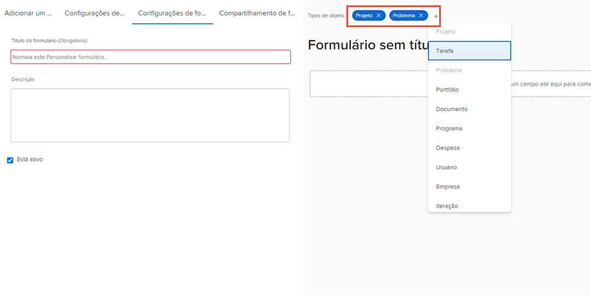

# Criar e compartilhar um formulário personalizado

Neste vídeo, você aprenderá a:

* Determine quais objetos usar para o formulário
* Adicionar campos exclusivos em vários formatos
* Organizar campos usando seções e lógica
* Compartilhar formulários com outros usuários

>[!VIDEO](https://video.tv.adobe.com/v/335172/?quality=12)

## Os formulários personalizados funcionam com vários tipos de objetos

Ao clicar no [!UICONTROL Novo formulário personalizado] , é possível selecionar quantos objetos deseja usar com um único formulário personalizado. Todos os campos adicionados a este formulário estarão disponíveis para qualquer um dos objetos selecionados quando o formulário personalizado estiver anexado a eles.

![Janela de formulário personalizado mostrando o [!UICONTROL Novo formulário personalizado] opções de objeto](assets/create-custom-form.png)

Ao editar um formulário personalizado, é possível visualizar todos os tipos de objetos selecionados. É possível adicionar ou excluir tipos de objetos dessa lista.

Talvez você queira criar um formulário personalizado do tipo projeto e problema. Quando anexado a um problema, é possível preencher qualquer um dos campos relacionados ao problema. Posteriormente, se você decidir converter o problema em um projeto, o formulário personalizado será carregado automaticamente no projeto e os dados inseridos nos campos do formulário personalizado de edição estarão disponíveis para visualização ou edição no formulário personalizado do projeto.

## Opções de campo personalizado

**[!UICONTROL Rótulo] e [!UICONTROL Nome] campos**

O [!UICONTROL Rótulo] e [!UICONTROL Nome] campos em um campo personalizado atendem a diferentes objetivos. [!UICONTROL Rótulo] é o nome do campo que os usuários verão no [!DNL Workfront]. [!UICONTROL Nome] O é o que pode ser usado com integrações, como a API.

![Janela de formulário personalizado mostrando [!UICONTROL Rótulo] e [!UICONTROL Nome] campos](assets/custom-forms-field-label-and-name.png)

Isso proporciona a flexibilidade para alterar o rótulo voltado para o usuário de modo a corresponder às alterações em sua organização, sem afetar as integrações ou outras conexões que dependem de um nome de campo específico.

**[!UICONTROL Campo de texto com formatação]**

O [!UICONTROL Campo de texto com formatação ]O contém ferramentas básicas de marcação de texto que permitem aos usuários adicionar negrito, itálico ou sublinhado no texto enquanto preenche o campo em um formulário personalizado.

![Janela de formulário personalizado mostrando [!UICONTROL Campo de texto com formatação] opção](assets/custom-forms-text-field-with-formatting.png)

O campo também tem um limite de 15.000 caracteres, permitindo que haja muito espaço para fornecer informações vitais e usar formatação para facilitar a leitura de outras pessoas.

**[!UICONTROL Digitalização antecipada] campo**

O [!UICONTROL Digitalização antecipada] permite que o sistema preencha automaticamente uma lista de opções com base no objeto selecionado para o campo.

![Janela de formulário personalizado mostrando [!UICONTROL Digitalização antecipada] opção de campo](assets/custom-forms-typeahead-1.png)

Por exemplo, se você criar um [!UICONTROL Digitalização antecipada] campo chamado &quot;Nome de Aprovação do Marketing Manager&quot; e selecione [!UICONTROL Usuário] como o tipo de objeto referenciado, uma lista de nomes de usuário é exibida quando um usuário preenche esse campo em um formulário personalizado. O [!UICONTROL Digitalização antecipada] O objetivo é conectar seus dados personalizados às informações capturadas no sistema e eliminar a necessidade de manter manualmente muitas opções nos campos suspensos.

![Janela de formulário personalizado mostrando [!UICONTROL Digitalização antecipada] menu suspenso](assets/custom-forms-typeahead-2.png)
