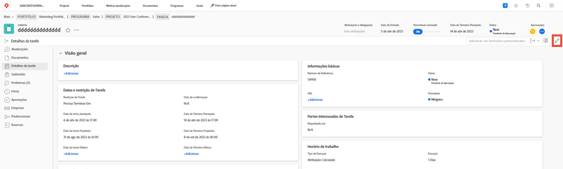

# Editar um formulário personalizado

<!---
21.4 updates have been made here
--->

Você pode editar informações em um formulário personalizado depois que o formulário for anexado a um objeto.

1. Navegue até o objeto para o qual deseja editar informações no formulário personalizado.
1. Clique em [Tipo de objeto] **[!UICONTROL Detalhes]** no painel esquerdo.
1. Expanda o formulário personalizado clicando na seta ao lado do seu nome.
1. Clique em um único campo no formulário personalizado para entrar no modo de edição nesse campo. Você também pode clicar no link [!UICONTROL Editar] no canto superior direito para editar todos os formulários personalizados ou editar seções dos formulários personalizados.
1. Digite as informações em um único campo personalizado, mesmo se os campos obrigatórios em outros formulários personalizados no objeto ainda não estiverem preenchidos.
1. Clique em **[!UICONTROL Salvar alterações]**.

