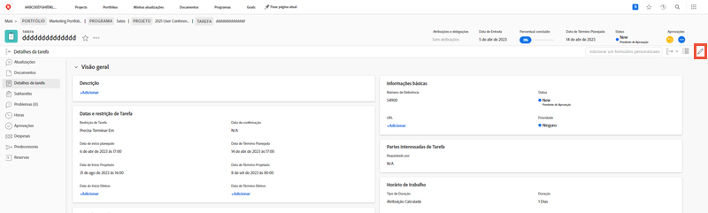

# Editar um formulário personalizado

<!--
21.4 updates have been made here
-->

Você pode editar informações em um formulário personalizado depois de anexá-lo a um objeto.

1. Navegue até o objeto cujas informações você deseja editar no formulário personalizado.
1. Clique em [Tipo de objeto] **[!UICONTROL Detalhes]** no painel esquerdo.
1. Expanda o formulário personalizado clicando na seta ao lado do seu nome.
1. Clique em um único campo no formulário personalizado para entrar no modo de edição desse campo. Você também pode clicar no ícone [!UICONTROL Editar] no canto superior direito para editar todos os formulários personalizados ou apenas algumas seções deles.
1. Digite informações em um único campo personalizado, mesmo que os campos obrigatórios de outros formulários personalizados do objeto ainda não estejam preenchidos.
1. Clique em **[!UICONTROL Salvar alterações]**.

