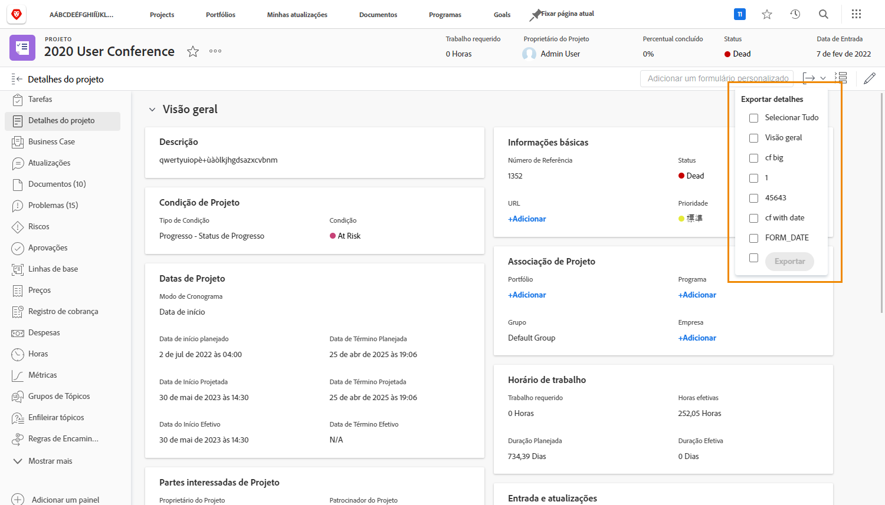
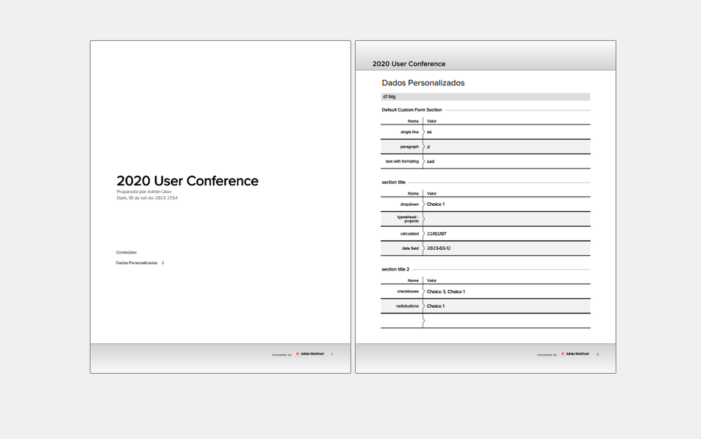

# Exportar um formulário personalizado como PDF

Capturar os dados exclusivos de uma organização é uma parte essencial do gerenciamento de trabalho. Formulários personalizados são comumente usados para essa finalidade. A capacidade de exportar formulários personalizados permite que eles sejam facilmente divulgados e compartilhados. Você pode exportar formulários personalizados de projetos, tarefas ou problemas ao acessar o formulário na seção [!UICONTROL Detalhes] dos objetos.

Você também pode incluir a área [!UICONTROL  Visão geral] no PDF exportado.

Por exemplo, para exportar um formulário personalizado denominado Informações de marketing de vídeo anexado a um projeto:

1. Clique no ícone **[!UICONTROL Exportar]**. Todos os formulários personalizados anexados ao projeto aparecem no menu suspenso, incluindo a seção [!UICONTROL Visão geral].
1. Selecione Informações de marketing de vídeo na lista.
1. Clique em **[!UICONTROL Exportar]** no final da lista.

Um arquivo PDF formatado é baixado.

