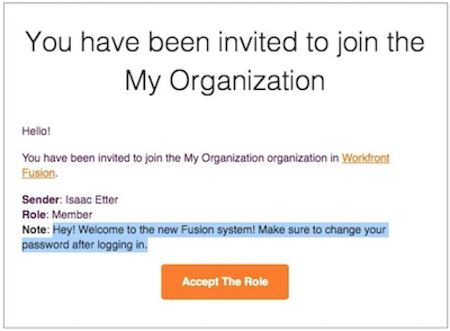
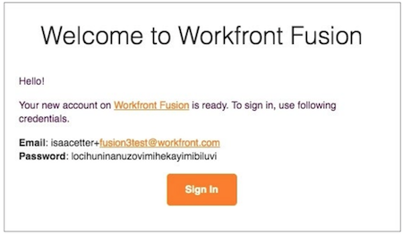

# Faça logon como um novo usuário

Ao ser convidado como um novo usuário para uma instância do Workfront Fusion, você recebe dois emails.

Um email contém uma nota que o administrador do sistema Workfront Fusion adicionou quando criou seu perfil e convidou você para a organização. Na parte inferior do email há um botão [!UICONTROL Aceitar função]. **Não clique neste botão ainda.**

O outro email contém suas credenciais de logon.

Para começar a usar o Workfront Fusion, clique no botão [!UICONTROL Fazer logon] no segundo email e faça logon usando a senha fornecida.

Após fazer logon pela primeira vez, você será solicitado a alterar sua senha.

Depois de fazer logon, volte para o outro email e clique no botão [!UICONTROL Aceitar função].

Depois de fazer isso, volte para o Workfront Fusion e atualize a página. Agora você pode ver sua equipe e as seções de visão geral no painel esquerdo.
