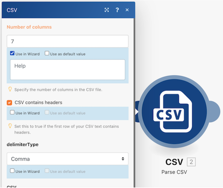

# Acessibilidade e clareza

No início do treinamento do Workfront Fusion, você aprendeu algumas práticas recomendadas básicas para facilitar a leitura, compartilhamento e compreensão dos cenários. Essas práticas ajudam a facilitar o processo para futuros usuários do Workfront Fusion ou qualquer pessoa que solucione problemas ou colabore com a sua instância do Workfront Fusion. Retribua isso seguindo as diretrizes abaixo ao criar os cenários.

## Rótulos e notas

Como regra geral, o objetivo principal do Workfront Fusion é sempre utilizar designs de cenários simples. Veja algumas maneiras de criar designs simples de se interpretar.

* Nomeie todos os módulos. Clique com o botão direito em um módulo e selecione Renomear. Os rótulos dos módulos devem ser curtos, mas também devem descrever bem o objetivo do módulo. Por exemplo, “Criar Proj Mktg com Modelo Ch”
  
* Rotule também os caminhos de roteamento. Mesmo que um caminho não use um filtro diretamente após um roteador, é possível aplicar um rótulo sem preencher a lógica do filtro. Fazer isso permite que outros entendam quais pacotes passam por quais caminhos e por quê. Para criar um rótulo para um caminho de roteador sem filtro, clique com o botão direito do mouse no caminho, adicione um rótulo e salve.
  
* Adicione notas em um cenário quando for necessário se um rótulo de módulo ou rótulo de caminho de roteamento for muito curto para esclarecer o que realmente está acontecendo. É possível adicionar notas sempre que necessário durante todo o processo de design e iteração.

No entanto, adicionar notas no final do design do cenário, quando tudo estiver pronto para o lançamento, pode facilitar a leitura e a compreensão. Trabalhe do final do design do cenário (no canto inferior direito) para trás. Dessa forma, as notas que se aplicam ao início do cenário estarão no topo da lista ao abrir o painel de notas.

Depois de salvar ou fechar o painel de notas, as notas são classificadas, e as criadas mais recentemente são exibidas na parte superior. Na imagem abaixo, a primeira nota criada aparece no final da lista. As notas foram criadas intencionalmente do canto inferior direito para cima, até chegar no acionador, ou seja, utilizando o caminho inverso que um conjunto de dados usaria no cenário. Isso permite que as notas apareçam na ordem em que o cenário realmente é executado no pacote de dados.

## Modelos do Workfront Fusion

Uma ótima maneira de simplificar a rotulagem de módulos e caminhos de roteamento é usar modelos. Os modelos de práticas recomendadas podem acelerar a criação de cenários para casos de uso comuns.

### Exemplo de modelo

Ao iniciar um cenário, primeiro verifique se há um modelo disponível que possa ajudar. Por exemplo, você deseja criar um cenário que começa com o download de um documento CSV do Workfront e, em seguida, uma análise desse documento.

Clique na seção Modelos para ver se algum modelo público atende às suas necessidades.

Clique na guia Modelos de equipe para ver se alguém na sua equipe criou um modelo que pode ser útil.

Se você encontrar um modelo que deseja usar, clique no nome para abri-lo.

Em seguida, vá para o canto superior direito, clique em Opções e selecione Criar cenário.

### Criar um modelo

Você pode criar um modelo na seção Modelos de equipe. O modelo criado está disponível para você e sua equipe, mas ao clicar no botão Publicar, ele pode ser compartilhado com pessoas de fora da equipe.

Ao criar o modelo, você pode incluir um assistente para orientar as pessoas que o usam para criar seus cenários, alterando as conexões, os dados mapeados e outros campos de painel, conforme necessário.

Marque a caixa de seleção “Usar no assistente” para adicionar instruções que estarão disponíveis quando alguém usar seu modelo para construir um cenário. Essas informações aparecerão no campo Ajuda. Para permitir que os usuários vejam esse texto ao usar o modelo, habilite a opção Usar como valor padrão.

## Quer saber mais? Recomendamos o seguinte:

[Documentação do Workfront Fusion](https://experienceleague.adobe.com/en/docs/workfront-fusion/using/get-started-with-fusion/understand-workfront-fusion/workfront-fusion-overview)
