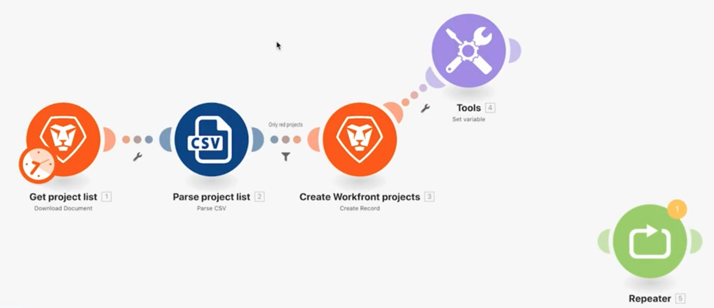
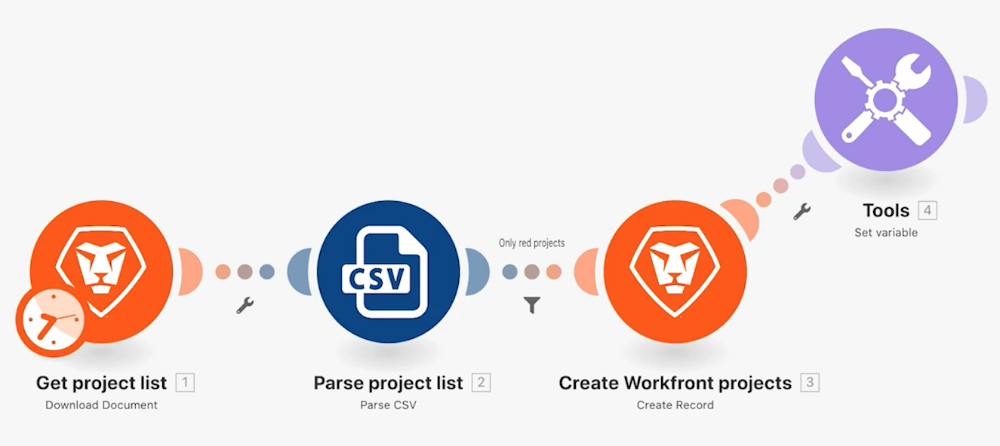
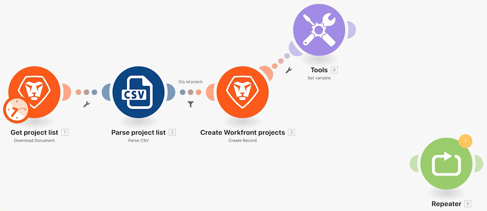
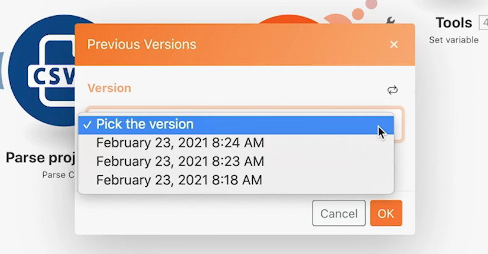

# Acessar exercícios das versões anteriores

Saiba como retornar para uma versão anterior de um cenário.

## Visão geral do exercício

Descubra como é possível restaurar versões anteriores depois de fazer alterações em um cenário e salvá-lo várias vezes.

## Etapas a serem seguidas

1. Clone o seu cenário “Uso do filtro poderoso” e chame-o de “Acesso a versões anteriores”.
1. Adicione um módulo “Definir variável” após o módulo “Criar projetos do Workfront”. Chame a variável de “Teste”.
1. Arraste-a para uma nova posição e salve o cenário.

   

1. Adicione um módulo “Repetidor”, desvincule-o do módulo anterior e salve o cenário novamente.

   

1. Agora, exclua todos os módulos e salve.
1. Na barra de ferramentas, clique no menu de três pontos e, em seguida, na opção “Versões anteriores”. A lista de opções mostra os carimbos de data e hora de cada versão salva.

   

1. Escolha uma versão anterior e observe como o cenário no designer retorna ao ponto salvo.
