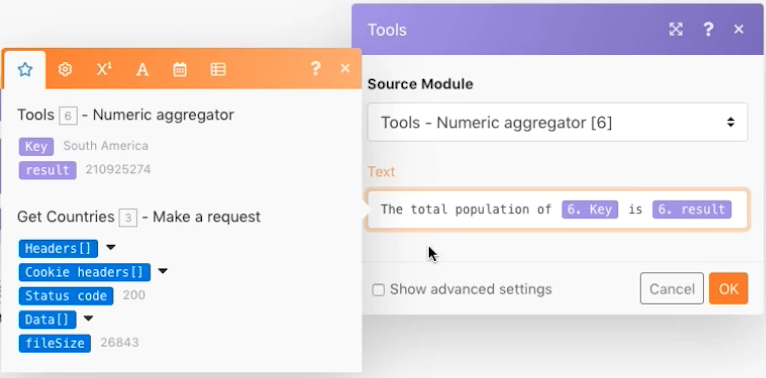

# Exercício de agregação avançado

Saiba como usar agrupamentos ao agregar.

## Visão geral do exercício

Chame um serviço da web para retornar detalhes sobre vários países e identificar a população total de todos os países, agrupada por sub-região.

## Etapas a serem seguidas

**Obter detalhes do país.**

1. Crie um novo cenário e nomeie-o como “Agregação avançada”.
1. Defina o módulo acionador como “HTTP - Fazer uma solicitação”.
1. Use este URL, `https://restcountries.com/v2/lang/es`, que fornece uma lista de todos os países onde o espanhol é falado.
1. Deixe o método como Get.
1. Clique na caixa de seleção Analisar resposta.
1. Renomeie esse módulo como “Obter países”.
1. Clique em Salvar e executar uma vez.

   **O resultado gerado é um único pacote, porém contido em uma matriz de 24 coleções, uma para cada país de língua espanhola.**

   

   **Você precisa coletar informações de sub-região para cada um dos países, portanto, precisará fazer uma solicitação HTTP adicional.**

1. Adicione outra solicitação para obter informações da sub-região. Ela retornará apenas o primeiro país, mas isso é o suficiente por enquanto. Adicione outro módulo “HTTP - Fazer uma solicitação” e use o URL `https://restcountries.com/v2/name/{country name}`.
1. Para obter o nome do primeiro país, acesse o painel de mapeamento e clique em Dados e depois em Nome na matriz. O [1] no campo de dados significa que ele retornará o primeiro item na matriz.

   + Clique no número e altere o índice se necessário, mas nesse caso, busque apenas o primeiro item.

1. Marque a opção Analisar resposta no painel de mapeamento e clique em OK.
1. Renomeie-a como “Obter detalhes do país”.
1. Clique em Salvar e Executar uma vez.

   + A resultado gerado são informações de um único país.

1. Para obter os outros países, você precisa de um processo de iteração na matriz. Adicione um iterador, que obtém uma lista de itens e gera um pacote para cada item na lista.

   **Adicione o iterador e o agregador.**

1. Clique com o botão direito do mouse entre os módulos HTTP e adicione o módulo Controle de fluxo do iterador.
1. No campo Matriz, selecione Dados no módulo Obter países.

   

1. No módulo Obter detalhes do país, atualize o campo URL para que utilize o campo de nome do iterador em vez do módulo Obter países.

   

1. Agora adicione um agregador numérico após Obter detalhes do país para agrupar e somar as populações.
1. O módulo de origem é o módulo iterador.
1. A função agregada é SUM.
1. O valor é [dados:população] no módulo Obter detalhes do país.
1. Clique na opção Mostrar configurações avançadas na parte inferior e agrupe por [dados:sub-região] no módulo Obter detalhes do país.

   

   **Finalize utilizando um agregador de texto para agregar o que foi agrupado no agregador numérico.**

1. Adicione um agregador de texto no final.
1. O módulo de origem é o agregador numérico.
1. Na área Texto, insira “A população total de [KEY] é [resultado]”.

   

1. Salve e execute uma vez.

   + Revise o resultado no módulo final.
