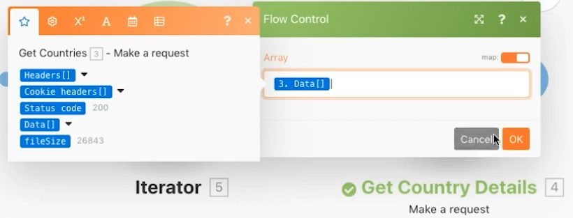

# Agregação avançada

Saiba como usar agrupamentos ao agregar.

## Visão geral do exercício

Chame um serviço Web para retornar detalhes sobre vários países e identificar a população total de todos os países, agrupada por sub-região.

## Etapas a serem seguidas

**Obter detalhes do país.**

1. Crie um novo cenário e nomeie-o como &quot;Agregação avançada&quot;.
1. Defina o módulo acionador como um módulo HTTP - Make a request.
1. Use este URL, `https://restcountries.com/v2/lang/es`, que fornece uma lista de todos os países onde o espanhol é falado.
1. Deixe o Método como Get.
1. Clique na caixa de seleção Analisar resposta.
1. Renomeie este módulo como &quot;Obter países&quot;.
1. Clique em Salvar e executar uma vez.

   **A saída é um único pacote, mas vem em uma matriz com 24 coleções, uma para cada país de língua espanhola.**

   

   **Você precisa coletar informações de sub-região para cada um dos países, portanto, precisará fazer uma solicitação HTTP adicional.**

1. Adicione outra solicitação para obter informações da sub-região. Só retornará o primeiro país, mas tudo bem por enquanto. Adicionar outro módulo HTTP Make a request e use o URL `https://restcountries.com/v2/name/{country name}`.
1. Para obter o nome do primeiro país, vá para o painel de mapeamento e clique em Dados e, em seguida, em Nome no storage. A variável [1] no campo de dados significa que retornará o primeiro item na matriz.

   + Clique no número e altere o índice se necessário, mas nesse caso, você deseja apenas o primeiro item.

1. Marque Analisar resposta no painel de mapeamento e clique em OK.
1. Renomeie este link como &quot;Obter detalhes do país&quot;.
1. Clique em Salvar e em Executar uma vez.

   + A saída é informação para um único país.

1. Para obter os outros países, você precisa iterar através da matriz. Adicione um iterador, que obtém uma lista de itens e gera um pacote para cada item na lista.

   **Adicione o iterador e o agregador.**

1. Clique com o botão direito do mouse entre os módulos HTTP e adicione o módulo Iterator Flow Control.
1. No campo Matriz, selecione Dados do módulo Obter países.

   

1. No módulo Obter detalhes do país, atualize o campo URL para obter o campo de nome do iterador em vez do módulo Obter países.

   

1. Agora adicione um agregador numérico depois de Obter detalhes do país para agrupar e somar as populações.
1. O módulo de origem é o módulo iterador.
1. A função agregada é SUM.
1. O valor é [dados:população] no módulo Obter detalhes do país.
1. Clique na opção Mostrar configurações avançadas na parte inferior e agrupe por [dados:sub-região] no módulo Obter detalhes do país.

   

   **Termine com um agregador de texto para agregar o que você agrupou dentro do agregador numérico.**

1. Adicione um agregador de texto ao final.
1. O módulo de origem é o agregador numérico.
1. Na área Texto, insira &quot;The total population of [CHAVE] é [resultado].&quot;

   

1. Salvar e executar uma vez.

   + Revise a saída do módulo final.
