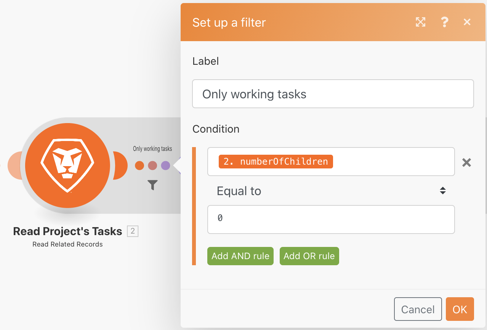
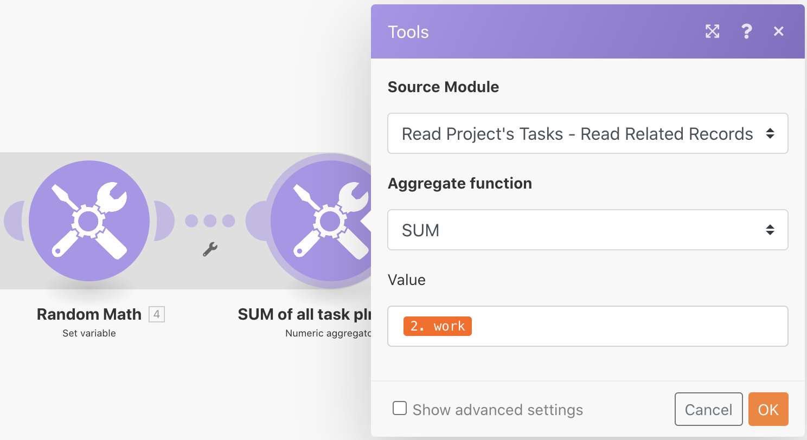
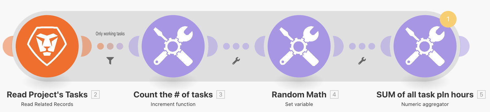
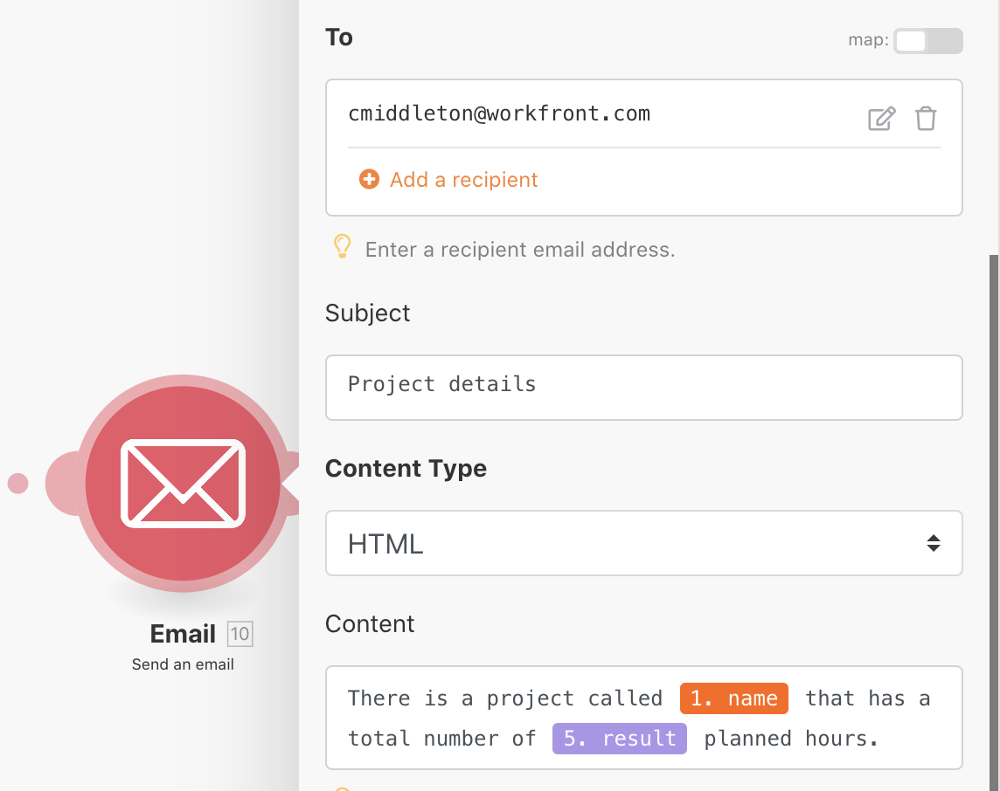

# Exercício de agregação

Saiba como agregar vários pacotes de informações em um mesmo valor.

## Visão geral do exercício

Usando o cenário “Introdução à iteração” que você criou no último exercício, agregue as horas planejadas em cada tarefa em andamento do projeto e envie um email a si mesmo com essas informações.

## Etapas a serem seguidas

**Adicione um filtro para SOMAR as horas planejadas.**

1. Clone o cenário “Introdução à iteração” criado no exercício anterior e nomeie-o como “Introdução à agregação”.
1. Adicione um filtro entre o módulo “Ler tarefas do projeto” e o módulo “Contar o número de tarefas”. Nomeie o filtro como “Somente tarefas em andamento”.
1. Defina a condição como “Número de tarefas derivadas” [Operador numérico: igual a] 0.

   

1. Após o módulo “Matemática aleatória”, adicione um módulo de ferramenta “Agregador numérico”.
1. Defina o módulo de origem como “Ler tarefas do projeto”.
1. Defina a função “Agregar” como SOMA.
1. Defina o valor como o campo “Trabalho” do módulo “Ler tarefas do projeto”.
1. Renomeie este módulo como “SOMA de todas as horas planejadas da tarefa”.

   

   **Observe a sombra que mostra que a agregação encerra a iteração.**

   

   **Enviar um email com horas agregadas.**

1. Adicione um módulo “Enviar um email” do aplicativo de email após o agregador numérico.
1. Envie o email a si mesmo(a).
1. A linha de assunto deve ser “Detalhes do projeto”.
1. No campo “Conteúdo”, insira “Há um projeto chamado [nome do projeto] com um total de [resultado] horas planejadas”. O “[nome do projeto]” é retirado do módulo “Ler um registro”, e o “[resultado]” é retirado do módulo agregador.

   

1. Salve e execute uma vez. Localize o email na sua caixa de entrada.

Os pacotes individuais podem ser acessados dentro da iteração. Porém fora da iteração, no módulo “Enviar um email”, somente os campos agregados podem ser acessados.
