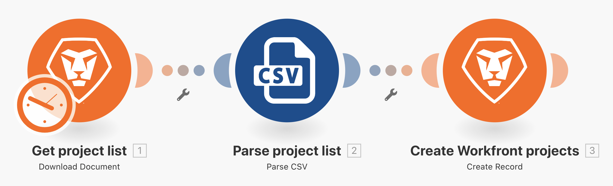
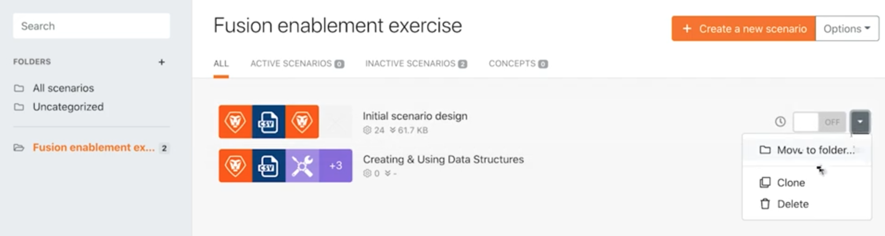
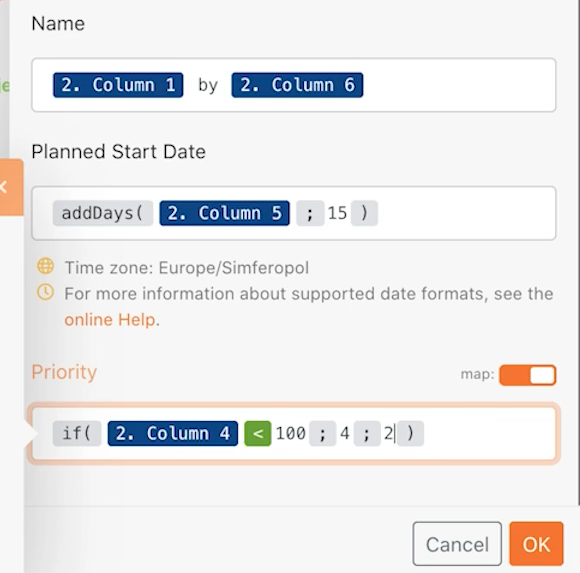

# Além do exercício básico de mapeamento

Saiba como usar as fórmulas do painel de mapeamento para manipular ou converter campos enviados para um módulo.

## Visão geral do exercício

Altere o nome do projeto, a data inicial planejada e a prioridade a partir dos exercícios do tutorial Além do mapeamento básico, que utilizam as fórmulas do painel de mapeamento.

## Etapas a serem seguidas

**Crie um design idêntico ao utilizado no cenário inicial.**

1. Selecione a opção Clonar à direita do design inicial na seção Cenário, conforme mostrado abaixo. Nomeie-o como “Além do mapeamento básico”.

   

   **Agora vamos usar o painel de mapeamento no módulo Criar projetos do Workfront para configurar o nome do projeto, a data inicial planejada e os campos prioritários.**

1. Clique no módulo Criar projetos do Workfront para editar as configurações. Usando o painel de mapeamento, altere o campo Nome para “[Nome do meu projeto] de [Patrocinador]”.

   + O [Nome do meu projeto] é a coluna 1 do módulo Analisar CSV e o[ Patrocinador] é a coluna 6. A palavra “de” é apenas inserida entre as duas.

1. Em seguida, vá para a data inicial planejada e use a fórmula addDays para adicionar 15 dias ao campo, conforme descrito no tutorial em vídeo Além do mapeamento básico.
1. Encontre o campo Prioridade e alterne o botão Mapa no canto superior direito do campo. O menu da lista de opções muda para um número. Crie uma instrução SE para rotular um projeto com prioridade Alta (4) se a classificação de confiança do arquivo CSV for inferior a 100; caso contrário, a prioridade pode ser Normal (2).

   + A classificação de confiança está na coluna 4.

   **A essa altura, o painel de mapeamento deve ter esta aparência:**

   

1. Clique em OK e selecione Executar uma vez.
1. Encontre o projeto na sua instância do Workfront para garantir que tudo foi mapeado corretamente.
1. Salve seu cenário.
