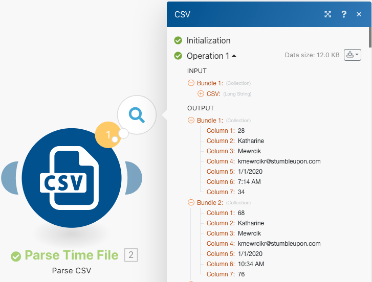

# Estruturas de dados

Transforme dados de um arquivo de origem em um arquivo de destino.

## Visão geral do exercício

Abra um arquivo CSV que contenha uma lista de entradas de tempo. Essas entradas de tempo são por minutos registrados ao longo de determinados dias por vários usuários. O objetivo é obter essas informações e produzir um novo CSV que mostre o tempo total, em horas, registrado por cada usuário, a cada dia.

Neste cenário, você abrirá um arquivo que contém uma lista de entradas de tempo para minutos trabalhados, incluindo a data e a hora, quantos minutos foram inseridos e o endereço de email de quem fez a entrada. Há 100 entradas, algumas feitas pelos mesmos indivíduos e algumas delas foram feitas no mesmo dia que outras.

Para produzir um arquivo que mostre o tempo total, em horas, trabalhado por dia para cada indivíduo, siga estas etapas:

1. No módulo de acionador, obtenha um arquivo da pasta Workfront. Baixe o arquivo .
1. No primeiro módulo CSV, analise os dados de entrada de tempo para gerar um pacote para cada entrada de tempo. Este é um iterador.
1. O primeiro módulo de Ferramentas é um agregador numérico. Isso fará com que SOMA todos os minutos e agrupe as linhas por endereço de email e, em seguida, por data. O resultado é o total de minutos trabalhados por dia por endereço de email.
1. O segundo módulo de Ferramentas é um módulo Definir variável. Use para formatar os minutos para dividir por 60 e arredondar para 2 decimais.
1. No segundo módulo CSV, configure o arquivo de saída.
1. No módulo final, faça upload do arquivo CSV no Workfront.

## Etapas a seguir

**Baixe o arquivo do Workfront.**

1. Na pasta &quot;Fusion Exercise Files&quot; da Workfront, selecione &quot;_Fusion1.0JanTime.csv&quot; e clique em Detalhes do Documento.
1. Copie o primeiro número de ID do endereço de URL.
1. Crie um novo cenário. Nomeie-o como &quot;Criando e usando estruturas de dados&quot;.
1. Comece com o módulo Baixar documento do aplicativo Workfront.
1. Configure sua conexão com o Workfront e inclua a ID do documento copiada do URL do Workfront.

   

   **Analise os dados de entrada de tempo.**

1. Adicione outro módulo, selecionando Analisar CSV.
1. Configure Analisar CSV para 7 colunas. Marque a caixa CSV contains headers . Escolha Comma delimiterType e coloque Data no campo CSV.

   

1. Clique em Executar uma vez para exibir a saída.
1. Abra o inspetor de execução para ver as entradas e as saídas do módulo CSV de análise. Há um pacote (um arquivo CSV) como entrada e vários pacotes como saídas (um pacote para cada linha no arquivo CSV). Deve ser algo como isto:

   

   **Em seguida, transforme os dados no formulário de saída desejado, com totais de tempo agregados expressos em horas em vez de minutos.**

1. Adicione um módulo de ferramenta Agregador numérico.
1. Selecione o módulo de origem, que é o módulo CSV de análise.
1. Selecione SUM para a função agregada.
1. O campo Valor é a coluna 7 do arquivo CSV. Estes são os minutos registrados por cada usuário.
1. Para somar os campos por grupo, clique em Configurações avançadas e defina Agrupar por para email (coluna 4), data (coluna 5).

   + Isso somará para cada combinação do email e da data. Coloque uma vírgula entre a coluna 4 e a coluna 5. Isso será usado como delimitador posteriormente.

   **O painel de mapeamento deve ter esta aparência:**

   

1. Clique em Executar uma vez para verificar a saída de agregação.

   **Os pacotes de saída devem ter esta aparência:**

   

   **Agora converta os minutos agregados em horas.**

1. Adicione outro módulo de ferramentas, selecionando Definir variável.
1. Nomeie a variável &quot;Hours&quot;.
1. Defina o valor da variável como formatNumber(result/60;2;.;,)

   **O painel de mapeamento deve ter esta aparência:**

   

   **Em seguida, obtenha os valores configurados para o arquivo de saída. Você deseja usar a userID e o valor de data usado para os agrupamentos. Você também deseja as horas que foram calculadas.**

1. Adicione outro módulo-CSV usando o agregador Criar CSV (avançado).
1. O módulo de origem é o agregador Ferramentas - Numérico.
1. Clique em Add by the Data structure e nomeie a estrutura de dados como &quot;Time Logged Daily Sum&quot;.
1. Clique em Adicionar item para criar o primeiro item.
1. Nomeie o item &quot;UserID&quot; e defina o tipo como Texto. Clique em Adicionar.
1. Clique em Adicionar item novamente para criar o segundo item.
1. Nomeie o item como &quot;Data&quot;, defina o tipo como Data e clique em Adicionar.
1. Clique em Adicionar item mais uma vez.
1. Nomeie o item &quot;Horas&quot;, defina o tipo como Número e clique em Adicionar.

   **Sua estrutura de dados deve ter esta aparência:**

   

1. Clique em Salvar para concluir a estrutura de dados Soma diária registrada em tempo.

   **Agora, você fornece os valores para os três campos que acabou de criar. Você deve ver esses três campos no painel de mapeamento CSV.**

1. Clique no campo UserID e escolha GET na guia funções gerais. No primeiro parâmetro, coloque SPLIT na guia de texto e funções binárias . O primeiro parâmetro para a função SPLIT é o campo Key . Adicione uma vírgula como delimitador e 1 como índice. Isso indica que você deseja que o GET recupere o primeiro campo na matriz Chave.
1. Copie essa expressão no campo Date . Altere o índice de 1 para 2 para GET o segundo valor na matriz.
1. Para o campo Horas , adicione o campo Horas da ferramenta Definir variável .

   **O painel de mapeamento de CSV deve ter esta aparência:**

   

   **Se você executar o cenário agora, deverá ver esta saída:**

   

   **Agora, adicione um módulo para obter essa saída e carregá-la como um documento para um projeto existente no Workfront.**

1. Abra o projeto no Workfront e copie a ID do projeto do URL.
1. Volte para o cenário em Fusion e adicione outro módulo - o módulo Upload Document do aplicativo Workfront.
1. Cole a ID do projeto no campo ID de registro relacionado.
1. Escolha Projeto para o Tipo de Registro Relacionado.
1. Escolha a opção Mapear para o arquivo de Origem.
1. Para o Nome do documento, use o nome de arquivo baixado, adicionando &quot;Atualizado&quot; na frente.
1. Para o conteúdo Arquivo, use a saída Texto do módulo Criar CSV.

   **O painel de mapeamento deve ter esta aparência:**

   

1. Clique em OK e Salve o cenário.
1. Clique em Executar uma vez para executar o cenário.

   **Verifique o inspetor de execução no módulo Fazer upload do documento para confirmar se o documento foi carregado.**

   
