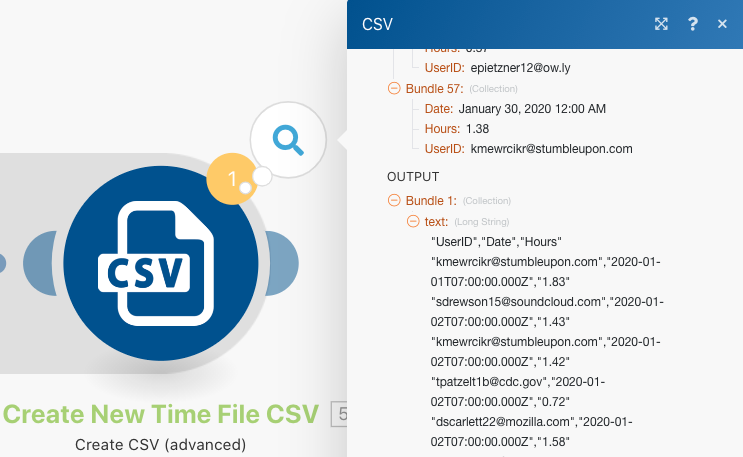
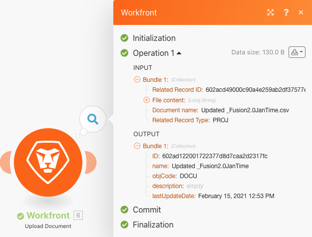

# Exercício de estruturas de dados

Transforme dados de um arquivo de origem em um arquivo de destino.

## Visão geral do exercício

Abra um arquivo CSV que contém uma lista de registros de horário. Esses registros de horário são para minutos registrados em determinados dias por vários usuários. A meta é coletar essas informações e produzir um novo CSV que mostre o tempo total (em horas) que cada usuário permaneceu conectado a cada dia.

Neste cenário, você abrirá um arquivo que contém uma lista de registro de minutos trabalhados, incluindo a data e hora, quantos minutos foram inseridos e o endereço de email de quem fez o registro. Há 100 registros de horário, alguns feitos pelas mesmas pessoas e outros que foram feitos no mesmo dia que outras pessoas.

Para produzir um arquivo que mostre o tempo total (em horas) que cada pessoa trabalhou todos os dias, siga estas etapas:

1. No módulo acionador, obtenha um arquivo da pasta Workfront. Baixe o arquivo.
1. No primeiro módulo CSV, analise os dados de registro de horário para gerar um pacote para cada um. Este é um iterador.
1. O primeiro módulo de ferramentas é um agregador numérico. Ele somará todos os minutos e agrupará as linhas por endereço de email e depois por data. O resultado é o total de minutos que cada endereço de email trabalhou por dia.
1. O segundo módulo de ferramentas é do tipo Definir variável. Use isso para formatar os minutos, dividindo-os por 60 e arredondando com 2 casas decimais.
1. No segundo módulo CSV, configure o arquivo de saída.
1. No módulo final, faça upload do arquivo CSV para o Workfront.

## Etapas a serem seguidas

**Baixe o arquivo do Workfront.**

1. Na pasta “Arquivos de exercícios do Fusion” do Workfront, selecione “_Fusion1.0JanTime.csv” e clique em Detalhes do documento.
1. Copie o primeiro número de ID do endereço URL.
1. Crie um novo cenário. Nomeie-o como “Criar e usar estruturas de dados”.
1. Comece com o módulo Baixar documento do aplicativo Workfront.
1. Configure sua conexão com o Workfront e inclua a ID do documento copiada do URL do Workfront.

   

   **Analise os dados de registro de horário.**

1. Adicione outro módulo, selecionando Analisar CSV.
1. Configure uma análise de CSV para 7 colunas. Marque a caixa CSV contém cabeçalhos. Escolha Vírgula como o tipo de delimitador e insira os dados no campo CSV.

   

1. Clique em Executar uma vez para ver o resultado.
1. Abra o inspetor de execução para ver as entradas e saídas do módulo Analisar CSV. Há um pacote (um arquivo CSV) como entrada e vários pacotes como saídas (um pacote para cada linha no arquivo CSV). A aparência deve ser semelhante a esta:

   

   **Em seguida, transforme os dados no formulário de saída desejado, com os totais de tempo agregados expressos em horas em vez de minutos.**

1. Adicione um módulo de ferramenta Agregador Numérico.
1. Selecione o módulo de origem: Analisar CSV.
1. Selecione SOMA como a função agregada.
1. O campo Valor é a coluna 7 do arquivo CSV. Isto representa quantos minutos cada usuário permaneceu conectado.
1. Para somar os campos por grupo, clique em Configurações avançadas e defina “Agrupar por” como Email (na coluna 4) e Data (na coluna 5).

   + Isso somará cada combinação de email e data. Certifique-se de colocar uma vírgula entre as colunas 4 e 5. Isso será usado como um delimitador posteriormente.

   **Seu painel de mapeamento deve ter esta aparência:**

   

1. Clique em Executar uma vez para verificar a saída da agregação.

   **Os pacotes de saída devem ter esta aparência:**

   

   **Agora converta os minutos agregados em horas.**

1. Adicione outro módulo de ferramentas, selecionando Definir variável.
1. Nomeie a variável como “Horas”.
1. Defina o valor da variável como formatNumber(result/60;2;.;,)

   **Seu painel de mapeamento deve ter esta aparência:**

   

   **Em seguida, configure os valores do arquivo de saída. Utilize os valores de ID de usuário e data para os agrupamentos. Além disso, utilize as horas que foram calculadas.**

1. Adicione outro módulo CSV usando o agregador Criar CSV (avançado).
1. O módulo de origem é Ferramentas - Agregador numérico.
1. Clique em Adicionar no campo Estrutura de dados e nomeie a estrutura como “Soma diária de tempo conectado”.
1. Clique em Adicionar item para criar o primeiro item.
1. Nomeie o item como “ID de usuário” e defina o tipo como Texto. Clique em Adicionar.
1. Clique em Adicionar item novamente para criar o segundo item.
1. Nomeie o item como “Data”, defina o tipo como Data e clique em Adicionar.
1. Clique em Adicionar item mais uma vez.
1. Nomeie o item como “Horas”, defina o tipo como Número e clique em Adicionar.

   **Sua estrutura de dados deve ter esta aparência:**

   

1. Clique em Salvar para finalizar a estrutura de dados Soma diária de tempo conectado.

   **Agora forneça valores para os três campos que acabou de criar. Você deverá ver esses três campos no painel de mapeamento do CSV.**

1. Clique no campo ID do usuário e escolha OBTER na guia de funções gerais. No primeiro parâmetro, selecione DIVISÃO na guia de texto e funções binárias. O primeiro parâmetro para a função DIVISÃO é o campo Chave. Adicione uma vírgula como delimitador e 1 como índice. Isso orienta a função OBTER a recuperar o primeiro campo na matriz Chave.
1. Copie esta expressão para o campo Data. Altere o índice de 1 para 2 para OBTER o segundo valor da matriz.
1. No campo Horas, adicione o campo Horas da ferramenta Definir variável.

   **O painel de mapeamento do CSV deve ter esta aparência:**

   

   **Se você executar o cenário agora, verá esta saída:**

   

   **Agora, adicione um módulo para coletar essa saída e carregá-la como um documento em um projeto existente no Workfront.**

1. Abra o projeto no Workfront e copie a ID do projeto contida no URL.
1. Retorne ao cenário no Fusion e adicione o módulo Fazer upload de documento do aplicativo do Workfront.
1. Cole a ID do projeto no campo ID de registro relacionada.
1. Escolha Projeto como o tipo de registro relacionado.
1. Escolha a opção Mapear para o arquivo de origem.
1. Em Nome do documento, use o nome do arquivo que você baixou e adicione “Atualizado” na frente dele.
1. Para o conteúdo Arquivo, use a saída de texto do módulo Criar CSV.

   **Seu painel de mapeamento deve ter esta aparência:**

   

1. Clique em OK e salve o cenário.
1. Clique em Executar uma vez para executar o cenário.

   **Verifique o inspetor de execução no módulo Fazer upload de documento para confirmar se o documento foi carregado.**

   
