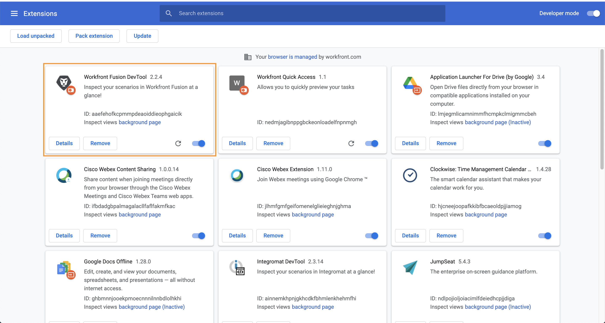
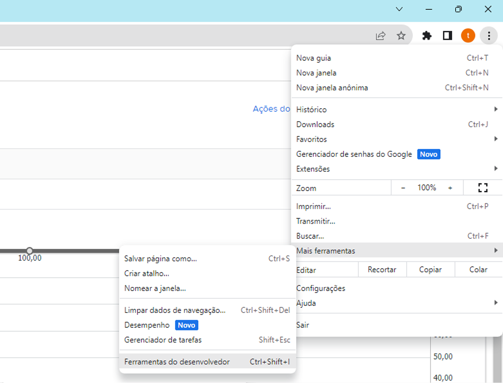

# Exercício da ferramenta Dev

Aprimore suas habilidades para solucionar problemas de um cenário e facilitar configurações complexas usando o Dev tool.

## Visão geral do exercício

Instale e use as diferentes áreas da ferramenta de desenvolvimento do Workfront para entender melhor as solicitações e respostas feitas e aprender truques avançados de design de cenários.

>[!NOTE]
>
>O Workfront Fusion Dev tool só está disponível no navegador Chrome ao usar a [Ferramenta para desenvolvedores do Chrome](https://developer.chrome.com/docs/devtools/).

## Etapas a serem seguidas

**Instale o Dev tool**

1. Baixe o documento “workfront-fusion-devtool.zip” encontrado na pasta Arquivos de exercícios do Fusion na unidade de teste.
1. Extraia os arquivos Zip para uma pasta.
1. Abra uma guia no Chrome e insira **chrome://extensions**.
1. Ative o modo de Desenvolvedor usando o botão no canto superior direito e clique no botão “Carregar descompactado” que aparece no canto superior esquerdo. Selecione a pasta que contém DevTool (a pasta em que você o descompactou).

   

1. Depois de descompactado, o DevTool é exibido entre suas outras extensões.

   

   **Use o Live Stream.**

1. Comece abrindo o cenário “Utilização de armazenamentos de dados para sincronizar dados”.
1. Abra o DevTool digitando F12 ou função F12. Ou você pode clicar no menu de três pontos na barra de endereços do Chrome e navegar até Ferramentas para Desenvolvedores.

   

1. Clique na guia Workfront Fusion e selecione Live Stream na lista à esquerda.
1. Clique em Executar uma vez para ver os eventos à medida que ocorrem.
1. Clique em um evento para ver as guias à direita para Cabeçalhos de solicitação, Corpo de solicitação, Cabeçalhos de resposta e Corpo de resposta.

   

   **Usar o Scenario Debugger**

1. Selecione Scenario Debugger e clique em um módulo para ver informações sobre as operações desse módulo.

   

1. Navegue até a guia Histórico. Clique em Detalhes em uma execução a fim de examinar os detalhes da operação do módulo para uma execução específica.

   

   **Usar as Ferramentas**

1. Volte para o designer de cenários e selecione Ferramentas no Dev tool. As ferramentas disponíveis serão exibidas.

   

+ Focar em um módulo: encontre e abra um módulo rapidamente usando a ID do módulo.
+ Localizar módulo(s) por mapeamento: pesquise um cenário usando uma palavra-chave para localizar valores e/ou chaves mapeados em módulos.
+ Obter metadados do aplicativo: veja os metadados do aplicativo selecionado em um cenário.
+ Copiar mapeamento: copia o mapeamento de um módulo para outro. Você também pode clonar o módulo no designer.
+ Copiar filtro: copia um filtro. O filtro é sempre atribuído ao módulo à direita.
+ Trocar conexão: a ferramenta pega a conexão do módulo selecionado e define a mesma conexão para todos os módulos do mesmo aplicativo no cenário. Isto é útil se você precisar alterar a conexão durante um cenário concluído. Evite perder todo o mapeamento e economize tempo usando essa ferramenta.
+ Trocar variável: encontra todas as ocorrências de uma determinada variável em todo o cenário, ou em um módulo, e as substitui pela nova. Curingas não são aceitos. Se você tiver mapeado acidentalmente um valor em todo o cenário, isso pode ajudar a trocar facilmente pelo valor correto.
+ Trocar aplicativo: troca o aplicativo fornecido por outro.
+ Base 64: codifica os dados inseridos para Base64 ou decodifica Base64. Útil quando você deseja pesquisar por dados específicos na solicitação codificada.
+ Copiar nome do módulo: copia o nome do módulo selecionado para a área de transferência.
+ Remapear origem: altera a origem do mapeamento de um módulo para outro. Primeiro você precisa adicionar o módulo a ser usado como módulo de origem para a rota em um cenário.
+ Migrar sistema operacional: feito especificamente para atualizar os módulos do Google Sheets (herdados) para a versão mais recente do Google Sheets. Adiciona uma nova versão do módulo logo após a versão herdada do módulo na rota do cenário.
