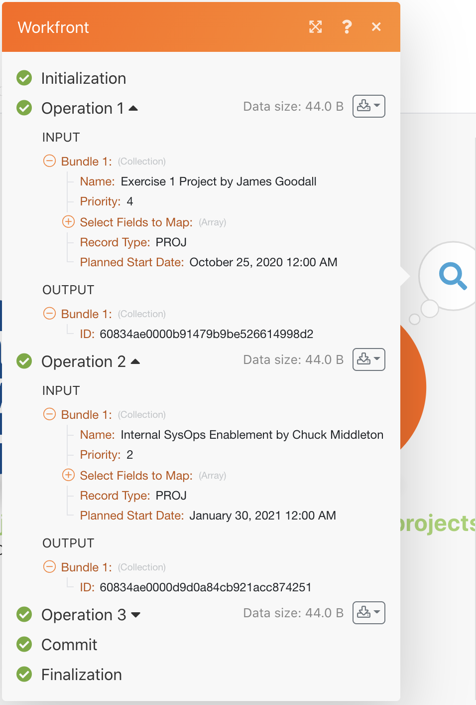

# Exercício de histórico de execução

Revise e audite detalhes sobre execuções anteriores e configurações de cenário.

## Visão geral do exercício

Revise o histórico de execução para o cenário “Uso do filtro poderoso” para entender o que aconteceu quando as execuções ocorreram e como elas foram estruturadas quando foram executadas.

## Etapas a serem seguidas

1. Abra o cenário “Usando o filtro de potência”.
1. Na página de visão geral, clique na guia Histórico (na parte superior, abaixo do nome do cenário).

   

1. Encontre uma execução e clique no botão de detalhes para abrir uma página que mostra as operações específicas realizadas (ou não realizadas), no painel direito. No painel esquerdo, é possível examinar o cenário como estava no momento da execução.

   

1. Ao clicar em um módulo no painel de cenário, um painel inspetor de módulo é mostrado, exibindo informações sobre as configurações do módulo. Clique no inspetor de execução ao lado de um módulo ou filtro para ver em quais conjuntos de informações foram executados.

   

   

1. No painel direito, role ou clique no log Simples para exibir detalhes “passo a passo” da execução.

   + Você pode ver quando as operações foram concluídas nos módulos e quando os pacotes passaram (ou não) pelos filtros.

   

   + Clique em um item de log para abrir o painel de operação no painel de cenário. Os logs são listados em ordem cronológica de quando ocorreram.

   

1. O log avançado mostra informações semelhantes. No entanto, ele fornece mais informações sobre quantos ciclos foram realizados por execução e permite aprofundar-se em quais pacotes de informações foram processados em cada ciclo.

