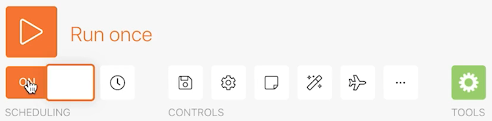

# Exercício de exploração de execuções, ciclos e pacotes

Entenda o comportamento das execuções, ciclos e pacotes utilizando o histórico de execução de um cenário.

## Visão geral do exercício

Pratique com diferentes configurações de cenário para explorar o uso de execuções e ciclos.

## Etapas a serem seguidas

1. Clone o cenário chamado “Compartilhar variáveis entre caminhos de roteamento”. Nomeie o novo cenário como “Compartilhar variáveis entre caminhos de roteamento - Teste de ciclos”.
1. Remova o módulo Enviar um email, pois ele não é necessário para esse teste.

   **Configure seu cenário para processar 3 ciclos por execução. Processe 5 projetos em cada ciclo.**

1. Clique no módulo acionador e defina o campo Máximo como 5, para que apenas 5 projetos sejam processados em cada ciclo.
1. Nos critérios de pesquisa, remova o segundo filtro que restringe a pesquisa a um único projeto.
1. Clique em OK.

1. Na barra de ferramentas do Fusion, abra as configurações do cenário e altere o campo “Número máximo de ciclos” de 1 para 3.
1. Clique em OK.

   

   **Programe o cenário para ser executado a cada minuto.**

1. Clique no ícone de relógio ao lado do módulo acionador e altere o campo Minutos para 1 minuto.

   

1. Em seguida, ative o botão Cronograma (localizado abaixo do botão Executar uma vez). Salve seu cenário.

   

1. Acesse o histórico de execução do cenário e observe como um novo registro aparecerá no histórico no minuto seguinte. Talvez seja necessário atualizar a página.

   

1. Clique no botão Detalhes de uma execução. Clique nos registros simples do painel direito, semelhante ao que você fez na parte relacionada ao histórico de execução do treinamento do Workfront Fusion.
1. Os registros das operações processadas são divididos em ciclos.

   

1. Um menu suspenso na parte superior direita da janela permite selecionar qualquer um dos 3 ciclos configurados para ser executado todas as vezes.

   
