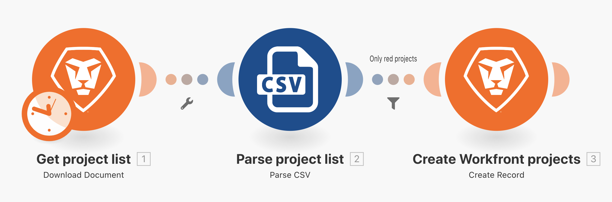
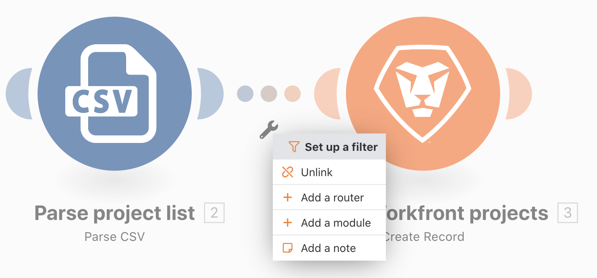
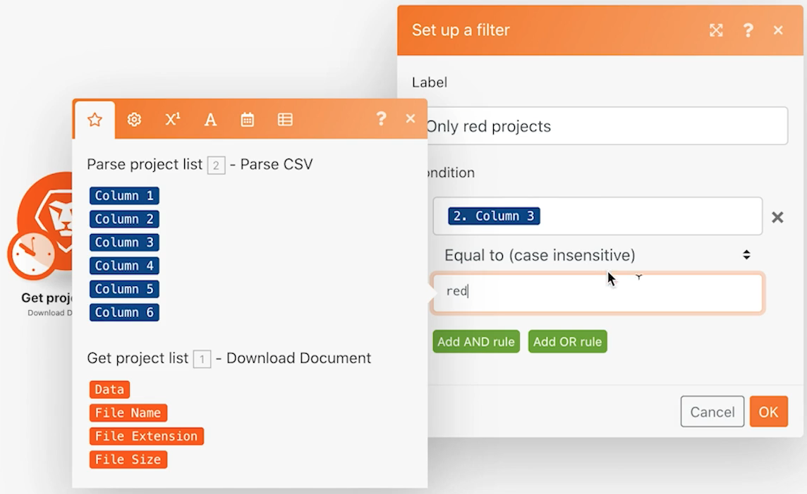
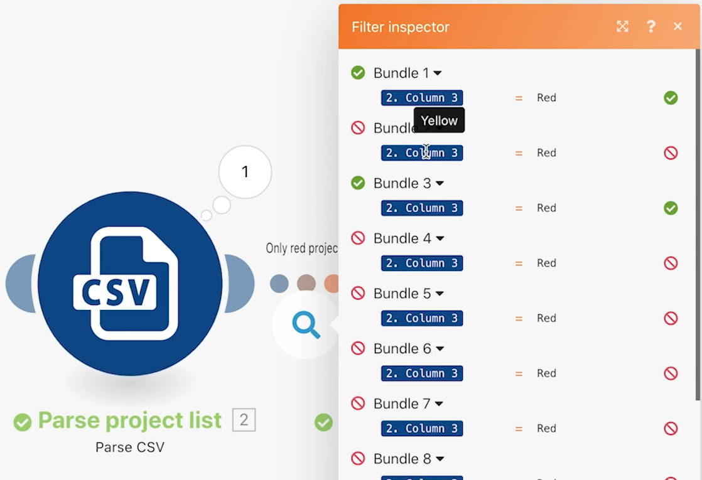

# Exercício de filtros

Saiba como usar o filtro em vários módulos para encontrar somente determinados tipos de pacotes.

## Visão geral do exercício

Adicione um filtro para os dois módulos no cenário Além do mapeamento básico para criar apenas projetos que tenham a cor “Vermelho” no arquivo CSV.

## Etapas a serem seguidas

1. Crie um clone do cenário “Além do mapeamento básico” e nomeie-o como “Usar o filtro avançado”.

   **Adicione um filtro no módulo Criar projetos do Workfront para permitir a criação apenas de projetos em vermelho.**

   

1. Adicione um filtro clicando na linha pontilhada que conecta os módulos ou no ícone de chave inglesa e selecionando Configurar um filtro.
1. Use o campo Rótulo para nomear o filtro como “Somente projetos em vermelho”.
1. No campo Condição, mapeie o campo Cor do projeto (coluna 3 no arquivo CSV). Selecione o operador Igual a (sem distinção entre maiúsculas e minúsculas) e digite “vermelho”.
1. Clique em OK.

   

   **Teste o filtro e verifique os resultados.**

1. Salve o cenário e clique em Executar uma vez.
1. Clique no inspetor de execução do filtro para ver como cada pacote foi examinado pelo filtro e se eles foram bem-sucedidos ou falharam na transição para o módulo Criar projetos do Workfront.

   

1. Encontre os projetos criados na sua instância do Workfront.
