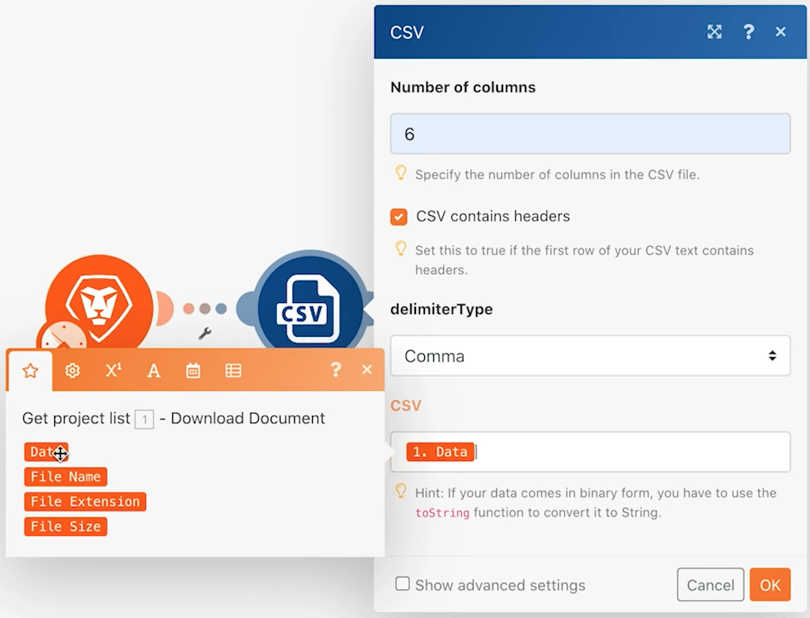

# Design do cenário inicial

Aprenda algumas dicas básicas de navegação para quando fizer logon pela primeira vez no Workfront Fusion, além de criar seu primeiro cenário.

## Visão geral do exercício

Crie um novo projeto no Workfront para cada linha no arquivo CSV da Lista de projetos .

## Etapas a seguir

1. Crie uma pasta na seção Cenário chamada &quot;Exercícios de ativação de fusão&quot;.
1. Clique em na pasta e, em seguida, clique em Create a new scenario.

   

1. Na próxima página, pesquise o Workfront e selecione esse aplicativo. Em seguida, clique em Continuar.
1. Na parte superior esquerda da tela do designer de cenário, renomeie o cenário para &quot;Design do cenário inicial&quot;
1. Clique no módulo de acionador vazio no centro da tela e selecione o aplicativo Workfront e selecione o módulo Download Document .

   **Autentique a conexão do módulo com sua conta Workfront.**

1. Para criar uma conexão pela primeira vez, clique no botão Add .

   

1. Dê um nome à conexão, como &quot;My Workfront 2020&quot;

   

1. Insira o URL da instância do Workfront e clique em Next (Avançar).

   

1. Digite sua senha e clique em Fazer logon.

   **A conexão é estabelecida. Agora, insira a ID do documento que você deseja baixar do Workfront.**

   

1. Volte para o Workfront. Na pasta &quot;Fusion Exercise Files&quot;, selecione &quot;_Fusion2020_Project List.csv&quot; e clique em Document Details (Detalhes do documento) no painel esquerdo. Copie o número de ID do documento do endereço do URL (esse é o primeiro número longo no URL).

   

1. Volte para Fusion (Fusão) e cole o número no campo Document ID (ID do documento) e clique em OK.
1. A prática recomendada é renomear módulos à medida que você os cria. Clique com o botão direito do mouse no módulo Workfront e escolha Renomear. Nomeie o módulo como &quot;Obter lista de projetos&quot;.

   **Em seguida, você irá analisar o arquivo CSV que acabou de baixar para acessar cada linha no arquivo. Você usará essas informações ao criar um projeto a partir de cada linha.**

1. Clique no lado direito do módulo Workfront para adicionar outro módulo. Procure pelo aplicativo CSV e selecione o módulo CSV de análise.
1. Configure Analisar CSV para 6 colunas, CSV contém cabeçalhos, Tipo de delimitador de vírgula e Coloque Dados no campo CSV. Em seguida, clique em OK.

   

1. Renomeie este módulo como &quot;Analisar lista de projetos&quot;.
1. Na parte inferior do designer do cenário, clique em Salvar para salvar seu cenário.
1. Clique em Executar uma vez para exibir a saída.

   >[!NOTE]
   >
   >Ignore o aviso de que um transformador não deve ser o último módulo (isso é verdadeiro, mas não importa para esse teste). Clique em Executar assim mesmo.

   

1. Abra o inspetor de execução no módulo CSV de análise para ver as entradas e as saídas do módulo. Há um pacote (um arquivo CSV) como entrada e vários pacotes como saídas (um pacote para cada linha no arquivo CSV). Deve ser algo como isto:

   

   **Adicione um módulo para criar um projeto para cada linha no arquivo CSV.**

1. Adicione outro módulo. Selecione o aplicativo Workfront, escolhendo o módulo Criar registro .
1. Defina o Tipo de registro como Projeto.

   >[!TIP]
   >
   >Procure por ele começando a digitar algumas letras, como *proj*, para ir direto ao assunto.

1. Em seguida, use Cmd/Ctrl+G para localizar Nome (nome do projeto). Marque a caixa ao lado de Name; o campo aparece abaixo.
1. Agora marque as caixas ao lado de Data inicial planejada e Prioridade.
1. Clique no campo Nome para que o painel de mapeamento seja exibido. Clique no campo Coluna 1 do módulo CSV de análise para adicioná-lo ao campo Nome . Esse é o nome do projeto do arquivo CSV.
1. Para a Data inicial planejada, clique na Coluna 5 do módulo CSV de análise.
1. Para Prioridade, escolha Normal no menu suspenso.

   **O painel de mapeamento deve ter esta aparência:**

   

1. Clique em OK.

   >[!NOTE]
   >
   >Se você não clicar em OK e, acidentalmente, clicar de volta no designer, seu trabalho não será salvo e você terá que mapear novamente.

1. Clique com o botão direito do mouse no módulo Workfront e renomeie-o como &quot;Criar projetos Workfront&quot;.
1. Salve o cenário e clique no botão Executar uma vez .
1. Clique no inspetor de execução na parte superior direita do último módulo.

   + Você verá que 20 operações foram executadas. Cada operação pegou um pacote, ou seja, uma linha, do arquivo CSV como entrada e saída de um pacote, que era um projeto criado no Workfront. A ID do projeto criado é exibida com o pacote de saída.

   

   **Uso de observações**

1. As observações ajudam a criar mais visibilidade sobre o design do cenário. Para adicionar uma observação ao módulo Criar projetos do Workfront , clique com o botão direito do mouse e selecione Adicionar uma observação. Um painel à direita da janela do designer é exibido para que você possa adicionar uma nota ao módulo. Digite &quot;Criar um projeto com Nome, Data de início planejada e Prioridade mapeada do arquivo CSV&quot;.
1. Adicione outra observação para descrever o que o módulo acionador (o primeiro módulo Workfront) está fazendo.
1. Feche o painel de notas clicando no X no canto superior direito.

   + Acesse as notas novamente clicando no botão de notas na barra de ferramentas inferior ou clicando com o botão direito do mouse em qualquer módulo e adicionando uma nova nota.
   + As notas são classificadas em ordem cronológica inversa.
   + Um ponto laranja é exibido no botão Notas depois que as notas são adicionadas.

   

1. Salve o cenário clicando no botão Save na barra de ferramentas de controles.
1. Você pode visualizar os projetos criados na sua instância do Workfront.
