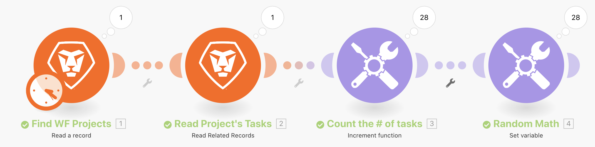
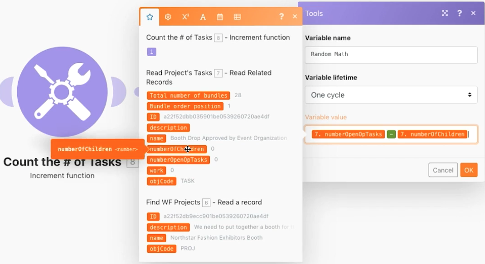

# Introdução ao exercício para iteradores

Saiba como usar aplicativos de iteração e executar ações em cada pacote de informações.

## Visão geral do exercício

Observe um projeto específico no Workfront e, em seguida, analise todas as tarefas desse projeto. Você usará o módulo de ferramenta de incremento para contar o número de tarefas no projeto. Por fim, você usará o módulo Definir variável para subtrair o Número de tarefas derivadas do Número de problemas em aberto, a fim de produzir um valor numérico para cada um dos pacotes de tarefas.

## Etapas a serem seguidas

**Leia o projeto e as tarefas relacionadas.**

1. Crie um novo cenário. Nomeie-o como “Introdução à iteração”.
1. Escolha o Workfront como o módulo acionador para a leitura do registro.
1. Em Tipo de registro, escolha Projeto.
1. Em Saídas, escolha ID, Nome e Descrição.
1. No campo ID, insira a ID do projeto Northstar Fashion Exhibitors Booth da sua instância de teste do Workfront.
1. Renomeie este módulo como “Localizar projetos do WF”.
1. Adicione outro módulo do Workfront para ler as tarefas relacionadas a este projeto. Escolha o módulo Ler registros relacionados.
1. Em Tipo de registro, escolha Projeto.
1. Em ID do registro principal, escolha a ID do módulo Ler um registro.
1. Em Coleções, selecione Tarefas.
1. Em Saídas, selecione ID, Nome, Descrição, Número de tarefas derivadas, Número de problemas em aberto e Trabalho.
1. Renomeie este módulo como “Ler tarefas do projeto”.
1. Salve o cenário e clique em Executar uma vez para ver as saídas.

   + Clique no inspetor de execução e você verá um pacote de entrada (o projeto) e 28 pacotes de saída (as tarefas).

   **Contar e processar pacotes iterados.**

1. Adicione outro módulo além de Ler registros relacionados. Escolha um módulo de ferramentas com a função de incremento.

   + Defina o campo Redefinir um valor como Nunca e clique em OK.

1. Renomeie este módulo como “Contar o número de tarefas”.
1. Adicione um módulo Definir variável. Defina o nome da variável como “Matemática aleatória”.
1. No campo Valor da variável, subtraia o número de tarefas derivadas abertas do número de tarefas abertas.

   **Ele deve ter a seguinte aparência:**

   

1. Renomeie este módulo como “Matemática aleatória”.
1. Salve o cenário e clique em Executar uma vez.

Para cada uma das tarefas produzidas pelo módulo iterador Ler registros relacionados, o Workfront Fusion realizou 28 execuções. Esses 28 pacotes continuarão a ser processados durante todo o cenário, a menos que um agregador seja adicionado para fechar o loop.
